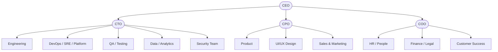

# Roles and Responsibilities

## Purpose

This section maps CYBERCUBE software-related functions to ownership, representative KPIs, and typical reporting lines so lifecycle phases can assign accountability. Use the **lifecycle accountability matrix** below for phase-level ownership; use sections **1–13** for functional depth.

This is a reference model. Titles, reporting lines, approvers, and role spans may be adjusted according to entity size, project complexity, and operating model. **Project-specific RACI matrices** belong in project charters, delivery plans, or phase execution documents. Gate criteria and minimum evidence are defined in **`21. Decision Gates.md`** and **`22. Required Documents.md`**.

---

## 1. Executive and Strategy

| Field | Description |
|---|---|
| Responsibilities | Company vision, mission, long-term strategy, budget ownership, major product decisions, cross-department alignment, investor relations, partnerships, organization-level KPIs, and OKRs. |
| Key Metrics | OKR completion, revenue growth, year-over-year growth, margins, market share, portfolio performance, NPS, and CSAT. |
| Typical Roles | CEO → CTO / CPO / COO → directors and senior managers. |

---

## 2. Product

| Field | Description |
|---|---|
| Responsibilities | Business requirements intake, roadmap ownership, backlog management, acceptance criteria, user research, prioritization by impact, cost, and risk, and alignment of business goals with engineering delivery. |
| Key Metrics | Feature adoption, roadmap accuracy, time-to-market, NPS, requirement volatility, and value delivered per iteration. |
| Typical Roles | CPO → product directors → product managers → business analysts / product owners. |

---

## 3. Engineering / Development

| Field | Description |
|---|---|
| Responsibilities | Frontend, backend, mobile, and desktop implementation; coding standards; architecture guardrails; APIs; data layers; defect fixing; improvements; refactoring; unit, integration, and E2E tests; and code review participation. |
| Key Metrics | Velocity, cycle time, lead time, deployment frequency, defect counts by severity, review turnaround, test coverage, and escaped defects. |
| Typical Roles | CTO → VP Engineering → engineering managers → engineers. |

---

## 4. DevOps / SRE / Platform

| Field | Description |
|---|---|
| Responsibilities | CI/CD, infrastructure as code, provisioning, observability, monitoring, alerting, uptime, reliability, incident management, performance, infrastructure security baselines, and disaster recovery. |
| Key Metrics | Uptime against SLA/SLO, MTTR, MTBF, deployment success rate, pipeline duration, latency percentiles, error rates, on-call incident volume, and cloud cost efficiency. |
| Typical Roles | Head of DevOps / SRE → SRE leads → DevOps and platform engineers. |

---

## 5. Quality Assurance

| Field | Description |
|---|---|
| Responsibilities | Manual testing, automated testing, test planning, test strategy, regression testing, performance testing, security testing with Security, automation frameworks, and validation of stories and acceptance criteria. |
| Key Metrics | Test coverage, defect density, escaped defects, test cycle time, automation ratio, flaky-test rate, and release pass/fail trends. |
| Typical Roles | QA director → QA managers → automation engineers → manual QA specialists. |

---

## 6. UI/UX and Design

| Field | Description |
|---|---|
| Responsibilities | Wireframes, prototypes, design systems, user research, usability testing, interaction design, branding, accessibility alignment, and collaboration with Product and frontend engineering. |
| Key Metrics | Usability scores, accessibility compliance, mockup lead time, design-system coverage, and UX survey results. |
| Typical Roles | Head of Design → UX leads → UI/UX designers → graphic designers. |

---

## 7. Security

| Field | Description |
|---|---|
| Responsibilities | Application security, infrastructure security, DevSecOps practices, vulnerability management, patching, compliance alignment, secure SDLC, incident response coordination, and identity and access management. |
| Key Metrics | Open critical vulnerabilities, time-to-remediate, penetration-test outcomes, MFA coverage, audit scores, and security incident frequency. |
| Typical Roles | CISO / Head of Security → AppSec / SecOps → compliance officers. |

---

## 8. Data and Analytics

| Field | Description |
|---|---|
| Responsibilities | Data pipelines, data warehousing, BI dashboards, analytics modeling, machine learning where applicable, product analytics, and KPI monitoring. |
| Key Metrics | Pipeline uptime, data quality, dashboard usage, model quality where relevant, ETL duration, and speed of insight for decisions. |
| Typical Roles | Head of Data → data engineers → analysts → ML engineers. |

---

## 9. Customer Success and Support

| Field | Description |
|---|---|
| Responsibilities | Customer onboarding, ticketing, triage, help desk support, training, documentation, retention initiatives, and feedback routing into Product and Engineering. |
| Key Metrics | First response time, time-to-resolution, CSAT, churn, backlog health, and deflection rate. |
| Typical Roles | Head of Customer Success → customer success managers → support specialists. |

---

## 10. Sales

| Field | Description |
|---|---|
| Responsibilities | Lead generation, customer acquisition, demos, pricing, negotiation, enterprise sales cycles, and revenue pipeline management. |
| Key Metrics | MRR, ARR, win rate, pipeline value, sales cycle length, upsell, and cross-sell. |
| Typical Roles | CRO → sales directors → account executives → SDRs. |

---

## 11. Marketing

| Field | Description |
|---|---|
| Responsibilities | Brand, content, social media, SEO, SEM, product marketing, campaigns, messaging, positioning, and growth analytics. |
| Key Metrics | Website traffic, search rankings, lead conversion, CPA, MQLs, and campaign ROI. |
| Typical Roles | CMO → marketing managers → content, SEO, and brand staff. |

---

## 12. HR / People

| Field | Description |
|---|---|
| Responsibilities | Recruiting, onboarding, performance management, policies, career paths, training, employee development, and people operations. |
| Key Metrics | Time-to-hire, offer acceptance rate, retention, employee satisfaction, and training completion. |
| Typical Roles | HR director → recruiters → people operations. |

---

## 13. Finance and Legal

| Field | Description |
|---|---|
| Responsibilities | Budgeting, forecasting, payroll, billing, contracts, compliance support, risk management, procurement, and vendor management. |
| Key Metrics | Budget variance, cost per employee, receivables aging, contract cycle time, procurement cycle time, and audit outcomes. |
| Typical Roles | CFO → finance staff → legal counsel. |

---

## Lifecycle accountability matrix

The table assigns **default** accountability using the functional areas above (sections **1–13**). Names (CPO, CTO, etc.) are **illustrative**; another executive may approve if governance and **`21. Decision Gates.md`** allow. Smaller teams may collapse roles (for example one lead covering Product and Engineering) while preserving evidence ownership.

| # | Phase | Primary owner | Approver (typical gate) | Key contributors | Evidence ownership |
| --- | --- | --- | --- | --- | --- |
| 1 | Idea Capture | Product | Portfolio sponsor (e.g. CPO or CEO delegate) | Executive strategy, Sales/Marketing, Engineering (sanity check) | Product |
| 2 | Problem Definition | Product | CPO + Technical Lead | UX/Design, Engineering, Customer Success | Product |
| 3 | Project Evaluation and Selection | Product + Executive | Portfolio sponsor / executive committee | Finance, Engineering, Product | Product + Finance (as needed) |
| 4 | Feasibility and Business Case | Product + Engineering | CTO + CPO (or combined portfolio gate) | Finance, Legal, Security | Product + Engineering |
| 5 | Requirements Definition | Product | CPO | Engineering, QA, Security, UX | Product |
| 6 | Planning and Scope Control | Product + Engineering | CTO + CPO | QA, DevOps/SRE, Finance | Product + Engineering lead |
| 7 | Architecture and Design | Engineering (Architect / Tech Lead) | CTO | Security, DevOps/SRE, Data, Product | Engineering (ADRs, design baselines) |
| 8 | Development Preparation | Engineering | Tech Lead / CTO | DevOps/SRE, QA, Security | Engineering |
| 9 | Implementation | Engineering | Tech Lead / Engineering manager | QA, DevOps/SRE, Security | Engineering |
| 10 | Testing and Validation | QA + Engineering | QA Lead + Product (acceptance) | Security (as needed), DevOps/SRE | QA + Engineering (test evidence) |
| 11 | Release Preparation | Engineering + DevOps/SRE | CTO or Release Manager (delegated) | QA, Security, Product | DevOps/SRE + Engineering |
| 12 | Deployment | DevOps/SRE | CTO or delegated operations authority | Engineering, QA, Security | DevOps/SRE |
| 13 | Maintenance and Improvement | Engineering + Customer Success / Support | Engineering manager + SRE lead (operational) | Security, Product (prioritization) | Engineering + Support (ops evidence) |
| 14 | Post-Release Review | Product + Executive sponsor | CPO + sponsor | Engineering, Customer Success, Finance | Product (review record) |

---

## Reference Organization Chart

The following chart shows high-level reporting paths for software delivery context. It is not an exhaustive headcount model.

Security may report under the CTO, COO, or directly to executive leadership depending on the operating model. Sales and Marketing may report to a CRO, with matrix alignment to Product for launches, positioning, and product-led growth.

---

## Related

- `03. Scope.md` — Applicability, lifecycle boundaries, and phase index (**`07.`–`20.`**).

- `04. Definitions.md` — Controlled vocabulary (gates, traceability, tailoring).

- `06. Lifecycle Overview.md` — Phase grouping, USSM tiers, and SDLC mapping.

- `12. Phase 6 — Planning and Scope Control.md` — Planning ownership, scope commitments, dependencies, and execution control.

- `19. Phase 13 — Maintenance and Improvement.md` — Post-release support, operational ownership, improvement planning, and maintenance handoffs.

- `20. Phase 14 — Post-Release Review.md` — Structured review after release.

- `21. Decision Gates.md` — Approval points, gate evidence, and lifecycle continuation decisions.

- `22. Required Documents.md` — Artifact register and traceability expectations.

- `Universal Software Project Development Procedure.md` — Program-level gate and artifact themes without replacing the modular phase documents.