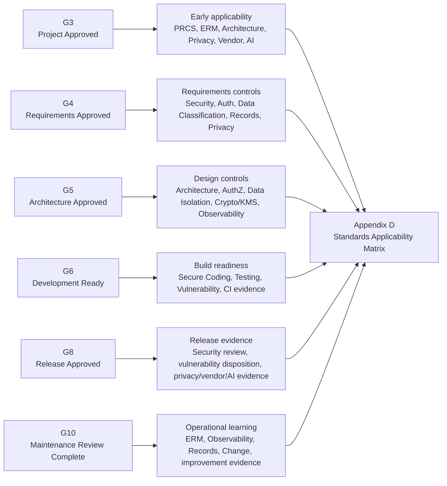

# Lifecycle Overview

The Master Lifecycle procedure is organized into **fourteen numbered phases**. The **authoritative** phase names and file index are in **`03. Scope.md`** §**3.4** (for the meta plan that defined the full procedure set, see `0. Plan to Build the Complete Software Project Procedure.md`). **USSM v1.0** (`USSM — Unified Software Standards Manual v1.0.md`) provides the **normative documentation spine** aligned to ISO/IEC 12207 and IEEE 29148.

The lifecycle is designed so work does not advance without sufficient understanding, planning, design, testing, release evidence, and maintenance preparation. Each phase has a purpose, produces outputs, and prepares the project for the next phase. **Per-phase detail** (activities, templates, gates) lives in **`07.`–`20.`**; **gate criteria and expected evidence** are in **`21. Decision Gates.md`** and **`22. Required Documents.md`**, together with **`03. Scope.md`** §**3.5**.

Follow phase files in numeric order; only open appendices, templates, standards, or supporting procedures when referenced by the current phase.

## Lifecycle structure at a glance

### Conceptual sequence

```text
Idea → Problem → Evaluation → Feasibility → Requirements →
→ Planning  → Architecture → Development preparation → 
→ Implementation → Testing → Release preparation → Deployment → 
→ Maintenance and improvement → Post-release review →
→ Process improvement (informs the next cycle)
```

### Master diagram 1: End-to-end lifecycle flow

```mermaid
flowchart LR

%% =========================================================
%% MASTER DIAGRAM 1 — END-TO-END LIFECYCLE FLOW
%% =========================================================

Start([Start<br/>Project Idea])

%% =======================
%% DISCOVERY
%% =======================
subgraph Discovery["1. Discovery"]
  direction LR

  P1["Phase 1<br/>Idea Capture"]
  G1{"G1<br/>Accepted?"}
  P2["Phase 2<br/>Problem Definition"]
  G2{"G2<br/>Validated?"}
  P3["Phase 3<br/>Evaluation & Selection"]
  P4["Phase 4<br/>Feasibility & Business Case"]
  G3{"G3<br/>Approved?"}

  P1 --> G1
  G1 -- Yes --> P2
  P2 --> G2
  G2 -- Yes --> P3
  P3 --> P4
  P4 --> G3
end

%% =======================
%% DEFINITION AND DESIGN
%% =======================
subgraph DefinitionDesign["2. Definition & Design"]
  direction LR

  P5["Phase 5<br/>Requirements Definition"]
  G4{"G4<br/>Approved?"}
  P6["Phase 6<br/>Planning & Scope Control"]
  P7["Phase 7<br/>Architecture & Design"]
  G5{"G5<br/>Approved?"}
  P8["Phase 8<br/>Development Preparation"]
  G6{"G6<br/>Ready?"}

  P5 --> G4
  G4 -- Yes --> P6
  P6 --> P7
  P7 --> G5
  G5 -- Yes --> P8
  P8 --> G6
end

%% =======================
%% DELIVERY
%% =======================
subgraph Delivery["3. Delivery"]
  direction LR

  P9["Phase 9<br/>Implementation"]
  P10["Phase 10<br/>Testing & Validation"]
  G7{"G7<br/>Passed?"}
  P11["Phase 11<br/>Release Preparation"]
  G8{"G8<br/>Approved?"}
  P12["Phase 12<br/>Deployment"]
  G9{"G9<br/>Verified?"}

  P9 --> P10
  P10 --> G7
  G7 -- Yes --> P11
  P11 --> G8
  G8 -- Yes --> P12
  P12 --> G9
end

%% =======================
%% OPERATIONS
%% =======================
subgraph Operations["4. Operations & Learning"]
  direction LR

  P13["Phase 13<br/>Maintenance & Improvement"]
  P14["Phase 14<br/>Post-Release Review"]
  G10{"G10<br/>Review Complete?"}
  PI["Process Improvement<br/>Next Cycle Inputs"]

  P13 --> P14
  P14 --> G10
  G10 -- Yes --> PI
end

%% =======================
%% MAIN FLOW CONNECTIONS
%% =======================
Start --> P1
G3 -- Yes --> P5
G6 -- Yes --> P9
G9 -- Yes --> P13

%% =======================
%% FEEDBACK / REWORK LOOPS
%% =======================
G1 -- No --> F1["Reject, Park,<br/>or Research More"]
F1 -. Resubmit .-> P1

G2 -- No --> F2["Refine Problem<br/>or Gather Evidence"]
F2 -. Revalidate .-> P2

G3 -- No --> F3["Stop, Defer,<br/>or Revise Case"]
F3 -. Revise .-> P3

G4 -- No --> F4["Clarify Requirements,<br/>Scope, or Acceptance Criteria"]
F4 -. Rebaseline .-> P5

G5 -- No --> F5["Revise Architecture,<br/>Design, or Standards Evidence"]
F5 -. Re-review .-> P7

G6 -- No --> F6["Complete Prep:<br/>Plans, Environments, CI, Evidence"]
F6 -. Re-check .-> P8

G7 -- No --> F7["Fix Defects<br/>Update Tests or Requirements"]
F7 -. Retest .-> P9

G8 -- No --> F8["Resolve Release,<br/>Security, Risk, or Readiness Gaps"]
F8 -. Reassess .-> P11

G9 -- No --> F9["Rollback, Remediate,<br/>or Redeploy"]
F9 -. Verify Again .-> P12

G10 -- No --> F10["Complete Review,<br/>Metrics, Lessons, and Actions"]
F10 -. Review Again .-> P14

%% =======================
%% OPTIONAL STYLING
%% =======================
classDef phase fill:#eaf3ff,stroke:#2f6fb0,stroke-width:1px,color:#0b2545;
classDef gate fill:#fff4cc,stroke:#b7791f,stroke-width:1px,color:#3b2500;
classDef rework fill:#ffecec,stroke:#c53030,stroke-width:1px,color:#4a0000;
classDef startEnd fill:#e8f7ef,stroke:#2f855a,stroke-width:1px,color:#063b1f;

class Start,PI startEnd;
class P1,P2,P3,P4,P5,P6,P7,P8,P9,P10,P11,P12,P13,P14 phase;
class G1,G2,G3,G4,G5,G6,G7,G8,G9,G10 gate;
class F1,F2,F3,F4,F5,F6,F7,F8,F9,F10 rework;

%% =======================
%% LINE STYLING
%% =======================
linkStyle default stroke:#334155,stroke-width:2px;
linkStyle 1,3,7,10,14,16,20,22,23,24 stroke:#2f855a,stroke-width:3px;
linkStyle 25,27,29,31,33,35,37,39,41,43 stroke:#c53030,stroke-width:3px;
linkStyle 26,28,30,32,34,36,38,40,42,44 stroke:#dd6b20,stroke-width:2px,stroke-dasharray:5 5;
```



### Master diagram 2: Artifact traceability map

```mermaid
flowchart LR
  Idea["Idea Capture Form<br/>A-0"] --> Problem["Problem Definition<br/>A-0.1"]
  Problem --> Selection["Selection / Feasibility / Business Case<br/>A-3.1 / A-3.2 / A-3.3"]
  Selection --> Requirements["Requirements Specification Package<br/>A-8 / NFR-001 / SUP-001"]
  Requirements --> Scope["Scope, Feature Inventory, Plan<br/>A-6 / A-9 / A-15"]
  Scope --> Design["Architecture and Design Evidence<br/>ARD-001 / UXD-001 / ERD / API Contract"]
  Design --> Prep["Development Preparation Evidence<br/>module plan / environment strategy / execution model"]
  Prep --> Code["Implementation Evidence<br/>tasks, code, reviews, implementation records"]
  Code --> Tests["Verification Evidence<br/>test strategy, scenarios, QA results, bugs, sign-off"]
  Tests --> Release["Release Evidence<br/>readiness, security review, known issues, release notes"]
  Release --> Deploy["Deployment Evidence<br/>checklist, deployment record, migration record, rollback confirmation"]
  Deploy --> Maintain["Maintenance Evidence<br/>maintenance plan, incidents, changes, backlog, metrics"]
  Maintain --> Review["Post-Release Review<br/>lessons learned, improvement recommendations"]
  Review --> Change["Process Improvement / Change Control<br/>next-cycle updates"]
```



### Master diagram 3: CYBERCUBE standards evidence overlay



### Five lifecycle groups

For planning and communication, the fourteen phases group into five areas:

| Lifecycle group | Phases | Purpose |
| --- | --- | --- |
| Discovery | 1–4 | Decide whether the project is worth doing |
| Definition | 5–6 | Define what will be built and control scope |
| Design | 7–8 | Decide how the system will be built |
| Delivery | 9–12 | Build, test, prepare, and deploy the software |
| Operation | 13–14 | Maintain, improve, and learn from the release |

This structure keeps software from being **started** without a clear problem, **planned** without defined requirements, **built** without approved design, **released** without testing and readiness evidence, or **abandoned** after deployment without maintenance and learning. **Advancement** between phases requires evidence and gates—see **`03. Scope.md`** §**3.5** and **`21. Decision Gates.md`**.

---

## Documentation tiers (USSM Section 2.2)

| Tier | Document types | Role |
| --- | --- | --- |
| 1 | Customer Requirements Specification (CRS) | Stakeholder needs, constraints, success criteria |
| 2 | Software Requirements Specification (SRS) | Testable functional and non-functional requirements |
| 3 | Design Documentation (DDS / SDD) | Architecture, interfaces, data, APIs |
| 4 | Development and test artifacts | Code, plans, test specs and reports |
| 5 | Deployment and maintenance records | Release, operations, maintenance, disposal |

Tiers chain through **bidirectional traceability** (USSM Sections 4.5, 5.5, 6.6, Annex A).

## USSM sections mapped to lifecycle themes

| USSM section | Typical lifecycle phases |
| --- | --- |
| Governance (§3) | Gates, roles, baselines, change control |
| CRS (§4 Annex A) | Idea through requirements / selection |
| SRS (§5) | Requirements definition |
| DDS / SDD (§6) | Architecture and design |
| Development and testing (§7) | Implementation, preparation, testing |
| Deployment (§8) | Release preparation, deployment |
| Maintenance (§9) | Maintenance and improvement |
| Annexes (§10) | Traceability templates, glossary, compliance checklists |

## Classic SDLC Stages Mapped to Master Lifecycle Phases

For teams using a six-stage mental model alongside the 14-phase procedure:

| Classic stage | Emphasis | Master Lifecycle phases (primary) |
| --- | --- | --- |
| Planning | Portfolio discovery (idea → selection), then elicitation, CRS, feasibility, initial plan, SRS shaping | Phases **1–6** — **Discovery 1–4** plus **Definition 5–6**; CRS/SRS outline templates in **`28. Appendix A — Template Library.md`** (e.g. Templates A-1, A-2); feasibility aligns with Phase **4** |
| Design | System/software/database design, DDS | Phase **7** |
| Development | Coding per design, modular structure | Phases **8–9** |
| Testing & debugging | Unit through system validation | Phases **10–11** (validation → release prep) |
| Deployment | Install, configure, production | Phase **12** |
| Maintenance | Corrective through preventive change and improvement | Phase **13 — Maintenance and Improvement** (+ Phase **14 — Post-Release Review**) |

### Planning stage detail (classic Stage 1)

Textbook **Planning** maps to a sequence that the Master Lifecycle splits across phases: **portfolio discovery** (Phases **1–3**) → **requirements elicitation** (summarize needs from analysts, customers, market, experts) → **CRS-class** stakeholder specification → **feasibility study** (technical, economic, operational — Phase **4**) → **initial software development plan** (timelines, resources, risk themes — Phase **4** prelude and Phase **6**) → **SRS-class** engineering requirements (Phase **5**). Use **`28. Appendix A — Template Library.md`** (Templates A-1 and A-2) for CRS/SRS outlines; feasibility dimensions align with `10. Phase 4 — Feasibility and Business Case.md`.

### Design and construction (classic Stages 2–3)

**Design** (system, software, database, DDS) consolidates in Phase **7**; DDS guides Phase **8–9** implementation alongside SRS for correctness checks. **Development** modularization and phased coding belong in Phase **8** (preparation) and Phase **9** (`14. Phase 8 — Development Preparation.md`, `15. Phase 9 — Implementation.md`).

## Related documents

- **`03. Scope.md`** — applicability, in/out of scope, fourteen-phase index to **`07.`–`20.`**
- **`04. Definitions.md`** — controlled vocabulary (gates, traceability, tailoring, overlays).
- **`05. Roles and Responsibilities.md`** — default accountability by phase and function.
- **`21. Decision Gates.md`** — gate model and continuation rules.
- **`22. Required Documents.md`** — artifact register and traceability expectations.
- **`24. Traceability Rules.md`** — bidirectional trace expectations across tiers.
- **`28. Appendix A — Template Library.md`** — CRS/SRS and other lifecycle templates.
- `USSM — Unified Software Standards Manual v1.0.md`
- `0. Plan to Build the Complete Software Project Procedure.md`
- **`Universal Software Project Development Procedure.md`** — thematic backbone, artifact list, gates, and mapping to these phase documents

