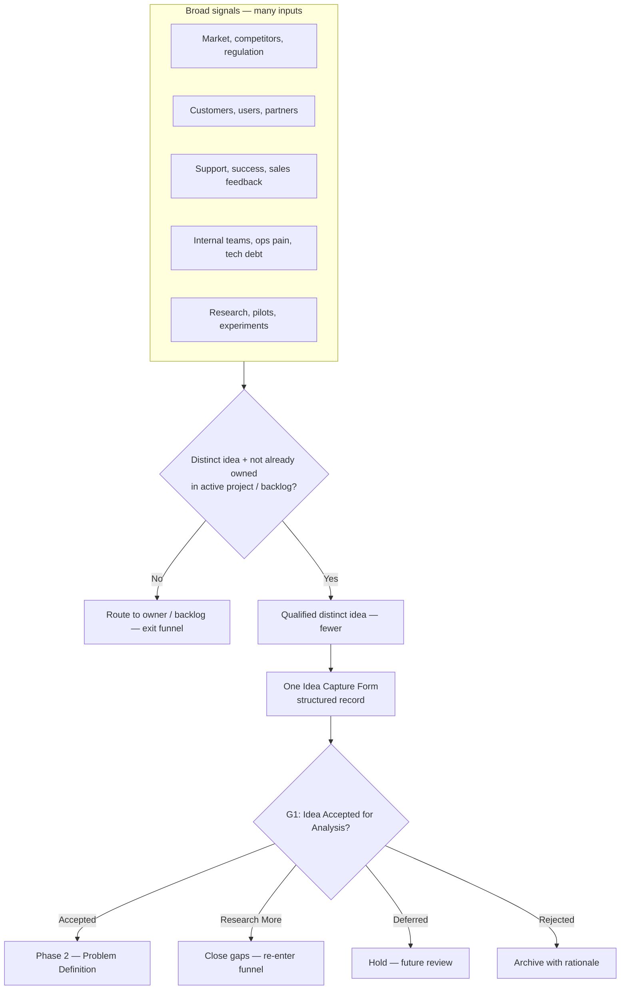
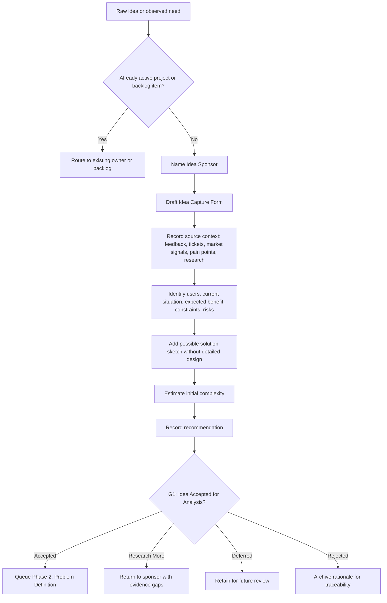
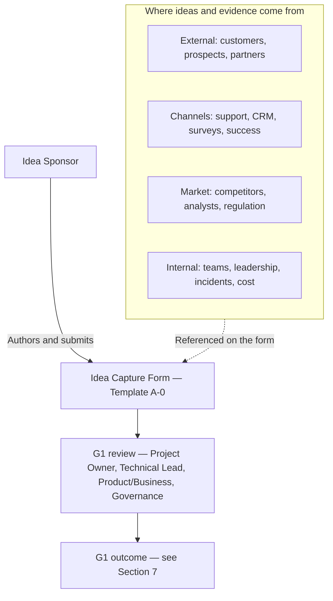

# Phase 1 — Idea Capture

Phase 1 records a software idea **before** it becomes an approved project. It produces a single artifact — the **Idea Capture Form** — which is reviewed at **G1 — Idea Accepted for Analysis** (`21. Decision Gates.md`) before the idea moves to **`08. Phase 2 — Problem Definition.md`**.

For lifecycle context see **`06. Lifecycle Overview.md`** (Idea Capture feeds **USSM** Tier 1 / CRS inputs); for the artifact register see **`22. Required Documents.md`**; for the canonical template see **`28. Appendix A — Template Library.md`** (**Template A-0 — Idea Capture Form**); for the complexity rubric used in the form see **`23. Project Complexity Levels.md`**.

---

## 1. Purpose

Capture the earliest version of an idea — its possible problem, target users, expected value, urgency, constraints, and known risks — in a structured record so it can be evaluated objectively in Phase 2 (Problem Definition) and Phase 3 (Project Evaluation and Selection).

This phase **does not approve** the project. It only ensures every idea enters the lifecycle through a controlled front door.

---

## 2. Visual models

Diagrams below summarize how ideas narrow from many signals to one governed record, the step-by-step intake path, and how idea sources relate to people in Phase 1.

### 2.1 Idea funnel

Many signals narrow to one governed record and one **G1** outcome per idea; later stages require clearer specificity.

### 2.2 Phase 1 intake flow

Operational sequence from raw need through the form to G1 and downstream phases.

### 2.3 Stakeholder and source map

Who contributes signals and the artifact, versus who participates in **G1** (role definitions in **Section 8 — Roles Responsible**).

---

## 3. Entry Criteria

- A new software idea has been proposed by an Idea Sponsor.
- No prior Idea Capture Form exists for the same idea (or the prior record is being superseded).
- The idea is not already covered by an active project or backlog item.

---

## 4. Required Inputs

- The original idea description in any form (note, conversation, email, chat, sketch).
- Available context: customer feedback, support tickets, market signals, internal pain points, prior research.

---

## 5. Activities

- Draft the Idea Capture Form using **Template A-0 — Idea Capture Form** in **`28. Appendix A — Template Library.md`**.
- Identify target users or beneficiaries.
- Describe the current situation and the gap being addressed.
- Sketch a possible software solution at a high level (no detailed design).
- Record whether the idea appears to be a new product, an enhancement to an existing product, pre-product exploration, or cross-cutting work. Capture any known PRCS metadata (`PRD-XXX`, tentative `PCL-L.D.E.C`, domain tags, or Work Type Tag) without requiring final classification at G1.
- Note urgency, constraints, risks, and any similar existing solutions.
- Provide an initial complexity estimate (see `23. Project Complexity Levels.md`).
- Record a recommendation for the next step.

---

## 6. Required Outputs

- **Idea Capture Form** (Template A-0 in **`28. Appendix A — Template Library.md`**).
- Initial PRCS context where known: existing `PRD-XXX`, candidate product/service name, likely domain tags, and whether product classification will be required later.
- Recorded approval status with reviewer name and date.

---

## 7. Decision Gate — G1 (Idea Accepted for Analysis)

At G1 the reviewer answers:

- Is the idea clear enough to justify analysis effort?
- Does the recommendation match the evidence in the form?
- Should the idea move to Phase 2, be deferred, be rejected, or require more research?

Possible decisions: **Accepted for Problem Definition**, **Deferred**, **Rejected**, **Research More**.

If rejected, deferred, or marked **Research More**, the form is retained for traceability and future reference.

---

## 8. Roles Responsible

| Role | Responsibility |
| --- | --- |
| Idea Sponsor | Owns and submits the Idea Capture Form |
| Project Owner | Reviews fit with business goals |
| Technical Lead | Provides early feasibility comment when needed |
| Product / Business Reviewer | Evaluates potential customer or business value |
| Standards / Governance Reviewer | Confirms the idea should enter the formal lifecycle |

For solo projects, one person may hold several roles.

---

## 9. Quality Checks

- Idea has a clear title.
- Sponsor and submission date are recorded.
- Problem or opportunity is described in plain language.
- Target users or beneficiaries are identified.
- Current situation is documented.
- Expected benefit is stated.
- A high-level solution sketch is included.
- Urgency, constraints, and known risks are recorded (or explicitly marked unknown).
- Similar existing solutions are listed or marked unknown.
- Initial complexity is estimated.
- A recommendation is recorded with approval status and reviewer name.

The form is **not complete** if the idea is vague, the problem is unclear, the target user is unknown, or there is no recommendation for what should happen next.

---

## 10. Exit Criteria

- Idea Capture Form passes the quality checks above.
- A recommendation is recorded.
- A reviewer has assigned an Approval Status.
- If **Accepted for Problem Definition**, the idea is queued for **Phase 2** with the form attached as input.

---

## 11. Related Templates and Documents

- **Idea Capture Form** — **Template A-0** in `28. Appendix A — Template Library.md` (canonical template).
- `04. Definitions.md` — controlled terms used by this phase (gate, traceability, required outputs).
- `08. Phase 2 — Problem Definition.md` — consumes accepted ideas.
- `21. Decision Gates.md` — G1 definition and downstream gate flow.
- `22. Required Documents.md` — full artifact register aligned to USSM tiers.
- `23. Project Complexity Levels.md` — guidance for the complexity estimate in Template A-0.
- `24. Traceability Rules.md` — traceability expectations for retaining and connecting lifecycle records.
- `28. Appendix A — Template Library.md` — canonical template library.
- `06. Lifecycle Overview.md` — USSM tier mapping (Phase 1 feeds CRS Tier 1).
- `05. Roles and Responsibilities.md` — department-level role context.

---

## 12. Idea Capture Form — Required Sections

The canonical reusable template is **Template A-0 — Idea Capture Form** in **`28. Appendix A — Template Library.md`**. This section lists the required sections for Phase 1 completeness so the phase can be reviewed without duplicating the full template.

1. Idea Title
2. Idea Sponsor and Date Submitted
3. Short Idea Summary
4. Problem or Opportunity
5. Target Users or Beneficiaries
6. Current Situation
7. Expected Benefit
8. Possible Software Solution
9. Urgency or Timing
10. Known Constraints
11. Known Risks or Concerns
12. Similar Existing Solutions
13. Initial Complexity Estimate
14. Recommendation
15. Approval Status

### 12.1 Completion Criteria

The Idea Capture Form is complete when every required section above has a value, the recommendation is recorded, and an approval status has been assigned by a named reviewer with a review date. Vague, unscoped, or unowned ideas must be returned to the sponsor before the form is accepted.
