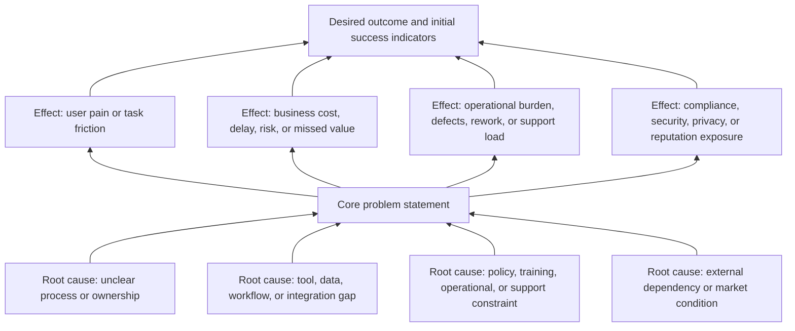
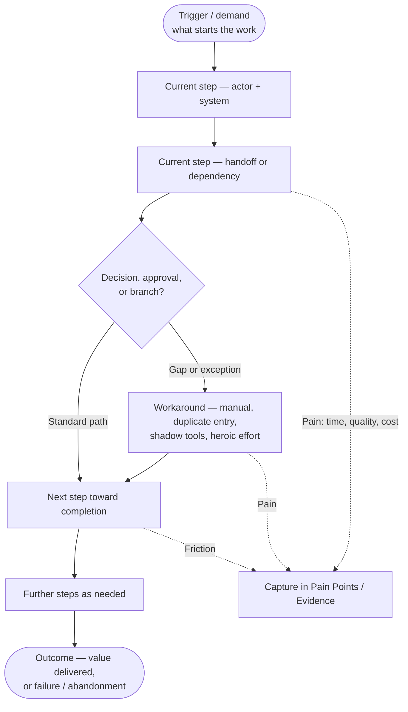
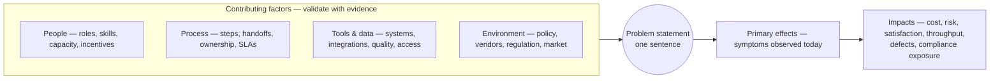

# Phase 2 — Problem Definition

Phase 2 defines the **real problem** behind a software idea **before** evaluation, selection, or design. It produces the **Problem Definition Document**, reviewed at **G2 — Problem Validated** before work moves to **`09. Phase 3 — Project Evaluation and Selection.md`**.

Inputs are accepted outputs from **`07. Phase 1 — Idea Capture.md`** (Idea Capture Form). For lifecycle context see **`06. Lifecycle Overview.md`** (problem framing feeds CRS / stakeholder needs); for the artifact register see **`22. Required Documents.md`**; for the canonical template see **`28. Appendix A — Template Library.md`** (**Template A-0.1 — Problem Definition Document**).

---

## 1. Purpose

Produce a shared, evidence-backed statement of **what is wrong today**, **who is affected**, **how serious it is**, and **why the status quo fails**—without prescribing the final software solution.

The Problem Definition Document answers:

- What problem exists?
- Who experiences it?
- How often and how severe is it?
- How is it handled today, and why is that insufficient?
- What would improve if the problem were solved?

This phase **does not** define architecture, stack, or detailed features. It establishes a problem baseline strong enough to support portfolio evaluation in Phase 3.

---

## 2. Visual models

These diagrams support Template A-0.1 sections such as **Current Process or Current Solution**, **Pain Points**, **Evidence**, and impact sections—without embedding a detailed product design.

### 2.1 Problem tree

Use this model to stay focused on **problem validation** instead of solution design. The **core problem** is stated plainly; place **source-backed causes** under it and **measurable effects** toward the **desired outcome** (initial success indicators).

### 2.2 Current-state process flow

Map the **as-is** path from trigger to outcome: actors, systems, handoffs, and where **workarounds** or **failure modes** appear. Label steps using language from interviews, tickets, or SOPs—this is the baseline **Section 12** items **6–8** depend on.

### 2.3 Cause and effect diagram

Use this **fishbone-style** view to cluster **contributing factors** (people, process, tools and data, environment and policy) that converge on one **problem statement**, then trace **forward effects** you will quantify under business, user, and operational impact. It complements the problem tree by stressing **factor categories** and **chains**, not hierarchy alone.

---

## 3. Entry criteria

- **G1** outcome allows analysis: Idea Capture Form is **Accepted for Problem Definition** (or equivalent program status).
- An **Idea Capture Form** (or superseding intake record) is available as the primary input.
- A **primary owner** (Project Owner or Idea Sponsor) is named for the Problem Definition Document.

---

## 4. Required inputs

- Completed **Idea Capture Form** from Phase 1 (idea summary, problem/opportunity sketch, users, current situation, constraints, risks).
- Access to **stakeholders** or proxies who can validate whether the problem is real (business, user, operations).
- Existing **evidence** where available (tickets, interviews, metrics, screenshots). G2 approval requires at least one independent validation source; if evidence is missing, document the gap and perform additional research before approval.

---

## 5. Activities

- Draft the Problem Definition Document using **Template A-0.1 — Problem Definition Document** in **`28. Appendix A — Template Library.md`**.
- Validate affected users and stakeholders; refine frequency and severity with evidence or labeled assumptions.
- Document the **current process / workaround** and pain points (no solution design).
- Capture **business, user, and operational** impacts and risks of **not** solving the problem.
- State **desired outcomes** and **initial success indicators** (outcomes, not feature lists).
- Record **assumptions**, **constraints**, and clear **out-of-scope** boundaries so Phase 3 stays honest about unknowns.
- Re-check the initial complexity estimate from Phase 1 against validated users, severity, constraints, and evidence; update the rationale if the level changes or remains **Unknown**.
- Record a **recommendation** (e.g. proceed to evaluation, research more, defer, reject, return to Idea Capture).
- Route the document for review per **G2**.

---

## 6. Required outputs

- **Problem Definition Document** (Template A-0.1 in **`28. Appendix A — Template Library.md`**).
- Updated complexity estimate or confirmation of the Phase 1 estimate, with rationale per `23. Project Complexity Levels.md`.
- Recorded **approval status**, reviewer, and date aligned with **G2**.

---

## 7. Decision gate — G2 (Problem Validated)

At G2 the reviewer answers:

- Is the problem **clear**, **significant enough**, and grounded by at least one **independent validation source**?
- Are affected users and current behavior described well enough to support **selection and feasibility** work?
- Does the recommendation align with the documented impacts and risks?

Possible decisions: **Validated — Proceed to Selection**, **Return to Phase 1**, **Deferred**, or **Rejected**.

If validation is not strong enough for approval, do not approve G2; return the document to research/revision and record the evidence gap. If rejected, deferred, or returned to Phase 1, retain the document for traceability.

---

## 8. Roles responsible

| Role | Responsibility |
| --- | --- |
| **Project Owner / Idea Sponsor** | Owns the problem definition, drives evidence gathering, submits for review |
| Idea Sponsor | Clarifies original motivation and early context |
| Business reviewer | Confirms business relevance and value hypothesis |
| User / customer representative | Confirms the problem is real for intended users |
| Technical lead | Flags early technical or feasibility concerns only (not detailed design) |
| Governance reviewer | Confirms completeness against G2 expectations |

For solo projects, one person may hold several roles.

---

## 9. Quality checks

- Problem has a **clear title** and **plain-language summary**.
- **Background**, **affected users**, and **current process** are documented.
- **Pain points**, **frequency**, and **severity** are recorded (with explanation when marked unknown).
- At least one **independent validation source** is documented for G2 approval; otherwise the evidence gap is explicit and the document is not ready for approval.
- **Business, user, and operational** impacts are addressed.
- **Why the current approach fails** and **desired outcome** are stated without jumping to a full solution design.
- **Initial success indicators** are outcome-oriented.
- **Assumptions**, **constraints**, **risks of not solving**, and **out-of-scope** items are listed.
- **Recommendation** and **approval status** are recorded with reviewer identity and date.
- Complexity estimate is re-checked against problem evidence, or explicitly marked **Unknown** with the discovery action needed.

The document is **not complete** if the problem is vague, users are unknown, the current situation is missing, or the write-up prescribes detailed product design instead of proving the problem. A document may be complete enough to route for review but still fail G2 if independent validation is missing.

---

## 10. Exit criteria

- Quality checks in Section 9 pass.
- G2 decision recorded.
- If **Validated — Proceed to Selection**, Phase 3 can begin with this document and the Idea Capture Form as inputs.

---

## 11. Related templates and documents

- **Problem Definition Document** — **Template A-0.1** in `28. Appendix A — Template Library.md` (canonical template).
- **`04. Definitions.md`** — controlled terms used by this phase (gate, traceability, required outputs).
- **`07. Phase 1 — Idea Capture.md`** — upstream Idea Capture Form.
- **`09. Phase 3 — Project Evaluation and Selection.md`** — consumes validated problem definition.
- **`21. Decision Gates.md`** — gate alignment (G2).
- **`22. Required Documents.md`** — artifact register (USSM-aligned names).
- **`23. Project Complexity Levels.md`** — complexity re-check and Unknown resolution guidance.
- **`24. Traceability Rules.md`** — traceability expectations for retaining and connecting lifecycle records.
- **`28. Appendix A — Template Library.md`** — canonical template library.
- **`Universal Software Project Development Procedure.md`** — portfolio gates and artifact themes.
- **`06. Lifecycle Overview.md`** — USSM tier mapping for requirements / stakeholder inputs.
- **`05. Roles and Responsibilities.md`** — department-level role context.

---

## 12. Problem Definition Document — Required Sections

The canonical reusable template is **Template A-0.1 — Problem Definition Document** in **`28. Appendix A — Template Library.md`**. This section lists the required sections for Phase 2 completeness so the phase can be reviewed without duplicating the full template.

1. Document Metadata  
2. Problem Title  
3. Problem Summary  
4. Background and Context  
5. Affected Users or Stakeholders  
6. Current Process or Current Solution  
7. Pain Points and Limitations  
8. Problem Frequency  
9. Problem Severity  
10. Evidence or Observations  
11. Business Impact  
12. User Impact  
13. Operational Impact  
14. Why the Current Solution Is Insufficient  
15. Desired Outcome  
16. Initial Success Indicators  
17. Assumptions  
18. Constraints  
19. Risks of Not Solving the Problem  
20. Out of Scope  
21. Complexity Estimate Review  
22. Recommendation  
23. Approval Status  

### 12.1 Completion Criteria

The Problem Definition Document is complete when:

1. The problem has a clear title and plain-language summary.  
2. Background and context are documented.  
3. Affected users and stakeholders are identified.  
4. The current process or solution is described.  
5. Pain points, frequency, and severity are recorded.  
6. At least one independent validation source is documented for G2 approval, or the document is explicitly not ready for G2 approval.  
7. Business, user, and operational impacts are explained.  
8. Insufficiency of the current approach is explained; desired outcome is stated.  
9. Initial success indicators are defined; assumptions and constraints listed.  
10. Risks of not solving and out-of-scope items are documented.  
11. Complexity estimate is confirmed, revised, or left Unknown with a discovery action.  
12. A recommendation is recorded and approval status assigned by a named reviewer with date.

This mirrors **Section 9** quality checks; both must pass before G2 approval.
