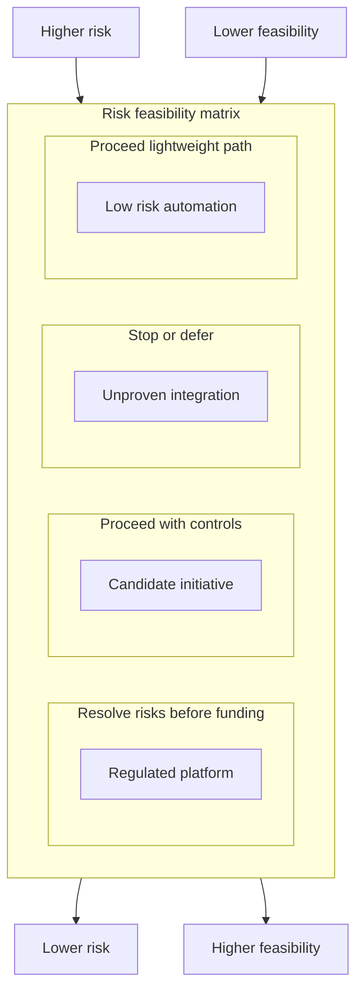

# Phase 4 — Feasibility and Business Case

Phase 4 decides whether a **selected** initiative is **worth funding** before heavy investment in detailed requirements and design. It produces a **Feasibility Assessment** (multi-dimension review) and a **Business Case** (recommendation, costs, benefits, risks). Together with the Phase 3 selection evidence, these artifacts complete the funding signal for **G3 — Project Selected** so **Phase 5 — Requirements Definition** can begin.

Inputs come from **`09. Phase 3 — Project Evaluation and Selection.md`** (Project Selection Scorecard / evaluation record, Business Field Report or waiver) and prior **`07.`** / **`08.`** artifacts. This phase covers the classic **feasibility study** and **initial plan skeleton** and absorbs part of textbook “Planning” before full CRS/SRS work (see **`06. Lifecycle Overview.md`**). For the artifact register see **`22. Required Documents.md`**. Feasibility template: **`28. Appendix A — Template Library.md`** → **Template A-3.2 — Feasibility Assessment**. Economic scenarios: **Template A-5 — Entrepreneurial forecasting guide**.

---

## 1. Purpose

Validate **technical**, **economic**, and **operational** feasibility; document findings in a **Feasibility Assessment**; package an approvable **Business Case**; and deliver planning prelude inputs for Phase 5 (CRS/SRS shaping) and Phase 6 (delivery planning). This phase **does not** fully baseline requirements or design; it proves the initiative is **realistic and fundable** enough to complete **G3 — Project Selected**.

---

## 2. Risk / Feasibility Quadrant

Use this quadrant to summarize feasibility posture before packaging the business case. It does not replace the Feasibility Assessment; it gives reviewers a fast way to see whether the recommendation is **proceed**, **condition**, **defer**, or **stop**.

**Interpretation:**

- **High feasibility / low risk:** proceed with standard evidence depth.
- **High feasibility / high risk:** proceed only with controls, owners, and conditions.
- **Low feasibility / high risk:** resolve blockers before funding or defer.
- **Low feasibility / low risk:** continue discovery only if value justifies effort.

---

## 3. Entry criteria

- Phase 3 selection recommendation is **Proceed to Feasibility**.
- Phase 3 selection evidence is available: **Project Selection Scorecard** (Template A-3.1) or equivalent evaluation record, plus **Business Field Report** (Template A-4) or approved waiver.
- **Idea Capture Form** and **Problem Definition Document** (validated at **G2**) are available.
- **Project Owner** (or delegate) named for feasibility coordination.

---

## 4. Required inputs

- Problem statement, stakeholders, initial **in-scope / out-of-scope** hypothesis.
- Phase **3** outputs: **Project Selection Scorecard** (Template A-3.1) or equivalent evaluation record, **Business Field Report** (**Template A-4**) or approved waiver per policy.
- Current complexity level and rationale from Phases 1–3.
- Market or operational context, constraints, and sponsor priorities.

---

## 5. Activities

### 5.1 Requirements elicitation (high level)

Collect and summarize needs from analysts, customers, users, and SMEs into concise statements. **Not** the full CRS/SRS baseline (Phase **5**); input to feasibility and later CRS.

### 5.2 Feasibility study (documented assessment)

Evaluate whether the project can succeed across the dimensions in **Template A-3.2 — Feasibility Assessment** (technical, resource, schedule, financial/business, operational, security/privacy/compliance, integration/dependency, maintenance). Use explicit **ratings**, **risks**, **assumptions**, and **dependencies**.

For **economic** feasibility, use structured projections and scenarios—not single-point guesses—per **Template A-5** where forecasts matter.

Identify high-risk applicable CYBERCUBE standards using **`25. Quality and Compliance Checks.md` §5 — CYBERCUBE Standards Applicability Matrix**. Record likely applicability, evidence needs, owners, and any non-applicability rationale in the Feasibility Assessment or Business Case so **G3** can verify the project is not under-scoped for security, privacy, data, vendor, integration, AI, or criticality obligations.

Confirm PRCS candidate metadata for the selected initiative: existing `PRD-XXX` if it extends a registered product, candidate `PCL-L.D.E.C` and domain tags if it may become a production product, or Work Type Tag rationale if it remains pre-product or cross-cutting. Use the candidate criticality facet to flag downstream standard tiering and review depth.

### 5.3 Initial project planning (skeleton)

Outline greenfield vs enhancement, major milestones, resources, and risk themes. Detailed schedules belong to **Phase 6**; here deliver a **credible planning prelude** for the business case.

Confirm the project complexity level using `23. Project Complexity Levels.md`. If the level remains **Unknown**, record the owner, discovery action, evidence needed, and the phase/gate where it must be resolved before downstream requirements or planning scale can be trusted.

### 5.4 Business case packaging

Synthesize feasibility conclusions into a **Business Case**: recommendation (proceed, pivot, defer, stop), costs/benefits, strategic alignment, risks, and conditions. Use **Template A-3.3 — Business Case**; attach forecasts per **A-5** when required.

---

## 6. Required outputs

- **Feasibility Assessment** (Template A-3.2 in **`28. Appendix A — Template Library.md`**).
- **Business Case** (Template A-3.3 in **`28. Appendix A — Template Library.md`**).
- Risk / feasibility quadrant summary, or equivalent feasibility posture summary, with recommendation impact.
- Confirmed complexity level, or explicit Unknown resolution plan with owner and due gate.
- PRCS candidate metadata or non-applicability rationale for G3: existing `PRD-XXX`, candidate `PCL-L.D.E.C`, domain tags, function descriptors, or Work Type Tag(s) as applicable.
- Planning prelude inputs for **`11. Phase 5 — Requirements Definition.md`** and **`12. Phase 6 — Planning and Scope Control.md`**.

---

## 7. Decision gate — G3 funding signal

Reviewers confirm:

- Feasibility dimensions are addressed with **evidence**, not assertion alone.
- **Risks**, **assumptions**, and **open questions** are visible.
- Risk / feasibility posture supports the recommendation or clearly explains required conditions.
- Complexity level is confirmed, or Unknown has an explicit owner and resolution plan.
- PRCS candidate metadata is recorded where the initiative may become a product, or non-applicability / Work Type Tag rationale is documented for pre-product or cross-cutting work.
- **Business Case** supports a funding decision (or explicit defer/stop).

G3 outcomes: **Proceed to Requirements**, **Pivot**, **Defer**, or **Stop**. **Proceed with conditions** may be recorded as a conditional form of **Proceed to Requirements** only when the conditions, owners, and due dates are explicit.

---

## 8. Roles responsible

| Role | Responsibility |
| --- | --- |
| Product / business owner | Outcomes, prioritization, sponsor alignment |
| Engineering / architecture | Technical, integration, maintenance feasibility |
| Finance or sponsor | Economic viability and funding |
| Operations / DevOps | Operational fit, deployment, sustainment |
| Security / governance | Privacy, compliance, approval gates |
| Product / UX | User feasibility and adoption risk |

One person may hold multiple roles on small teams.

---

## 9. Quality checks

- Each feasibility area in **Template A-3.2** has content or explicit **Unknown** / research plan.
- **Rating summary** reflects narrative sections; no contradictions between summary and details.
- **Blocking risks** identified with mitigation or path to resolution.
- Risk / feasibility quadrant or equivalent posture summary is consistent with the Feasibility Assessment and Business Case recommendation.
- Business case traceable to Phase **3** selection criteria and Phase **4** assessment.
- G3 outcome aligns with `21. Decision Gates.md` and is supported by both Phase 3 and Phase 4 evidence.
- **Template A-5** discipline applied when economic viability depends on modeled projections.
- CYBERCUBE standards applicability reviewed per `25. Quality and Compliance Checks.md` §5; high-risk applicable standards have owners or a documented non-applicability rationale.
- Complexity level is confirmed per `23. Project Complexity Levels.md`, or Unknown resolution is owned before G3 completion.

---

## 10. Exit criteria

- Feasibility Assessment and Business Case stored under change control.
- Confirmed complexity level or Unknown resolution plan stored with G3 evidence.
- G3 decision recorded; Phase **5** may begin requirements definition only when the outcome is **Proceed to Requirements** or an explicitly owned conditional proceed.

---

## 11. Related templates and documents

- **`09. Phase 3 — Project Evaluation and Selection.md`** — upstream selection signal, Project Selection Scorecard, and Business Field Report.
- **`04. Definitions.md`** — controlled terms used by this phase (gate, waiver, traceability, required outputs).
- **`11. Phase 5 — Requirements Definition.md`** — CRS/SRS baseline.
- **`12. Phase 6 — Planning and Scope Control.md`** — detailed planning.
- **`21. Decision Gates.md`** — canonical gate registry; **G3 — Project Selected** evidence and outcomes.
- **`22. Required Documents.md`** — artifact register for selection and feasibility evidence.
- **`23. Project Complexity Levels.md`** — complexity confirmation before G3 and downstream scaling guidance.
- **`24. Traceability Rules.md`** — traceability expectations for evidence, assumptions, and decisions.
- **`25. Quality and Compliance Checks.md`** — CYBERCUBE Standards Applicability Matrix and G3 applicability evidence expectations.
- **`28. Appendix A — Template Library.md`** — **A-3.1** (Project Selection Scorecard), **A-3.2** (Feasibility Assessment), **A-3.3** (Business Case), **A-4** (Business Field Report), **A-5** (forecasting), **A-1–A-3** (CRS/SRS/DDS outlines).
- **`USSM — Unified Software Standards Manual v1.0.md`** — documentation tiers.
- **`Universal Software Project Development Procedure.md`** — gates and artifact themes.
- **`06. Lifecycle Overview.md`** — Planning vs Master Lifecycle phase split.
- **`05. Roles and Responsibilities.md`** — organizational roles.

---

## 12. Feasibility Assessment — Required Sections

The canonical reusable template is **Template A-3.2 — Feasibility Assessment** in **`28. Appendix A — Template Library.md`**. This section lists the required sections for Phase 4 completeness so the phase can be reviewed without duplicating the full template.

1. Project Identification  
2. Source Documents  
3. Feasibility Summary  
4. Technical Feasibility  
5. Resource Feasibility  
6. Schedule Feasibility  
7. Financial / Business Feasibility  
8. Operational Feasibility  
9. Security, Privacy, and Compliance Feasibility  
10. Integration and Dependency Feasibility  
11. Maintenance Feasibility  
12. Feasibility Rating Summary  
13. Risk Summary  
14. Assumptions and Open Questions  
15. Feasibility Decision  
16. Approval Status  

### 12.1 Completion Criteria

The Feasibility Assessment is complete when:

1. Project is identified and **source documents** listed.  
2. **Overall summary** recorded.  
3. Sections **4–11** evaluated with ratings (or explicit Unknown + plan).  
4. **Rating summary** filled.  
5. **Risks** and mitigations documented (blocking vs non-blocking).  
6. **Assumptions** and **open questions** listed.  
7. **Feasibility decision** and **approval status** recorded.

Incomplete if major areas are blank, risks ignored, assumptions hidden, or no decision recorded.

---

## 13. Business Case — Required Sections

The canonical reusable template is **Template A-3.3 — Business Case** in **`28. Appendix A — Template Library.md`**. This section lists the required sections for Phase 4 completeness so the phase can be reviewed without duplicating the full template.

1. Executive Summary
2. Strategic Alignment
3. Expected Benefits
4. Expected Costs / Investment
5. ROI, Payback, or Scenario Summary
6. Major Risks and Mitigations
7. Constraints and Dependencies
8. Recommendation
9. Conditions
10. Approval Record

### 13.1 Completion Criteria

The Business Case is complete when the recommendation is explicit, costs and benefits are traceable to assumptions (and **Template A-5** when used), risks are visible, constraints/dependencies are documented, any conditions have owners and due dates, and the approver and date are recorded.
