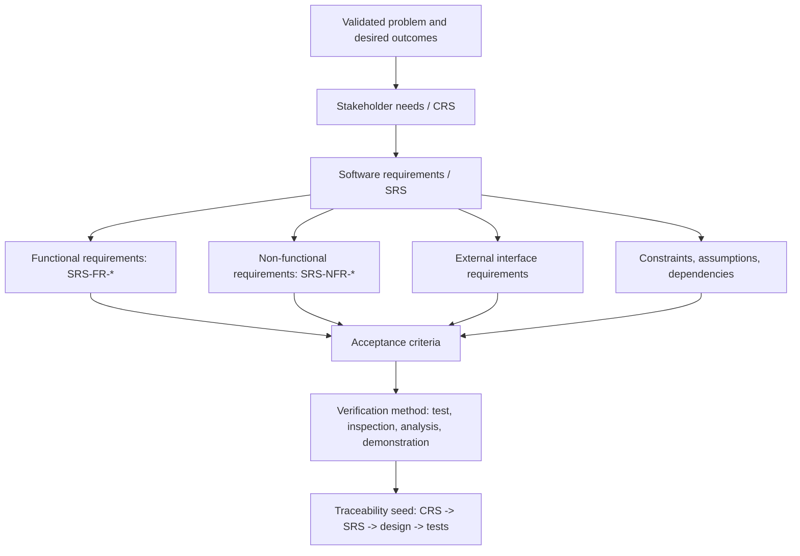

# Phase 5 — Requirements Definition

Phase 5 takes a funded project (cleared **G3 — Project Selected** in `21. Decision Gates.md`) and produces a baselined **Requirements Specification Package** (Template A-8) containing **CRS** and **SRS**-class artifacts that all downstream phases (Architecture, Implementation, Testing) trace to. Its exit checkpoint is **G4 — Requirements Approved**.

For lifecycle context see `06. Lifecycle Overview.md`; for USSM tier mapping (this phase produces Tier 1 / CRS and Tier 2 / SRS) see `USSM — Unified Software Standards Manual v1.0.md` §§4–5; for the canonical requirements package see `28. Appendix A — Template Library.md` (**Template A-8 — Requirements Specification Package**, with CRS/SRS outlines in Templates A-1 and A-2); for downstream traceability see `24. Traceability Rules.md`.

---

## 1. Purpose

Convert the validated problem (Phase 2) and approved business case (Phase 4) into a **complete, verifiable, baselined** set of requirements that:

- describe **what** the software must do (functional requirements),
- describe **how well** it must behave (non-functional requirements),
- express **stakeholder needs** in solution-agnostic language (CRS),
- express **engineering requirements** with stable IDs (SRS),
- carry **assumptions, constraints, and dependencies** explicitly,
- seed the **traceability matrix** that links requirements to design (Phase 7) and tests (Phase 10).

This phase **does not specify architecture or implementation choices** — those are Phase 7 decisions.

---

## 2. Requirements Hierarchy

Use this hierarchy to keep requirements layered and traceable. Stakeholder needs stay solution-agnostic in the CRS, while engineering requirements become verifiable SRS functional requirements, NFRs, interface requirements, constraints, assumptions, and acceptance criteria.

---

## 3. Entry Criteria

- **G3 — Project Selected** outcome is **Proceed to Requirements** or an explicitly owned conditional proceed.
- A Problem Definition Document exists and is validated (`08. Phase 2 — Problem Definition.md`).
- A Feasibility Assessment (Template A-3.2) and Business Case (Template A-3.3) exist with an explicit requirements-phase recommendation (`10. Phase 4 — Feasibility and Business Case.md`).
- Complexity level is confirmed in G3 evidence, or an explicitly owned Unknown resolution plan exists.
- Access to representative stakeholders, users, and SMEs is available for elicitation.
- Identifier and traceability conventions (CRS-, SRS-FR-, SRS-NFR-) are agreed for the project.

---

## 4. Required Inputs

- Problem Definition Document and validation evidence.
- Feasibility Assessment (Template A-3.2), Business Case (Template A-3.3), and any forecasts (Template A-5).
- Confirmed complexity level and required document expectations from `23. Project Complexity Levels.md`.
- Initial scope hypothesis from Phase 4.
- Stakeholder and User Profile (Template A-7 / SUP-001) when stakeholder groups, authority, or user roles affect requirements.
- Constraints: regulatory, contractual, platform, performance, security, accessibility, data residency.
- Existing systems or codebases the solution must coexist with or replace.

---

## 5. Activities

### 5.1 Elicitation

Collect needs from stakeholders, target users, and SMEs through interviews, observation, document review, workshops, and analysis of existing systems. Summarize each need in the stakeholder's own language.

Where stakeholders are diverse or authority is unclear, maintain a **Stakeholder and User Profile** package (**`Stakeholder and User Profile — SUP-001.md`**)—personas, inventories, decision authority, communications, and operational roles—to complement CRS narrative and traceability.

### 5.2 CRS authoring (USSM §4)

Produce a **Customer Requirements Specification** that locks:

- **Purpose, audience, scope, terminology** (CRS §1).
- **Overall description** — product context, users, market position, general constraints (CRS §2).
- **Specific requirements at the stakeholder level** — functions, non-functional needs, design constraints expressed in solution-agnostic language (CRS §3).
- **External interface needs** — user, hardware, software (CRS §4).
- **Standards and design constraints** the stakeholders impose (CRS §5).

Use **Template A-1** in `28. Appendix A — Template Library.md` as the outline.

### 5.3 SRS authoring (USSM §5)

Translate stakeholder needs into engineering requirements with stable IDs:

- **Introduction** locking purpose, audience, scope, terminology.
- **Overall description** — why the product exists, who uses it, assumptions, dependencies on other systems or prior codebases.
- **Specific requirements** — functional requirements (`SRS-FR-…`), external interfaces (user, hardware, software, communications), system features, non-functional requirements (`SRS-NFR-…`: performance, safety, security, usability, scalability, accessibility) per domain rules.
- **Assumptions, constraints, and dependencies** (USSM §5.2.5) recorded explicitly.

Use **Template A-2** in `28. Appendix A — Template Library.md` as the outline.

Convert applicable CYBERCUBE standards from **`25. Quality and Compliance Checks.md` §5** into requirements, NFRs, constraints, acceptance criteria, and verification methods. If a standard is conditionally applicable or not applicable, preserve the rationale so **G4** can verify coverage without forcing irrelevant controls.

Apply the confirmed complexity level from `23. Project Complexity Levels.md` to determine requirements/NFR depth, traceability rigor, review depth, and required document coverage. If complexity is still **Unknown**, use Medium or Large review depth until the Unknown resolution plan is completed.

### 5.4 Traceability seeding

Establish bidirectional links per `24. Traceability Rules.md`:

- Stakeholder need (CRS) ↔ engineering requirement (SRS).
- Engineering requirement (SRS) ↔ source evidence (Problem Definition Document, interview record).
- Engineering requirement (SRS) ↔ planned design item (Phase 7) and test case (Phase 10) — at minimum the **link slots** are established now even if the targets are filled in later.

### 5.5 Verification readiness

For every SRS requirement, record **how it will be verified** (test, inspection, analysis, demonstration). Requirements that cannot be verified are not yet requirements; rewrite or remove them.

### 5.6 Baseline

Submit the CRS and SRS for review and approval, then **freeze** the baseline. Subsequent changes flow through `26. Change Control.md`.

---

## 6. Required Outputs

| Artifact | USSM tier | Template | Purpose |
| --- | --- | --- | --- |
| Requirements Specification Package | Tier 1 + Tier 2 wrapper | A-8 | Controlled package tying CRS, SRS, NFRs, acceptance criteria, assumptions, and traceability seed together |
| Customer Requirements Specification (CRS) | Tier 1 / §4 (Annex A) | A-1 | Solution-agnostic stakeholder needs, success criteria, constraints |
| Software Requirements Specification (SRS) | Tier 2 / §5 | A-2 | Verifiable functional and non-functional requirements with stable IDs |
| Stakeholder and User Profile (optional, recommended) | Elicitation support | A-7 / SUP-001 | Personas, stakeholder inventory, authority, comms, operational roles |
| Non-Functional Requirements register | Tier 2 (SRS subset) | Template A-10 / NFR-001 | Performance, security, usability, accessibility, compliance targets |
| Acceptance Criteria | Tier 2 | inline or separate | Per requirement, the conditions for "satisfied" |
| Traceability matrix (seed) | Tier 1 ↔ Tier 2 ↔ downstream | USSM §4.5, §5.5 | CRS ↔ SRS ↔ design ↔ tests |
| Assumptions, constraints, dependencies log | Tier 2 | USSM §5.2.5 | Explicit context for downstream phases |

---

## 7. Decision Gate — G4 (Requirements Approved)

At G4 the reviewer answers:

- Are the CRS and SRS complete enough to baseline?
- Is every SRS requirement verifiable (test, inspection, analysis, or demonstration recorded)?
- Are assumptions, constraints, and dependencies explicit and acceptable?
- Is the traceability seed in place (CRS ↔ SRS, SRS ↔ source evidence)?
- Are applicable CYBERCUBE standards represented as requirements/NFRs or explicitly marked not applicable with rationale?
- Does requirements depth match the confirmed complexity level, or does Unknown complexity use sufficient review depth until resolved?

Possible decisions: **Approved** · **Approved with conditions** · **Returned for revision**.

**Authority:** Product Owner + Engineering Lead.

**On failure:** scope back into Phase 5 with the unresolved items listed; re-baseline before re-approval. See failure routing in `21. Decision Gates.md` §6.

---

## 8. Roles Responsible

| Role | Responsibility |
| --- | --- |
| Product Owner | Owns the CRS; aligns scope with business case |
| Business Analyst | Drives elicitation; drafts CRS/SRS |
| Engineering Lead | Owns the SRS; ensures requirements are verifiable and feasible |
| Architect | Reviews requirements for architectural impact (informs Phase 7) |
| QA / Test Lead | Reviews verifiability; seeds Phase 10 test plan |
| Security / Privacy Reviewer | Reviews NFRs for security, privacy, compliance fit |
| Accessibility Reviewer | Reviews accessibility NFRs (WCAG or program standard) |

---

## 9. Quality Checks

- Every CRS need is traceable to evidence in the Problem Definition Document or a recorded elicitation source.
- Every SRS requirement has a stable ID (`SRS-FR-…` / `SRS-NFR-…`).
- Every SRS requirement is **verifiable** (verification method recorded).
- Non-functional requirements are quantitative wherever possible (e.g. p99 latency target, error budget, accessibility level, retention period).
- Assumptions, constraints, and dependencies are recorded — none are implicit.
- Traceability links are bidirectional and machine-checkable per `24. Traceability Rules.md`.
- No requirement specifies implementation technology unless that technology is a stakeholder constraint (then record it as a constraint, not a functional requirement).
- Requirements language uses RFC 2119 keywords (MUST / SHOULD / MAY) consistently.
- Applicable CYBERCUBE standards from `25. Quality and Compliance Checks.md` §5 are converted into requirements/NFRs, acceptance criteria, or documented non-applicability rationale.
- Requirements, NFRs, traceability, and required document coverage are scaled to the confirmed complexity level from `23. Project Complexity Levels.md`.

The CRS/SRS package is **not complete** if any requirement is unverifiable, if traceability is one-directional only, if NFRs are vague ("fast", "secure"), or if the assumptions log is empty.

---

## 10. Exit Criteria

- CRS and SRS pass the quality checks above.
- Traceability matrix seed is in place.
- G4 decision is recorded in `21. Decision Gates.md`.
- Baselined CRS, SRS, NFR register, and acceptance criteria are queued as inputs to **Phase 6 — Planning and Scope Control** and **Phase 7 — Architecture and Design**.

---

## 11. Related Templates and Documents

- **`Stakeholder and User Profile — SUP-001.md`** — stakeholder and user analysis template feeding CRS context (Appendix A Template A-7 pointer).
- **`Non-Functional Requirements — NFR-001.md`** — categorized NFR working catalog; normalize draft IDs to **`SRS-NFR-…`** when baselining SRS (Template A-2).
- **Templates:** `28. Appendix A — Template Library.md` — A-8 (Requirements Specification Package), A-1 (CRS), A-2 (SRS), A-7 (SUP pointer), A-3.2 (Feasibility Assessment), A-3.3 (Business Case).
- **USSM:** `USSM — Unified Software Standards Manual v1.0.md` §§4–5; Annex F (templates index); Annex B (document control metadata).
- `08. Phase 2 — Problem Definition.md` — supplies the validated problem and success indicators.
- `10. Phase 4 — Feasibility and Business Case.md` — supplies the business case and scope hypothesis.
- `12. Phase 6 — Planning and Scope Control.md` — consumes baselined requirements for the scope baseline and **Feature Inventory Document** (Section 11) when mapping requirements to features.
- `13. Phase 7 — Architecture and Design.md` — consumes the SRS for DDS/SDD design.
- `16. Phase 10 — Testing and Validation.md` — consumes acceptance criteria and verification methods.
- `21. Decision Gates.md` — G4 definition.
- `22. Required Documents.md` — full artifact register.
- `23. Project Complexity Levels.md` — confirmed complexity level and scaling expectations for requirements depth.
- `24. Traceability Rules.md` — traceability conventions, optional machine-readable extension.
- `25. Quality and Compliance Checks.md` — CYBERCUBE Standards Applicability Matrix and G4 applicability evidence expectations.
- `26. Change Control.md` — handles post-baseline changes.

---

## 12. Reference: Classic SDLC Backbone

The following mirrors classic *Stage 1 — Planning* documentation flow while staying aligned with USSM. It is included as orientation for teams used to legacy SDLC numbering; the canonical structure for this phase is §§1–11 above.

| Step | Focus | Output alignment |
| --- | --- | --- |
| Elicitation | Gather needs from stakeholders and experts; summarize clearly | CRS-style narrative and success criteria (USSM §4) |
| CRS-class artifact | Stakeholder-facing scope, constraints, interfaces at need level | Template A-1; Phase 5 identifiers |
| SRS-class artifact | Engineering requirements: objectives, detailed FR/NFR, interfaces, assumptions, risks | Template A-2; SRS-style IDs for traceability |

**SRS authoring reminders:**

- Build an **introduction** that locks purpose, audience, scope, and terminology.
- **Overall description** — why the product exists, who uses it, assumptions, dependencies on other systems or prior codebases.
- **Specific requirements** — functional requirements; external interfaces (user, hardware, software, communications); system features; non-functional requirements (performance, safety, security, usability, scalability) per domain rules.

Maintain **CRS ↔ SRS ↔ downstream design/tests** links early so Phase 7 and Phase 10 inherit stable IDs.
