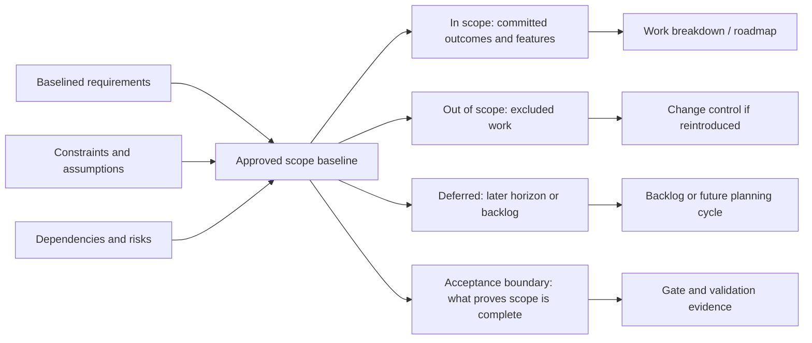

# Phase 6 — Planning and Scope Control

Phase 6 converts baselined requirements into an **approved scope**, **delivery framing**, and **traceable work decomposition**. Outputs feed **`13. Phase 7 — Architecture and Design.md`** and preparation for implementation (Phase 8). Use **Template A-6 — Scope Document** in **`28. Appendix A — Template Library.md`** for the approved scope boundary. When the program tracks capabilities at **feature** granularity, maintain the **Feature Inventory Document** (Template A-9) as the controlled list linking scope, requirements, design, testing, and release.

For lifecycle context see **`06. Lifecycle Overview.md`**; for the artifact register see **`22. Required Documents.md`**. Planning inputs assume outputs from **`11. Phase 5 — Requirements Definition.md`**.

---

## 1. Purpose

Establish an **approved scope baseline**, delivery framing, and **controlled decomposition** of planned work so that later phases (architecture, preparation, implementation) execute against explicit boundaries, priorities, and traceable execution units.

This phase locks **what** is in scope for the planning horizon, **how** work is chunked for execution, and **which** planning artifacts are authoritative until change control applies.

## 2. Scope Boundary Diagram

Use this boundary diagram to make the scope baseline explicit before architecture and implementation planning begin. Every item should be traceable to a requirement, feature, constraint, dependency, or documented deferral.

---

## 3. Entry Criteria

- **G4 — Requirements Approved** is recorded, or conditional approval is explicitly owned with conditions tracked.
- Decision makers for scope and priority are identified.
- Product or program constraints (time, budget, compliance) are documented at a level sufficient to bound the plan.

## 4. Required Inputs

- Requirements Specification Package (Template A-8), including CRS (Template A-1) and SRS (Template A-2) or approved equivalents.
- Project constraints: schedule expectations, budget bands, regulatory or policy constraints.
- Dependencies: other programs, vendors, infrastructure, or data availability.
- Risk and assumption registers from prior phases (as applicable).

## 5. Activities

- Define the **Scope Document** using **Template A-6**: in-scope outcomes, explicit exclusions, deferrals, assumptions, constraints, dependencies, and acceptance boundaries.
- Build or refine the **work breakdown** aligned to priorities and dependencies (features, epics, workstreams, or domains—consistent with your toolchain).
- Produce or refresh the **Feature Inventory Document** (Template A-9) when using feature-level scope baselines; align **feature IDs** with requirement IDs per **`24. Traceability Rules.md`**. If the program waives a named inventory, record an equivalent mapping (e.g. epic/story catalog) under traceability hooks and justify the waiver.
- Establish **planning baselines**: milestones, target dates or horizons, and dependency ordering.
- Select or propose the **execution decomposition model** for the current baseline: Development Plan only, **TD-001**, **HG-001**, or another approved backlog model. Record the selection, rationale, and any deferred finalization in the Development Plan or planning baseline.
- Integrate **change impact**: how scope changes propagate to requirements, design, and delivery (handoff to change control in `26. Change Control.md` when applicable).
- Apply **TD-001 — Agnostic Execution Decomposition** (`Agnostic Execution Decomposition — Create Tasks List Procedure.md`) when the program needs a **five-iteration execution roadmap** with atomic tasks and optional `tasks_board.json`. Refresh or extend this roadmap when scope baseline shifts materially.
- Apply **HG-001 — Hyper-Granular Execution Plan** (`Document Decomposition — Hyper-Granular Execution Plan Directive.md`) when the program needs **seven delivery-phase (PH1–PH7) decomposition** with **benchmark** numbering, **P0–P3** priorities, and **blocker / blocked-by** metadata on the backlog. Do not mix TD-001 and HG-001 numbering on the same artifact without an explicit mapping table.

## 6. Required Outputs

### Standard planning artifacts

- **Scope Document / scope baseline** (Template A-6): approved boundary document (in/out list, exclusions, deferrals, assumptions, constraints, dependencies, acceptance boundaries).
- **Scope boundary diagram or equivalent boundary summary:** visual or tabular map of in-scope work, exclusions, deferrals, acceptance boundaries, dependencies, and change-control routing.
- **Feature Inventory Document** (Template A-9): classified, prioritized, traceable feature list with dependencies and explicit **out-of-scope** candidates—**standard practice** for CYBERCUBE programs; if waived, capture equivalent scope mapping and rationale in the work breakdown / traceability exports.
- **Delivery plan:** milestones, phases, or horizon plan tied to governance gates (`21. Decision Gates.md`).
- **Work breakdown:** sufficient for estimation, staffing, and dependency management.
- **Execution model selection:** recorded choice among Development Plan only, TD-001, HG-001, or another approved model, including rationale and any mapping/deferment notes.
- **Execution roadmap (when TD-001 is used):** `tasks_list.md` (and optionally `tasks_list_iter1.md` … `tasks_list_iter5.md`) plus optional **`tasks_board.json`** when automation or board integration applies—see TD-001 for hierarchy, numbering, and sync rules.
- **Hyper-granular plan (when HG-001 is used):** Markdown (or agreed export) listing Phase PH1–PH7, benchmarks, milestones, PowerTasks, and atomic tasks with IDs `phase.benchmark.milestone.powertask.task`; include priorities and dependency flags per HG-001.

### Traceability hooks

- Mapping from plan items to requirement IDs or feature IDs where the organization uses them (alignment with `24. Traceability Rules.md`).

### Requirements-To-Tasks Traceability (Reference)

When using **TD-001** with **`tasks_board.json`**, extend machine-readable tasks with **`linked_requirement_ids`** (arrays of stable requirement IDs) backed by a **requirements catalog** (structured file under version control per `24. Traceability Rules.md`). Run a **traceability report** (script or CI) to detect dangling references, **orphan** tasks, and **uncovered** requirements; record policy (**fail** vs **warn** on violations). Phase 10 verification can reuse the same IDs for evidence and audit trails.

## 7. Planning Checkpoints

- **Scope approved:** Scope Document and exclusions accepted by authority; planning may proceed to architecture and detailed preparation.
- **Plan acceptable:** schedule and milestone model accepted for the next horizon (or iteration), with known risks recorded.
- **Execution model selected:** Phase 6 has recorded whether the baseline uses Development Plan only, TD-001, HG-001, or another approved backlog model; unresolved selection must be explicitly deferred to Phase 8 with rationale.
- **Task decomposition (if TD-001 applied):** roadmap passes TD-001 verification (no vague milestones, atomic tasks, iterations progressive)—see TD-001 Section 7 and Section 9.
- **Task decomposition (if HG-001 applied):** roadmap passes HG-001 verification (benchmark coverage, no vague PowerTasks, atomic tasks, blockers documented)—see HG-001 Sections 7 and 9.

## 8. Roles Responsible

- **Product or program lead:** scope ownership, prioritization, and stakeholder alignment.
- **Engineering or delivery lead:** feasibility, dependency sequencing, and technical planning inputs.
- **Project manager or equivalent:** integrated plan, milestones, and gate readiness.
- **Governance or compliance (as needed):** constraint verification for regulated or policy-bound scope.

## 9. Quality Checks

- Scope Document is explicit about exclusions and deferrals (no silent drift).
- Scope boundary diagram or equivalent summary matches the Scope Document and shows in-scope, out-of-scope, deferred, acceptance-boundary, dependency, and change-control routing.
- Plan reflects documented dependencies and does not assume unstated resources.
- Estimates or sizing assumptions are recorded where the organization requires them.
- The execution model selection is explicit and does not mix TD-001 and HG-001 numbering unless a mapping table is approved.
- If TD-001 is used: milestones are verifiable, PowerTasks are single-concern, tasks are verb-first and under about one hour each; Markdown and JSON artifacts stay synchronized when both exist.
- If HG-001 is used: milestones and PowerTasks meet HG-001 granularity rules; task IDs are consistent; P0/P1 items and blockers are traceable.
- If a Feature Inventory Document is maintained (Template A-9): every listed feature has a **unique ID**, **type**, **priority**, **status**, **target users** (where applicable), **requirement link** or explicit gap, **dependencies**, and **complexity**; out-of-scope features and high-risk items are recorded.

## 10. Exit Criteria

- Approved scope and planning baseline suitable for **Phase 7 — Architecture and Design**.
- Task roadmap status: either TD-001 or HG-001 outputs are accepted for the current baseline (only one primary numbering model unless mapped), or the team explicitly defers granular decomposition to Phase 8 with rationale recorded.

## 11. Related Templates / Documents

- **TD-001:** `Agnostic Execution Decomposition — Create Tasks List Procedure.md` — five-iteration roadmap, PowerTasks, atomic tasks, optional `tasks_board.json`.
- **HG-001:** `Document Decomposition — Hyper-Granular Execution Plan Directive.md` — PH1–PH7 buckets, benchmarks, priorities, blockers.
- **Example roadmap:** `Example — Five-Iteration Website Task List.md` — non-normative static-to-CMS website iteration pattern; refine through Template A-15 and align with TD-001/HG-001 when formalizing tasks.
- `14. Phase 8 — Development Preparation.md` — refinement of execution backlog before implementation.
- `21. Decision Gates.md`, `26. Change Control.md`, `24. Traceability Rules.md` (including machine-readable requirements ↔ tasks extension when TD-001 JSON is used).
- `05. Roles and Responsibilities.md` — departmental ownership, KPIs, and org reference for cross-functional plans and RACI-style alignment.
- Development Plan / Module and File Planning Document (when maintained separately).
- **`11. Phase 5 — Requirements Definition.md`** — upstream requirements baseline.
- **`13. Phase 7 — Architecture and Design.md`** — consumes scope and feature commitments.
- **`28. Appendix A — Template Library.md`** — **Template A-6 — Scope Document**, **Template A-8 — Requirements Specification Package**, **Template A-9 — Feature Inventory Document**, **Template A-10 — NFR pointer**.
- **`Non-Functional Requirements — NFR-001.md`** — standalone canonical NFR template referenced by Appendix A Template A-10.

---

## 12. Feature Inventory Document — Required Sections

The canonical reusable template is **Template A-9 — Feature Inventory Document** in **`28. Appendix A — Template Library.md`**. This section lists the required sections for Phase 6 completeness so the phase can be reviewed without duplicating the full template.

1. Project Identification  
2. Source Documents  
3. Feature Inventory Summary  
4. Feature Classification Rules  
5. Feature Priority Rules  
6. Feature Status Rules  
7. Feature Inventory Table  
8. Feature Dependency Summary  
9. Out-of-Scope Feature List  
10. Risk and Complexity Notes  
11. Traceability Notes  
12. Approval Status  

### 12.1 Completion Criteria

The Feature Inventory Document is complete when:

1. Project identification and **source documents** are recorded.  
2. Classification, priority, and status **rules** are defined.  
3. **Every known in-scope feature** appears in the inventory table with unique ID, name, description, type, priority, status, users (where applicable), requirements links (or explicit gaps), dependencies, and complexity.  
4. **Out-of-scope** candidates are listed with rationale.  
5. **Risks**, **complexity**, and **traceability** notes are updated.  
6. **Approval status** is assigned by a named reviewer with date.

This aligns with **Section 9** quality checks when a feature inventory is in use.

Incomplete if features lack priority, requirements are disconnected, out-of-scope ideas are omitted, or dependencies are unclear.
