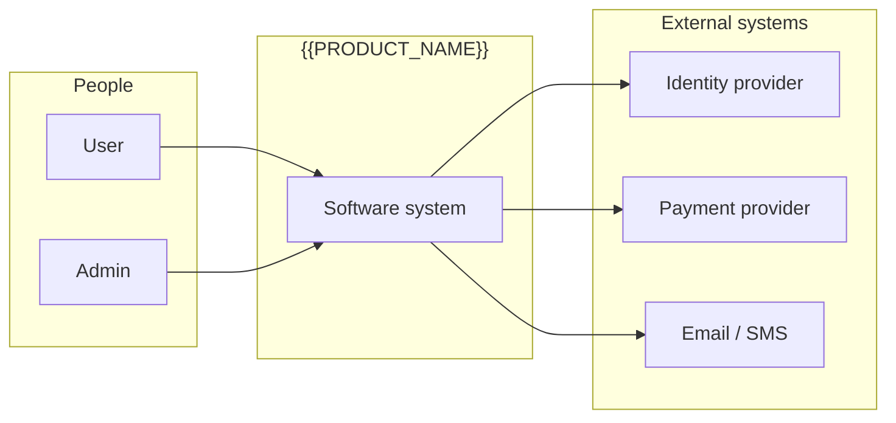
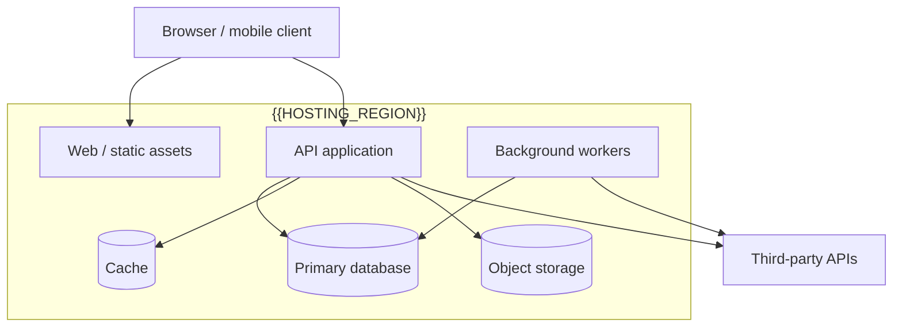
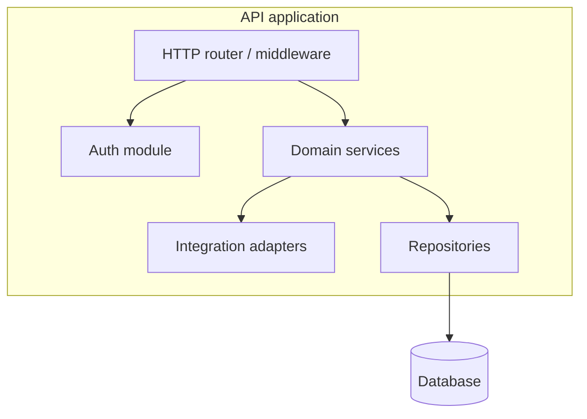
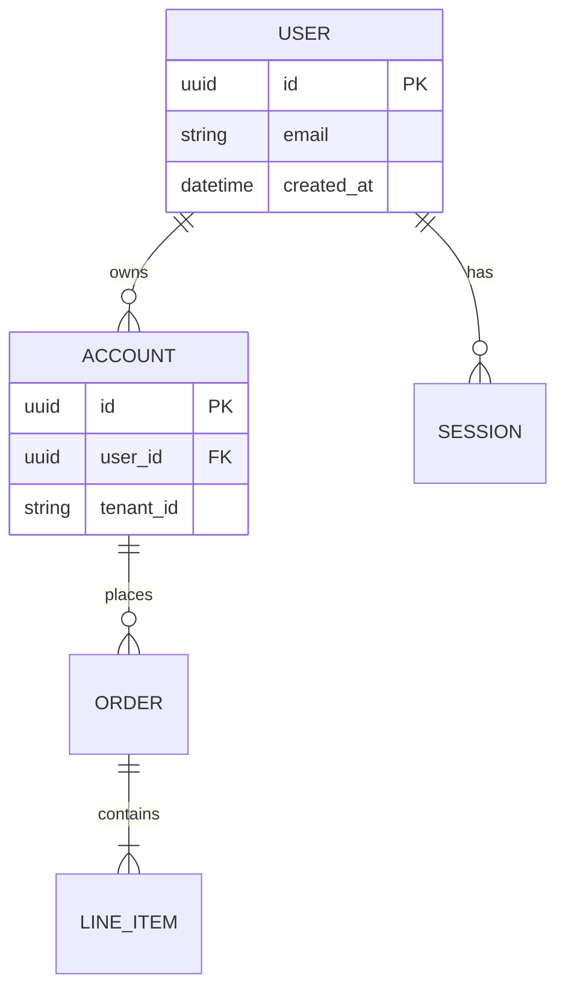
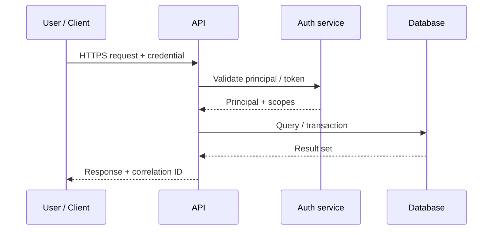
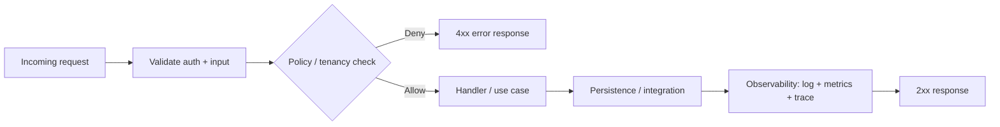

# Phase 7 — Architecture and Design

## 1. Purpose

Establish solution architecture, boundaries, domains, abstraction tiers, UI naming and design-token conventions, and blueprint-ready documentation so implementation can proceed with clear structure, approvals, and trace hooks to source evidence.

This phase may include an optional blueprint extraction subprocedure when the goal is to reverse-document or migrate an existing codebase into a modular, traceable blueprint under `docs/blueprint/`. Select the model deliberately: use canonical **BP-001** (`Universal Blueprint Extraction — BP-001 Procedure.md`) for normal source-facing extraction, or **BP-001-DRCR** (`Dirty Room Clean Room Blueprint Design Template — BP-001-DRCR.md`) when dirty-room / clean-room separation is required.

**Global component naming:** Use **Section 12** (global component code naming and CYBERCUBE UI conventions) as the default UI architecture standard unless the project defines a conflicting approved standard.

### Classic DDS / SDD Outline (Reference)

Phase 7 delivery maps to **USSM Tier 3 — Design Documentation (DDS/SDD)**. For section-by-section legacy SDLC compatibility, use **Appendix A — Template A-3 (DDS/SDD)** in `28. Appendix A — Template Library.md`: introduction; overall design (architecture, UI, data); detailed design (modules, algorithms, interfaces); constraints and assumptions; verification and validation; appendices (diagrams, examples, references). Phase-specific canonical artifacts include **ARD-001**, **UXD-001**, **Template A-11 — Data Model / ERD Document**, and **Template A-12 — API and Integration Contract**.

**Design-stage architecture themes** often referenced alongside DDS:

- **Modular programming:** Separate capability into independent, interchangeable modules.
- **Component-based architecture:** Pre-built components with well-defined interfaces.
- **Microservices:** Small, autonomous services; single business capability per service; own process; network APIs (e.g. REST); independent deploy/scale.
- **Plug-in architecture:** Core plus extensions loaded at extension points (e.g. IDE plugins).

Also treat **system design** (structure, components, interfaces, data blueprint) and **software design** (component-level behavior and interfaces) together with **database design** (entities, relationships, integrity, performance, security) when persistence is in scope.

### Structure Visualization (Reference)

Use diagrams and dependency views to stress-test modular boundaries and interfaces before implementation; align with **MOD-001** (`Principles of Modularization.md`) and the tooling choices recorded in **Phase 8 — Efficient Development and Management Practices (Reference)**.

## 2. Architecture diagram templates (C4 / data / behavior)

Replace placeholders with project-specific names. Authoritative diagrams belong in **ARD-001**, **Template A-11** (data model / ERD), and **Template A-12** (API and integration contract).

### 2.1 System context (C4 Level 1)

Shows the software system and its relationships to users and external systems.



### 2.2 Container diagram (C4 Level 2)

Shows deployable applications and data stores and how they communicate.



### 2.3 Component diagram (within a container)

Example: components inside the API application.



### 2.4 Entity-relationship diagram (ERD)

Align entities and cardinalities with **Template A-11**. Extend or replace with your domain model.



### 2.5 Sequence diagram (representative interaction)

Example: authenticated request that reads and persists data.



### 2.6 API flow (request lifecycle)

High-level REST-style flow; mirror **Template A-12** for concrete paths, schemas, and errors.



---

## 3. Entry Criteria

- **G4 — Requirements Approved** is recorded, or an explicit waiver exists for exploratory architecture.
- Scope and stakeholders are identified for the architecture decision.
- For blueprint extraction: read access to `{{PROJECT_ROOT}}` and agreement not to modify source except via approved tooling.

## 4. Required Inputs

- Requirements Specification Package (Template A-8), including SRS/NFR requirements and acceptance criteria.
- Scope Document (Template A-6) and Feature Inventory Document (Template A-9) where feature-level planning is used.
- Non-Functional Requirements (`Non-Functional Requirements — NFR-001.md`) where quality attributes affect architecture.
- Constraints (technical, compliance, hosting).
- Existing system artifacts (repos, diagrams, runbooks) when evolving or extracting.
- Blueprint model selection constraints where extraction is in scope: normal source-facing BP-001, or BP-001-DRCR when source-reader separation, IP protection, vendor handoff, litigation-safe analysis, or source-independent rebuild design is required.
- Applicable CYBERCUBE standards from `25. Quality and Compliance Checks.md` §5, including any non-applicability rationale carried from Phase 4 or Phase 5.

## 5. Activities

- Select architecture patterns and document boundaries (layers, services, integrations).
- Produce or validate architecture views (context, container, components as appropriate).
- Produce the **Architecture Design Document** using **ARD-001**.
- Produce **Data Model / ERD** documentation using **Template A-11** when persistence, reporting, migration, or integration data is in scope.
- Produce **API and Integration Contract** documentation using **Template A-12** when APIs, webhooks, events, files, SDKs, or third-party integrations are in scope.
- Produce **UI/UX Design Document** using **UXD-001** when user interaction, screen structure, journeys, components, or accessibility are material.
- Define domain grouping and entry-point traces (UI → service → persistence).
- Choose tiered abstraction strategy for documentation or rebuild planning.
- Apply global UI/component naming, CSS or token conventions, and folder layout rules for front-end architecture (see Section 12).
- **If running blueprint extraction:** select and record the blueprint model before starting. Execute Blueprint Phases 1–5 per canonical **BP-001** for normal source-facing extraction, or per **BP-001-DRCR** when dirty-room / clean-room separation is required. Record selection rationale, approver, and constraints in the architecture record or blueprint kickoff notes.
- **If analyzing an existing public or cloned frontend without full repo context:** apply **WEB-001** (`Webpage Structure Analysis and Rebuild Guide.md`) for DOM, CSS, JS, and dependency mapping before locking redesign decisions.
- Apply **MOD-001** (`Principles of Modularization.md`) when defining or reviewing module and service boundaries, interface contracts, and cohesion/coupling across domains.
- Reflect applicable CYBERCUBE standards in architecture, security, data, API, integration, tenancy, deployment, observability, and UI design decisions where relevant.

## 6. Required Outputs

- **Architecture Design Document** (ARD-001) or approved DDS/SDD equivalent.
- **Architecture views** (system context, containers, components where applicable, ERD, representative sequence interactions, API request lifecycle) captured in ARD-001 or linked artifacts — **Section 2** provides Mermaid templates and notation guidance.
- **ADRs** for material architecture decisions.
- **Data Model / ERD Document** (Template A-11) when data modeling is in scope.
- **API and Integration Contract** (Template A-12) when APIs/integrations are in scope.
- **UI/UX Design Document** (UXD-001) when UI/UX design is in scope.
- Module/Component Design Documents when MDM-001 or component-level design is required.
- Domain / bounded-context map and dependency view.
- Tier mapping for abstraction (overview → domain logic → UI/workflow → infrastructure).
- Pseudocode format guidelines and templates (shared with Phase 8 execution).
- Phased implementation plan with acceptance gates aligned to blueprint phases.
- Blueprint model selection record when BP-001 or BP-001-DRCR is used.
- Documented UI naming standard and CYBERCUBE-oriented repo/folder/token patterns when applicable (see Section 12).
- Architecture/design evidence showing how applicable CYBERCUBE standards are satisfied, or why a standard is not applicable.

### Artifact naming (blueprint extraction)

Primary output root: `docs/blueprint/` (Markdown).

Planned files for the **design-heavy** portion:

| File | Role |
|------|------|
| `01-project-analysis-architecture.md` | Structure, style, components |
| `02-functional-domain-extraction.md` | Domains, entry points |
| `03-multi-tier-conversion-approach.md` | Tier strategy |
| `04-pseudocode-format-guidelines.md` | Syntax, templates, trace annotations |
| `05-phased-implementation-plan.md` | Schedule + gates |

Supporting folders (populated in Phase 8 for pseudocode bodies):

```text
docs/blueprint/
  ├── 06-backend-logic-pseudo/
  ├── 07-frontend-logic-and-UI-flow-pseudo/
  ├── integrations/
  └── templates/
```

## 7. Decision Gate — G5 and Blueprint Checkpoints

- **G5 — Architecture Approved:** Architecture Design Document, ADRs, Data Model / ERD, API/Integration Contracts, UI/UX Design Document, and Module/Component Design Documents are reviewed as applicable and accepted for implementation.

Blueprint extraction has additional local checkpoints when BP-001 is in scope:

- **Blueprint Phase 1 gate:** architecture map complete; component inventory validated.
- **Blueprint Phase 2 gate:** domains confirmed; traceability links established.
- **Blueprint Phase 3 gate:** tier mapping consistent with Phase 1 architecture and Phase 2 domains.
- **Blueprint Phase 4 gate:** pseudocode templates validated and consistent.
- **Blueprint Phase 5 gate:** phased plan accepted; consistency audit + glossary prep scheduled with Phase 9.

After each blueprint sub-phase: stop for **explicit approval** before continuing (“Approve Phase X to proceed?”).

## 8. Roles Responsible

- Technical lead / architect: architecture and tier strategy.
- Domain or product owner: domain boundaries and feature mapping.
- Security / compliance reviewer: as required by policy.
- Blueprint extraction operator (human or agent): runs subprocedure; edits only under `docs/blueprint/` unless otherwise approved.

## 9. Quality Checks

- Evidence sections present with `SOURCE` paths for major claims.
- G5-required artifacts are present or explicitly marked not applicable / waived with rationale (including Section 2 diagram views when architecture modeling applies).
- Applicable CYBERCUBE standards from `25. Quality and Compliance Checks.md` §5 are reflected in design artifacts or explicitly marked not applicable with rationale.
- No undocumented invention of APIs or behavior; unknowns marked `UNKNOWN: _______`.
- Numbering and filenames consistent across blueprint files.
- Assumptions and unknowns explicitly listed per document.
- Where architecture is decomposed into modules or services, boundaries remain consistent with **MOD-001** (cohesion, coupling, encapsulation, explicit interfaces).

### UI/UX Design Review (Reference)

For UI and experiential quality before implementation, apply **`29. Appendix B — Checklists.md`** (UI hierarchy, consistency, feedback, typography, accessibility contrast; UX heuristics, IA, honeycomb facets, friction metrics). Dense or mission-critical UIs may prioritize **efficiency** and **error prevention** in the review.

For **CRM/admin-style shells** (header, sidebar, main, 12-column grids, master–detail, modals), use **`UI-UX Layout Guide — LYG-001.md`** as the layout-pattern reference alongside Section 12 naming and tokens.

For the **controlled UX artifact** (goals, journeys, screen inventory, components, traceability), use **`UI-UX Design Document — UXD-001 Procedure.md`** (**UXD-001**).

## 10. Exit Criteria

- Architecture is documented, reviewed, and approved per gates.
- Blueprint Phases 1–5 complete and approved when extraction is in scope.
- Handoff to Phase 8 is clear: pseudocode conversion scope, folders, and traceability expectations.

## 11. Related Templates / Documents

- **`Pseudocode to Code Conversion Guidelines.md`** — shared with Phase 8/9; complements Blueprint Phase 4 file `docs/blueprint/04-pseudocode-format-guidelines.md`.
- **BP-001:** `Universal Blueprint Extraction — BP-001 Procedure.md` — blueprint phases 1–9, gates, artifact names.
- **BP-001-DRCR:** `Dirty Room Clean Room Blueprint Design Template — BP-001-DRCR.md` — dirty-room / clean-room variant for source-reader separation and clean-room design handoff.
- **WEB-001:** `Webpage Structure Analysis and Rebuild Guide.md` — inspect HTML/CSS/JS, CDN/API dependencies, rebuild checklist.
- **MOD-001:** `Principles of Modularization.md` — cohesion, coupling, encapsulation, interfaces, reusable boundaries.
- **ARD-001:** **`Architecture Design Document — ARD-001.md`** — standalone canonical **G5** artifact/template for the architecture baseline; includes §11 project template and completion criteria (DDS/SDD-class / USSM Tier 3).
- **UXD-001:** `UI-UX Design Document — UXD-001 Procedure.md` — UX goals, IA, journeys, screens, components, interaction, states, a11y, responsive, traceability.
- **Data Model / ERD:** `28. Appendix A — Template Library.md` — **Template A-11 — Data Model / ERD Document**.
- **API and Integration Contract:** `28. Appendix A — Template Library.md` — **Template A-12 — API and Integration Contract**.
- **`21. Decision Gates.md`** — G5 — Architecture Approved evidence and outcomes.
- **`22. Required Documents.md`** — artifact register for architecture and design evidence.
- **`24. Traceability Rules.md`** — traceability expectations across requirements, design, APIs, data, code, and tests.
- **`25. Quality and Compliance Checks.md`** — CYBERCUBE Standards Applicability Matrix and G5 design evidence expectations.
- **`04. Definitions.md`** — controlled lifecycle terms.
- **`29. Appendix B — Checklists.md`** — UI/UX scoring and audit framework.
- **LYG-001:** `UI-UX Layout Guide — LYG-001.md` — CRM/admin layout shells, grids, responsive patterns, Tailwind-oriented snippets (disk-safe filename; title reads “UI/UX”).
- **MDM-001:** `Module Design Methodology — MDM-001 Procedure.md` — standalone canonical module/component design package when module-level design is required; includes interface-first methodology, §1–§18 catalog, and appendices A–D.

---

## 12. Standard — Global component code naming & CYBERCUBE UI conventions

Cross-cutting UI architecture rules for code, styles, domain-based component names, and CYBERCUBE-specific prefixes and tokens. The **reusable component inventory** (named building blocks) lives in Phase 8, Section 12, for implementation prep.

### 12.1 Component and file names (code)

**React / Vue / Svelte components**

- **PascalCase** for component identifiers: `AppShell`, `DashboardHeader`, `KpiCard`.
- **File names match component names:** `AppShell.tsx`, `KpiCard.tsx`.

**Hooks and utilities**

- **camelCase:** `useDashboardMetrics`, `formatCurrency`, `useAuthGuard`.

**TypeScript types and interfaces**

- **PascalCase:** `UserProfile`, `ProjectHealthScore`.

**Enums**

- **PascalCase** enum name; **SCREAMING_SNAKE_CASE** members.

```ts
enum ProjectStatus {
  IN_PROGRESS,
  BLOCKED,
  DONE,
}
```

### 12.2 CSS, Tailwind, and class names

- **Class names:** **kebab-case**; prefix by UI role when useful: `btn-primary`, `panel-header`, `marketing-hero`, `stat-card`.
- **Design tokens (CSS variables):** `--color-primary`, `--color-surface`, `--shadow-soft`, `--radius-xl`.
- **BEM (when used):** `card`, `card__header`, `card__body`, `card--highlighted`.

### 12.3 Domain-based naming (recommended)

Use **domain + role** so names stay stable across projects:

| Domain      | Examples |
| ----------- | -------- |
| Layout      | `LayoutShell`, `MainContainer`, `SidebarNav` |
| Dashboard   | `DashboardHeader`, `DashboardGrid`, `InsightCard` |
| Auth        | `AuthGate`, `LoginForm`, `UserMenu` |
| Projects    | `ProjectList`, `ProjectOverviewCard`, `ProjectHealthMeter` |
| Billing     | `BillingSummary`, `InvoiceTable`, `PaymentMethodForm` |

**Pattern:** `<Domain><ComponentRole>` — e.g. `ProjectHealthMeter`, `BillingKpiCard`, `DocsSidebarNav`.

---

### 12.4 CYBERCUBE Naming and Identifier Alignment

For CYBERCUBE products, align UI, package, component, file, and design-token names with `STD-ENG-001` and the authoritative lookup in `../CYBERCUBE standards/[1]-CYBERCUBE-Name-Registry.md`.

Registered Namespace A/B/G/M values must come from the Name Registry. Do not invent registry-controlled prefixes, entity codes, product/module IDs, or module records in this section. The examples below use registered-style Namespace A work/artifact codes for project/package context and Namespace M-style local component names for implementation anatomy.

#### 12.4.1 Registry-aligned UI/package namespace examples

Use Name Registry Namespace A codes for repos, packages, work items, and build artifacts. Use the exact registered code that matches the work type:

| Namespace A code | Use |
| --- | --- |
| `WA-SS` | SaaS web app work items or artifacts |
| `WA-PO` | Portal / dashboard work items or artifacts |
| `WA-CM` | Content or marketing-site work items or artifacts |
| `CS-IT` | Internal-tool work items or artifacts |
| `DC-CD` | CI/CD pipeline work items or artifacts |
| `QA-AT` | Automated testing work items or artifacts |

#### 12.4.2 Component naming pattern

- Prefer `<Domain><ComponentRole>` (neutral, reusable).
- Add CYBERCUBE context via **folders and tokens**, not by overloading every component name.
- Treat component examples as Namespace M-aligned local names. If a reusable module needs a registered `MOD-XXX` record, use the Name Registry process rather than assigning an ID locally.

**Example — WA-CM marketing site**

```text
/components
  /layout
    AppShell.tsx
    MainContainer.tsx
    SiteHeader.tsx
    SiteFooter.tsx
  /marketing
    HeroSection.tsx
    FeatureGrid.tsx
    TestimonialCarousel.tsx
    PricingTable.tsx
    CallToActionBanner.tsx
  /blog
    BlogCard.tsx
    BlogList.tsx
    BlogPostHeader.tsx
  /shared
    Button.tsx
    IconButton.tsx
    Card.tsx
    Badge.tsx
```

**Example — WA-PO dashboard / portal**

```text
/components
  /dashboard
    DashboardHeader.tsx
    DashboardGrid.tsx
    KpiCard.tsx
    HealthMeter.tsx
    BlockerList.tsx
    VelocityChart.tsx
  /projects
    ProjectList.tsx
    ProjectFilterBar.tsx
    ProjectHealthSummary.tsx
  /billing
    BillingSummary.tsx
    InvoiceTable.tsx
    PaymentMethodForm.tsx
  /auth
    LoginForm.tsx
    RegisterForm.tsx
    AuthGate.tsx
```

#### 12.4.3 CSS and design tokens

- **Global classes (kebab-case, descriptive):** `app-shell`, `marketing-hero`, `button-primary`, `summary-card`, `stat-card`.
- If a project uses a CSS/design-token prefix, record it in the design system. Do not reuse Namespace A codes, CC-PID entity codes, or Namespace G IDs as CSS prefixes.

Example token block (extend per design system):

```css
:root {
  --color-primary: #...;
  --color-secondary: #...;
  --color-accent: #...;
  --color-surface: #...;
  --radius-md: 0.5rem;
  --radius-xl: 1.25rem;
  --shadow-soft: 0 10px 30px rgba(0, 0, 0, 0.12);
  --spacing-sm: 0.5rem;
  --spacing-md: 1rem;
  --spacing-lg: 1.5rem;
}
```

#### 12.4.4 CYBERCUBE-specific component examples

**Marketing site (`WA-CM`)**

- `HeroSection`, `FeatureGrid`, `TestimonialCarousel`, `LogoWall`, `PricingTable`, `ContactForm`, `FaqAccordion`, `StatsStrip`.

**Dashboard / portal (`WA-PO`)**

- `ProjectHealthPanel`, `DiagnosticKpiRow`, `IssueSeverityBreakdown`, `ExecutionVelocityPanel`, `TestCoveragePanel`, `QualityScoreCard`, `NextActionsList`, `RiskAlertBanner`.

---

## Subprocedure — Module Design Methodology (MDM-001)

**Classification:** Keep — standalone Phase 7 module-design subprocedure for module/component design packages; interface-first rule, internal V-model with exit gates, trust boundaries, ADRs, detailed design, FMEA, data objects, flow maps, observability, verification/validation, release/readiness controls.

**Canonical documents:**

| Document | Role |
| --- | --- |
| **`Module Design Methodology — MDM-001 Procedure.md`** | Sole canonical MDM-001 artifact: methodology overview, section catalog §1–§18, appendices A–D, Phase 7 mapping, governance cross-references. |

**Operator summary**

- Use MDM-001 when producing or reviewing a **full module design package** (not only high-level architecture sketches).
- Align with **MOD-001** for cohesion/coupling and boundaries.
- Do not conflate MDM internal V-model phases with **Master Lifecycle** phase numbers.

Full methodology and per-§ completion framing: **`Module Design Methodology — MDM-001 Procedure.md`**.

---

## Subprocedure — Universal Blueprint Extraction (BP-001)

**Classification:** Keep — standalone BP-001 procedure; this Phase 7 section is a summary and entry point for Blueprint Phases 1–5.

**Canonical document:** `Universal Blueprint Extraction — BP-001 Procedure.md` (same folder as this lifecycle). Use `Dirty Room Clean Room Blueprint Design Template — BP-001-DRCR.md` when the project selects the dirty-room / clean-room variant.

Blueprint internal phases **1–9** are **not** Master Lifecycle phase numbers. Phases **1–5** (documents `01`–`05`) are produced primarily during **Phase 7**; Phases **6–9** continue in **Phase 8 — Development Preparation**. BP-001-DRCR uses its own internal 1–10 sequence with dirty-room / clean-room folders.

**Operator summary**

- Outputs live under `docs/blueprint/` (Markdown).
- Gate after each blueprint phase: explicit stakeholder or delegate approval before continuing.
- Trace hooks: `SOURCE` paths and domain/module tags on all pseudocode; evidence sections on narrative artifacts.
- Model selection: canonical BP-001 for normal extraction; BP-001-DRCR when source-reader separation, sanitized handoff, or source-independent design is required.

**Artifact index**

| BP phase | Output |
| --- | --- |
| 1 | `01-project-analysis-architecture.md` |
| 2 | `02-functional-domain-extraction.md` |
| 3 | `03-multi-tier-conversion-approach.md` |
| 4 | `04-pseudocode-format-guidelines.md` |
| 5 | `05-phased-implementation-plan.md` |
| 6–9 | See Phase 8 — Section 16 (continuation) and canonical BP-001 Sections 11–14 |

Full steps, gates, pseudocode skeleton, and audit checklist: **`Universal Blueprint Extraction — BP-001 Procedure.md`** for canonical extraction, or **`Dirty Room Clean Room Blueprint Design Template — BP-001-DRCR.md`** when the dirty-room / clean-room variant is selected.

