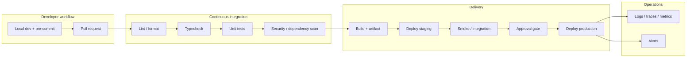

# Phase 8 — Development Preparation

## 1. Purpose

Make implementation ready: environments, conventions, work breakdown, a **reusable UI component inventory** aligned to Phase 7 naming rules, a **TD-001** or **HG-001** execution roadmap when granular backlog is required (`tasks_list.md` / optional `tasks_board.json` for TD-001; benchmark-scoped plan per HG-001), and—when using blueprint extraction—pseudocode bodies, UI flow abstracts, end-to-end traceability, and final consistency audit before coding at scale.

This phase continues the blueprint model selected in Phase 7. Canonical **BP-001** (`Universal Blueprint Extraction — BP-001 Procedure.md`) continues Blueprint internal Phases **6–9**: backend and frontend pseudocode conversion, traceability matrix, glossary, and review (see **Section 16** below). If Phase 7 selected **BP-001-DRCR** (`Dirty Room Clean Room Blueprint Design Template — BP-001-DRCR.md`), continue the dirty-room / clean-room sequence and preserve room-separation constraints.

**Component library:** Use **Section 12** below as the canonical named list of building blocks (extend or trim per product). Optionally export to JSON or a `components.registry.json` for tooling.

**Layout shells (CRM/admin):** Align page structure and grids with **`UI-UX Layout Guide — LYG-001.md`** (sidebar + main, dashboard grid, master–detail, section wireframes) when building workspace UIs.

**Image → code:** Use **Section 14** and the standalone prompt **`Translate Component Image to Code — Template Prompt.md`** when translating mocks/screenshots into HTML/CSS/JS with assistants; align naming with Section 12.

### Efficient Development and Management Practices (Reference)

**Classification:** Reference guidance embedded in Phase 8 — planning-before-coding, modular design, incremental delivery, testing, documentation, refactoring, dependency visualization, codebase management.

Consolidated guidance for the stretch from **design readiness through implementation prep**:

| Theme | Practice |
| --- | --- |
| **Plan before coding** | Decompose into tasks or features; use diagrams, flowcharts, or pseudocode for logic and flow; use skeleton code with comments stating intent for functions, methods, or classes. |
| **Modular design** | Organize by capability (e.g. data access, UI); one clear purpose per module; small, single-focus functions; visualize dependencies and class relationships (diagrams, dependency graphs); treat structure as reviewable and “queryable.” |
| **Incremental implementation** | Ship one feature or coherent unit at a time; test immediately after each unit where feasible; refactor periodically for readability, DRY, and simpler logic (pair with **REF-001** in Phase 9). |
| **Testing and QA** | Unit tests per feature or unit; regression tests to protect existing behavior; automate repetitions when practical; record which functions or methods tie to which features (traceability). |
| **Documentation** | Keep architecture diagrams, flowcharts, and module descriptions current; meaningful function/method comments; README or technical overview of features and where they live in the repo. |
| **Review and refactor** | Revisit dependencies and package or folder layout; refactor to simplify complexity, remove redundancy, improve readability. |
| **Tools and visualizations** | Dependency graphs; tools that analyze modular structure and packages; **code→diagram** views where the toolchain supports reverse engineering structure; configurable class/method diagrams — select and standardize in Phase 8 so Phase 9 uses them consistently. |

These seven rows consolidate the **Efficient Development and Management Practices** reference (plan/design before code; modular boundaries; incremental delivery with tests; QA trace hooks; documentation; periodic refactor; visualization tooling).

**Cross-phase mapping:** Structure visualization supports **Phase 7** validation of boundaries; this section is the **prep hub** for conventions and tools; **Phase 9** applies incremental delivery and refactor cadence; **Phase 10** owns formal test strategy, regression policy, and CI alignment (`Unit Test and Pseudocode Writing Guidelines.md`, USSM §7).

### Module decomposition techniques (classic SDLC)

Structure the codebase to mirror **DDS** boundaries and iteration plans. Pick approaches that match domain shape and Phase 7 architecture (pair with **MOD-001** — `Principles of Modularization.md`):

| Technique | When it fits |
| --- | --- |
| **Functional decomposition** | Distinct user-visible capabilities (e.g. authentication, catalog, payments)—one module per major function and its collaborators. |
| **Object-oriented decomposition** | Stable domain objects and relationships (e.g. accounts, orders, policies)—classes grouped by bounded context. |
| **Layered architecture** | Strong separation of presentation, application/services, and data access—modules per layer with strict downward dependencies. |
| **Modular programming** | Self-contained compilation units with explicit interfaces; encapsulation; minimal cross-module surface area. |

**Practices:** high **cohesion** inside modules, **loose coupling** between them; document tool/language choices and rationale for the team; design modules so they can be **unit-tested independently**; prefer established patterns (e.g. MVC, MVVM, hexagonal, microservices) only when they match agreed architecture—not by default.

### Tooling and language selection

Maintain a **written list** of languages, frameworks, and dev tools chosen for the project, with **one-line rationale** each (fit for platform, team skill, performance, ecosystem). Revisit when Phase 7 assumptions change.

### Construction Quality Principles (Reference)

Consolidates construction-focused guidance (e.g. McConnell, *Code Complete*) into conventions teams adopt **before** Phase 9 scales coding. Use with secure coding policy, **REF-001**, and **`Pseudocode to Code Conversion Guidelines.md`**.

| Theme | Practice |
| --- | --- |
| **Managing complexity** | Complexity drives defects and slows change; simplify deliberately. Use **abstraction** (stable operations over hidden detail), **decomposition** (single-responsibility modules/functions), **incremental** build → test → integrate, and **defensive programming** for invalid inputs and edge cases. |
| **Construction as the core activity** | Requirements, architecture, and testing matter—but most effort is **building** software. Quality and clarity in construction dominate long-term cost. |
| **Iterative delivery** | Requirements and designs evolve; ship **working increments**, gather feedback, refine. Plan iterations so each slice is testable. |
| **Readable code** | Prefer **meaningful names**; **consistent formatting**; **short functions** with one job; **comments** that explain *why* or non-obvious constraints—not what the next line already says. |
| **Balance planning** | Before coding: understand the problem and sketch **architecture, major components, and interactions**. Avoid **analysis paralysis** (frozen planning) and **under-planning** (unstructured sprawl). |
| **Abstraction and encapsulation** | Expose intent (“what”) through APIs; hide replaceable internals (“how”) so implementations can change without ripple effects. |
| **Refactoring** | Improve structure **without** changing behavior—split large units, rename for clarity, remove duplication—using **REF-001** when scope is non-trivial. |
| **Pseudocode-first** | Draft logic in pseudocode or approved `.pseudo.md`; review with peers where helpful; then translate per **`Pseudocode to Code Conversion Guidelines.md`**. |
| **Testing while building** | **Unit** isolation, **integration** across modules, **regression** after changes; automate repetition (**`Unit Test and Pseudocode Writing Guidelines.md`**, Phase **10** for formal strategy). |
| **Conventions and coupling** | Team-wide naming and layout; **loose dependencies** (interfaces, facades, repository patterns) instead of wiring concrete details across layers. |
| **Craftsmanship** | Consistent **error handling**; attention to layout and clarity—code is read far more than it is written. |

### Development Guidelines Package (DGP-001)

This section replaces the standalone `Initial Project Guidelines Template — DGP-001.md`. Use it as the Phase 8 implementation-readiness package when spinning up development work. It supports setup guidance, coding standards reference, initial test setup, and implementation-record conventions for **G6 — Development Ready**.

DGP-001 supports Templates A-13, A-14, and A-15. It does not replace the Module and File Planning Document, Environment and Delivery Strategy, Development Plan, TD-001, HG-001, or Phase 10 Test Strategy.

| Module | Intent |
| --- | --- |
| **Before scripting guidelines** | Confirm requirements, compliance constraints, architecture/pseudocode prep, test planning, and dependency planning before coding. |
| **File formatting guidelines** | Set readability and consistency rules for structure, spacing, comments, and pre-submission checks. |
| **Coding standards** | Establish naming consistency, `STD-ENG-001` namespace conformance, low coupling, error handling, maintainability, secure coding alignment, and code review expectations. |
| **Modularization guidelines** | Reinforce cohesion, separation of concerns, encapsulation, clear interfaces, and module quality checks. |
| **Refactoring guidelines** | Keep refactors behavior-preserving, incremental, test-backed, and aligned with **REF-001**. |
| **Pseudocode guidelines** | Define header format, syntax conventions, block structure, and pseudocode review expectations where pseudocode-first work is used. |
| **Pseudo-to-code guidelines** | Convert approved pseudocode into implementation using scaffolding, systematic translation, error handling conversion, optimization checks, and completion checks. |
| **Unit test guidelines** | Apply AAA structure, independence, edge/error coverage, naming conventions, and mock discipline before Phase 10 formal validation. |
| **Mock tracking guidelines** | Mark mocks, isolate them behind interfaces, create replacement tickets, and maintain a mock registry when temporary substitutes are used. |
| **Error documentation guidelines** | Record reproducible errors, resolution notes, incident/solution patterns, and knowledge-base updates. |
| **Markdown documentation guidelines** | Keep docs structured, linkable, maintained, and consistent with lifecycle terminology. |
| **Task documentation guidelines** | Define task and implementation records for traceability and reviews. |

#### Task and Implementation Record Conventions

Use one task-template family only. Avoid duplicate PowerTask/task record blocks in project copies.

Suggested record names:

```text
TASK-{MAJOR}-{MINOR}-{SUBTASK}-{NAME}.md
PSEUDO-{TASK-ID}-{NAME}.md
IMPL-{TASK-ID}-{NAME}.md
```

Each implementation record should include, at minimum:

- task metadata, status, labels, and mock flags where applicable
- pseudocode reference and review status when pseudocode-first workflow is used
- files changed or created
- tests created, updated, or intentionally deferred with rationale
- error-resolution notes
- documentation updates
- traceability links to requirements, features, design artifacts, tests, and source artifacts
- verification checklist

#### Naming and Identifier Conformance Notes

Record how the project applies `STD-ENG-001` before coding starts:

```text
Lifecycle-local artifact ID policy:
Namespace A artifact naming applies? Yes / No / Rationale:
Namespace B / CC-PID public IDs apply? Yes / No / Rationale:
Namespace G registry IDs used or mapped:
Namespace M module/component/file naming convention:
Raw database IDs exposed externally? No / Exception:
Identifier validation owner:
```

Use `../CYBERCUBE standards/[1]-CYBERCUBE-Name-Registry.md` as the lookup source for registered Namespace A/B/G/M values, UUID-to-CC-PID mappings, and project registry entries. For public APIs, URLs, logs, support workflows, or UI references, use CC-PID where public entity identifiers are needed and do not expose raw database primary keys externally. For modules/components/files, align planned names with Namespace M and record deviations before G6 approval.

#### Adoption Notes

Suggested project folder locations may include guideline, report, template, error-catalog, knowledge-base, task, pseudocode, and implementation-record folders. Treat those paths as examples only; use the repository layout approved in Template A-13 and Template A-14.

Completion checks for adoption:

- Required guideline modules are copied, linked, or explicitly marked not applicable.
- Duplicate task/PowerTask sections are removed.
- Template links are valid in the destination repo.
- Coding, testing, and documentation checks are mapped to CI, review process, or manual verification.
- Naming and identifier checks are mapped to CI, review process, or manual verification.
- Mock-tracking and error-reporting paths are agreed by the team.

## 2. Toolchain pipeline template (CI / CD / quality gates)

Replace tool names and stages with your stack (**Template A-14** owns the authoritative narrative). This diagram is a **reference pattern** for how work flows from commit to production observability.



**Caption guidance:** Map each box to a concrete system (for example Git hosting, workflow engine, registry, orchestrator, IaC). Record **blocking vs advisory** checks, **required reviewers**, **environment promotion rules**, and **rollback** in **Environment and Delivery Strategy** (A-14); align observability with Phase 7 architecture and **CYBERCUBE** observability expectations where applicable (`25. Quality and Compliance Checks.md` §5).

---

## 3. Entry Criteria

- **G5 — Architecture Approved** is recorded, and Blueprint Phases 1–5 are approved when blueprint extraction applies.
- Pseudocode guidelines accepted: `docs/blueprint/04-pseudocode-format-guidelines.md` (Blueprint Phase 4 minimum) and **`Pseudocode to Code Conversion Guidelines.md`** (full format + pseudocode-to-code translation standard).
- Repository / branching strategy and toolchain expectations agreed (see **Section 2** for a pipeline reference pattern; authoritative detail belongs in **Template A-14**).

## 4. Required Inputs

- Approved architecture and domain map, including ARD-001 / DDS outputs and ADRs.
- Module, data, API/integration, and UI/UX design artifacts from Phase 7 where applicable.
- Scope Document (Template A-6), Requirements Specification Package (Template A-8), Feature Inventory Document (Template A-9), and NFR inputs (Template A-10 / NFR-001) where they affect implementation prep.
- Access to source tree for extraction.
- Phase 4 pseudocode templates and tier plan from Phase 7.
- Applicable CYBERCUBE standards evidence and control expectations from `25. Quality and Compliance Checks.md` §5.

## 5. Activities

- Prepare dev environments, branching model, and coding standards handoff using **Template A-14 — Environment and Delivery Strategy**.
- Align implementation with Phase 7 UI naming, folders, and tokens; confirm which entries from the **reusable component library** (Section 12) the project will adopt or fork.
- Adopt or customize the **Translate component image to code** prompt (Section 14); record which `@` context files developers should attach for charts/cards/factory CSS in your repo.
- Plan module/file ownership, directory structure, file catalog, and test placement using **Template A-13 — Module and File Planning Document**.
- Prepare the **Development Plan** using **Template A-15**, and confirm the selected **execution decomposition model** from Phase 6: Development Plan only, TD-001, HG-001, or another approved backlog model.
- If Phase 6 deferred model selection, make the selection here before G6; record rationale, artifact names, ownership, and any mapping table required between models.
- **Blueprint extraction:** continue the selected Phase 7 blueprint model. For BP-001, generate backend pseudocode folder, frontend pseudocode folder, traceability matrix, glossary, and final review notes. For BP-001-DRCR, continue clean-room contracts/design/pseudocode, traceability, final audit, and room-separation log.
- **Task decomposition (TD-001):** convert approved planning/design inputs into a five-iteration roadmap with milestones, PowerTasks, and atomic tasks per `Agnostic Execution Decomposition — Create Tasks List Procedure.md`. Produce `tasks_list.md` (and optional per-iteration splits); generate `tasks_board.json` when automation, boards, or orchestration require machine-readable cards (mandatory in those cases per TD-001).
- **Hyper-granular decomposition (HG-001):** when using PH1–PH7 delivery phases and benchmark numbering, apply `Document Decomposition — Hyper-Granular Execution Plan Directive.md`; record **P0–P3**, **isBlocker**, and **blockedBy** on milestones or PowerTasks as defined there.
- **Frontend inspection (WEB-001):** when implementation prep depends on reverse-engineering an existing site’s markup, styles, or scripts, follow `Webpage Structure Analysis and Rebuild Guide.md` and record dependency/load-order notes for the team.
- **Modularization (MOD-001):** validate planned module ownership, shared libraries, and reusable UI pieces against `Principles of Modularization.md` so Phase 9 work does not blur boundaries agreed in Phase 7.
- Prepare tooling, environment, coding, testing, CI, review, and evidence controls needed to satisfy applicable CYBERCUBE standards before implementation starts.

## 6. Required Outputs

### Standard preparation artifacts

- **Environment and Delivery Strategy** (Template A-14), including environments, branching, configuration/secrets, CI/CD, deployment/rollback, access, and observability expectations. Use **Section 2** as a diagrammatic checklist against A-14 (toolchain pipeline); replace placeholders with your actual systems and gates.
- **Development Plan** (Template A-15), including milestones, iterations, work breakdown, dependencies, owners, quality expectations, traceability links, and the selected execution decomposition model.
- **Module and File Planning Document** (Template A-13), including module/domain inventory, directory structure, file specification catalog, ownership, interfaces/dependencies, and test placement.
- Development setup guide / coding standards reference, either as standalone records or as controlled sections inside Templates A-13, A-14, A-15, and Section 1 DGP-001 guidance above.
- Initial test setup aligned with Phase 10 and recorded in Template A-14 / Template A-15 or the test strategy.
- Tooling, environment, coding, testing, CI, review, and evidence controls mapped to applicable CYBERCUBE standards, or documented non-applicability rationale.
- Agreed component-library scope: named primitives and composites from Section 12 (or a derived registry) mapped to routes/domains as needed.
- Optional: team conventions for **image-to-code** assists (prompt version, required output sections, default `@` attachments).

### Task decomposition artifacts (TD-001, when used)

| File | Role |
| --- | --- |
| `tasks_list.md` | Human-readable execution roadmap (Iterations 1–5, phases, milestones, PowerTasks, tasks). |
| `tasks_list_iter1.md` … `tasks_list_iter5.md` | Optional split when scope requires separate iteration files. |
| `tasks_board.json` | Optional but mandatory for automation/board/governance consumers; must stay synchronized with Markdown when both exist. |

Authoritative procedure: **TD-001** in `Agnostic Execution Decomposition — Create Tasks List Procedure.md`. Phase 6 selects or proposes the model and may start the roadmap; Phase 8 finalizes it against architecture and blueprint outputs before Phase 9.

### Hyper-granular plan artifacts (HG-001, when used)

| Artifact | Role |
| --- | --- |
| `execution_plan_hg.md` (or team name) | Human-readable PH1–PH7 plan with benchmarks, milestones, PowerTasks, tasks, priorities, and dependency flags. |

Authoritative procedure: **HG-001** in `Document Decomposition — Hyper-Granular Execution Plan Directive.md`. Phase 6 selects or proposes the model and may start the plan; Phase 8 finalizes it against architecture and blueprint outputs before Phase 9. Use **either** TD-001 **or** HG-001 as the primary ID scheme unless a written mapping exists.

### Blueprint extraction artifacts (when applicable)

| File / location | Role |
|-----------------|------|
| `docs/blueprint/06-backend-logic-conversion-summary.md` | Backend conversion rollup |
| `docs/blueprint/06-backend-logic-pseudo/<service_name>.pseudo.md` | Per-service pseudocode |
| `docs/blueprint/07-frontend-logic-and-UI-flow-pseudo-summary.md` | Frontend rollup |
| `docs/blueprint/07-frontend-logic-and-UI-flow-pseudo/<component>.pseudo.md` | Per-component pseudocode |
| `docs/blueprint/08-traceability_matrix.md` | End-to-end trace links |
| `docs/blueprint/09-01-glossary.md` | Terms, domains, core methods |
| `docs/blueprint/09-02-final-review-notes.md` | Audit, gaps, recommendations |

Full tree reference:

```text
docs/blueprint/
  ├── 01-project-analysis-architecture.md
  ├── 02-functional-domain-extraction.md
  ├── 03-multi-tier-conversion-approach.md
  ├── 04-pseudocode-format-guidelines.md
  ├── 05-phased-implementation-plan.md
  ├── 06-backend-logic-conversion-summary.md
  ├── 07-frontend-logic-and-UI-flow-pseudo-summary.md
  ├── 08-traceability_matrix.md
  ├── 09-01-glossary.md
  ├── 09-02-final-review-notes.md
  ├── 06-backend-logic-pseudo/
  ├── 07-frontend-logic-and-UI-flow-pseudo/
  ├── integrations/
  └── templates/
```

## 7. Decision Gate — G6 and Blueprint Checkpoints

- **G6 — Development Ready:** environments, standards, module/file plan, development plan, setup guidance, coding standards reference, and initial test setup are accepted for Phase 9 implementation start.

Blueprint extraction has additional local checkpoints when BP-001 is in scope:

- **Blueprint Phase 6 gate:** backend pseudocode scope and quality acceptable.
- **Blueprint Phase 7 gate:** frontend/UI flow abstracts acceptable.
- **Blueprint Phase 8 gate:** traceability matrix complete and reviewable.
- **Blueprint Phase 9 gate:** glossary and consistency audit complete; extraction closed or iteration agreed.

## 8. Roles Responsible

- Engineering lead: prep and blueprint phase sign-off.
- Developers: validate pseudocode accuracy against source.
- QA / BA: traceability IDs and requirement links where applicable.

## 9. Quality Checks

- **TD-001:** Milestones verifiable; PowerTasks single-concern; tasks verb-first and atomic; five iterations form a progressive capability ladder; `tasks_board.json` matches `tasks_list.md` when both are produced.
- **HG-001:** Benchmark and milestone coverage verified against source docs; blockers and P0/P1 items documented; task IDs consistent with HG-001 Section 4.
- Each pseudocode file includes `SOURCE` references and domain/module tags per Phase 7 templates.
- Trace matrix columns populated; statuses meaningful (e.g. Planned, Converted, Verified, Implemented).
- Final review cross-checks: Phase 1 vs Phase 2 alignment; tiers reflected in Phases 6–7; Phase 8 links consistent.
- **MOD-001:** Module/file plans and component reuse align with stated architecture boundaries; avoid introducing tight coupling across domains without an explicit interface.
- G6-required artifacts are present or explicitly marked not applicable / waived with rationale.
- Applicable CYBERCUBE standards from `25. Quality and Compliance Checks.md` §5 have corresponding tooling, environment, coding, testing, CI, review, and evidence controls prepared or explicitly marked not applicable.
- **Template A-14** (or equivalent) documents the real **toolchain pipeline**: each **Section 2** stage is mapped to a concrete system and policy, or the diagram is marked not applicable with rationale (e.g. single-developer prototype with manual deploy only).

## 10. Exit Criteria

- Team can start implementation with approved blueprint and trace hooks **or** conventional dev prep is signed off without extraction.
- **TD-001:** When used, `tasks_list.md` (and `tasks_board.json` if applicable) is reviewed against architecture and blueprint outputs; TD-001 completion criteria met.
- **HG-001:** When used, hyper-granular plan reviewed against architecture and blueprint outputs; HG-001 completion criteria met.
- Blueprint extraction: Phases 6–9 approved; gaps and risks recorded in `09-02-final-review-notes.md`.
- Blueprint model consistency: Phase 8 continues the Phase 7-selected BP-001 or BP-001-DRCR model; any model switch is approved and recorded.

## 11. Related Templates / Documents

- **Module and File Planning Document:** `28. Appendix A — Template Library.md` — **Template A-13 — Module and File Planning Document**.
- **Environment and Delivery Strategy:** `28. Appendix A — Template Library.md` — **Template A-14 — Environment and Delivery Strategy** (pair with **Section 2** toolchain diagram in this phase).
- **Development Plan:** `28. Appendix A — Template Library.md` — **Template A-15 — Development Plan**.
- **`21. Decision Gates.md`** — G6 — Development Ready evidence and outcomes.
- **`22. Required Documents.md`** — artifact register for development preparation evidence.
- **`24. Traceability Rules.md`** — traceability expectations across requirements, design, tasks, implementation, and tests.
- **`25. Quality and Compliance Checks.md`** — CYBERCUBE Standards Applicability Matrix and G6 development-readiness evidence expectations.
- **`04. Definitions.md`** — controlled lifecycle terms.
- Test Strategy (early alignment).
- **TD-001:** `Agnostic Execution Decomposition — Create Tasks List Procedure.md` — task list and optional JSON task board.
- **HG-001:** `Document Decomposition — Hyper-Granular Execution Plan Directive.md` — PH1–PH7, benchmarks, priorities, blockers.
- **BP-001:** `Universal Blueprint Extraction — BP-001 Procedure.md` — canonical blueprint phases 6–9 (pseudocode, trace matrix, glossary, audit).
- **BP-001-DRCR:** `Dirty Room Clean Room Blueprint Design Template — BP-001-DRCR.md` — dirty-room / clean-room variant when separation constraints apply.
- **WEB-001:** `Webpage Structure Analysis and Rebuild Guide.md` — DOM/CSS/JS analysis and rebuild sequencing.
- **MOD-001:** `Principles of Modularization.md` — module boundaries, cohesion/coupling, interfaces.
- Phase 7 — Pseudocode format, tier definitions, and Section 12 (UI naming & CYBERCUBE conventions).
- **`Pseudocode to Code Conversion Guidelines.md`** — pseudocode formatting, per-file separation, translation procedure, error-handling and testing expectations for Phase 9.
- **`Unit Test and Pseudocode Writing Guidelines.md`** — unit test principles merged with test strategy; pseudocode cross-reference; test file placement and execute-after-write loop (with Phase 10).
- `Translate Component Image to Code — Template Prompt.md` — image-to-code workflow.

---

## 12. Reference — Reusable component library (names + descriptions)

Canonical inventory of UI building blocks. Names follow Phase 7 Section 12 (`<Domain><ComponentRole>`, PascalCase files). Use as checklist for design-system coverage and backlog decomposition.

### 12.1 Layout and structure

| Name | Description |
| --- | --- |
| `AppShell` | Top-level layout (header, sidebar, main). |
| `MainContainer` | Centers and constrains page width. |
| `PageHeader` | Title, breadcrumbs, primary actions. |
| `PageSection` | Logical section within a page. |
| `SidebarNav` | Vertical navigation for modules. |
| `TopBar` | Logo, search, user menu. |
| `BottomBar` | Footer actions or secondary nav. |
| `SplitView` | Two panes (e.g. list + detail). |
| `Card` | General content container. |
| `CardHeader` | Card title/action region. |
| `CardBody` | Card main content. |
| `CardFooter` | Card actions or meta. |
| `Panel` | Larger grouped container. |
| `GridLayout` | Responsive grid for tiles/cards. |
| `StackLayout` | Vertical stack with consistent spacing. |

### 12.2 Navigation

| Name | Description |
| --- | --- |
| `NavBar` | Primary section navigation. |
| `NavItem` | Single nav entry. |
| `NavGroup` | Grouped items with label. |
| `Breadcrumbs` | Hierarchical path. |
| `TabBar` | Horizontal tabs. |
| `TabItem` | One tab. |
| `TabPanel` | Content for selected tab. |
| `SidebarSection` | Grouped sidebar links with heading. |
| `Pagination` | Page-through controls. |
| `CommandPalette` | Quick search / command launcher (e.g. Ctrl+K). |

### 12.3 Inputs and forms

| Name | Description |
| --- | --- |
| `FormContainer` | Layout and validation summary wrapper. |
| `FormSection` | Grouped fields with label. |
| `InputField` | Text input with label and error. |
| `NumberField` | Numeric input with step. |
| `PasswordField` | Password with show/hide. |
| `TextArea` | Multi-line text. |
| `SelectMenu` | Single-select dropdown. |
| `MultiSelect` | Multi-value (chips/tags). |
| `SearchBox` | Search/filter input. |
| `Checkbox` | Boolean checkbox. |
| `SwitchToggle` | Boolean switch. |
| `RadioGroup` | Mutually exclusive choices. |
| `Slider` | Range thumb. |
| `DatePicker` | Single date. |
| `DateRangePicker` | Start/end dates. |
| `FilePicker` | Upload selector. |
| `ColorPicker` | Color input. |
| `SubmitButton` | Primary submit. |

### 12.4 Display and feedback

| Name | Description |
| --- | --- |
| `Heading` | Page/section heading. |
| `Subheading` | Secondary title. |
| `ParagraphText` | Body copy. |
| `StatCard` | Compact metric. |
| `MetricValue` | Value + unit. |
| `Badge` | Status or category label. |
| `Tag` | Filter/category tag. |
| `Avatar` | User/entity thumbnail. |
| `AvatarGroup` | Stacked avatars. |
| `Tooltip` | Hover info. |
| `Banner` | Full-width notice. |
| `EmptyState` | No-data placeholder. |
| `ProgressBar` | Linear progress. |
| `ProgressRing` | Circular progress. |
| `KpiCard` | Key metric + trend. |
| `HealthMeter` | Health/score visualization. |

### 12.5 Data and visualization

| Name | Description |
| --- | --- |
| `DataTable` | Sortable/filterable table. |
| `DataGrid` | Grid/tile data layout. |
| `LineChart` | Time series. |
| `BarChart` | Category comparison. |
| `StackedBarChart` | Composition bars. |
| `PieChart` | Proportional. |
| `DonutChart` | Pie with center label. |
| `RadarChart` | Multi-axis comparison. |
| `HeatmapChart` | Two-axis intensity. |
| `TimelineView` | Events over time. |
| `GaugeDisplay` | Single-metric gauge. |
| `KpiGrid` | Metric overview grid. |

### 12.6 Interactive / overlays

| Name | Description |
| --- | --- |
| `ModalDialog` | Centered blocking overlay. |
| `SideDrawer` | Slide-in panel. |
| `Popover` | Anchored popup. |
| `Accordion` | Expand/collapse sections. |
| `Carousel` | Horizontal swiper. |
| `ContextMenu` | Right-click or overflow menu. |
| `Toast` | Short notification. |
| `NotificationTray` | Notification list panel. |
| `HoverCard` | Rich anchored tooltip. |
| `ConfirmDialog` | Destructive confirmation. |

### 12.7 Workflow and tasks

| Name | Description |
| --- | --- |
| `TaskList` | Tasks with status. |
| `TaskCard` | Single task card. |
| `KanbanColumn` | Status column. |
| `ActivityFeed` | Recent events stream. |
| `AuditLogViewer` | Paginated audit log. |
| `Wizard` | Multi-step flow. |
| `StepIndicator` | Wizard steps. |
| `StatusPill` | Compact status label. |

### 12.8 System, auth, integration

| Name | Description |
| --- | --- |
| `AuthGate` | Route guard by auth state. |
| `LoginForm` | Credentials login. |
| `RegisterForm` | Registration. |
| `UserMenu` | Account dropdown. |
| `SessionIndicator` | Session/user state. |
| `ApiStatusIndicator` | API health. |
| `SyncStatus` | Sync state. |
| `ConfigPanel` | Settings. |
| `PermissionGuard` | Role-based wrapper. |

### 12.9 File and data management

| Name | Description |
| --- | --- |
| `UploadBox` | Drag-and-drop + picker. |
| `FileList` | File list. |
| `FileItem` | Single file row/card. |
| `FolderTree` | Hierarchy. |
| `FilePreview` | Preview pane. |
| `VersionHistory` | Version list. |
| `BackupPanel` | Backup/restore UI. |
| `ImportWizard` | Guided import. |
| `ExportMenu` | Export formats. |

### 12.10 Editors and productivity

| Name | Description |
| --- | --- |
| `RichTextEditor` | WYSIWYG. |
| `MarkdownEditor` | Markdown + preview. |
| `CodeEditor` | Syntax-highlighted. |
| `DiffViewer` | Diff view. |
| `CanvasArea` | Drawing surface. |
| `LayerList` | Visual layer stack. |
| `PreviewPane` | Rendered preview. |

### 12.11 Utility / infrastructure UI

| Name | Description |
| --- | --- |
| `LoadingSpinner` | Loading indicator. |
| `SkeletonLoader` | Skeleton placeholder. |
| `ErrorBoundary` | UI error boundary. |
| `DebugPanel` | Debug data. |
| `LoggerConsole` | Log console view. |
| `ThemeSwitcher` | Light/dark toggle. |
| `ShortcutMap` | Keyboard shortcuts dialog. |

---

## 13. Pseudocode to code conversion (standard)

**Classification:** Keep — standard pseudocode-to-implementation procedure.

**Canonical document:** `Pseudocode to Code Conversion Guidelines.md` (same folder as this lifecycle).

**Use**

- Preserve language-independent constructs, per-file pseudocode separation, `SOURCE` traceability, and BP-001 Phase 4 alignment.
- Phase 9 implementation follows Sections 7–11 (translation steps, error handling, testing, conversion inputs).
- **`Unit Test and Pseudocode Writing Guidelines.md`** expands unit-test discipline (AAA, mocks, determinism) and the workflow: implement → unit test from pseudocode → run tests.

Blueprint extraction still emits **`docs/blueprint/04-pseudocode-format-guidelines.md`** as the Phase 4 gate artifact; it summarizes format and points to the canonical guideline for full translation rules.

---

## 14. Template — Translate component image to code

**Classification:** Keep — reusable frontend codegen prompt for AI-assisted UI builds.

**Canonical document:** `Translate Component Image to Code — Template Prompt.md` (same folder as this lifecycle).

**Use**

- Standardize how designers’ images become HTML/CSS (and JS only when necessary).
- Enforce output order: summary → HTML → CSS → JS → assumptions.
- Require accessibility checks, CSS variables where the design system uses tokens, and **reuse** of existing chart/card/factory modules via documented `@` paths.

Phase 9 implementation work should follow this template when tasks are driven from screenshots or visual specs.

---

## 15. Subprocedure — Task decomposition (TD-001)

**Classification:** Keep — standard protocol for converting approved documents into five-iteration execution roadmaps, atomic tasks, and optional machine-readable `tasks_board.json`.

**Canonical document:** `Agnostic Execution Decomposition — Create Tasks List Procedure.md` (same folder as this lifecycle).

**Use**

- Turn baselined specs, architecture, governance plans, or blueprint rollups into an execution-ready backlog before Phase 9.
- Keep numbering and hierarchy consistent: Iteration → Phase (logical segment) → Milestone (global index) → PowerTask → Task.
- When JSON is required, enforce synchronization with Markdown per TD-001 Section 6.1.8.

**Relationship to Phase 6:** Scope and first-pass decomposition may begin in planning; Phase 8 reconciles the roadmap with architecture, naming, environments, and blueprint artifacts.

---

## 16. Subprocedure — Universal Blueprint Extraction (BP-001), continued

**Classification:** Keep — standalone BP-001 procedure; this Phase 8 section summarizes continuation of the selected blueprint model during Development Preparation.

**Canonical document:** `Universal Blueprint Extraction — BP-001 Procedure.md` — Sections **11–14** (Blueprint Phases 6–9). If Phase 7 selected the dirty-room / clean-room model, use `Dirty Room Clean Room Blueprint Design Template — BP-001-DRCR.md` instead.

**Precondition:** Blueprint model selected and recorded in Phase 7; relevant Phase 7 blueprint phases approved before continuation.

**Summary**

| BP phase | Focus | Key outputs |
| --- | --- | --- |
| 6 | Backend pseudocode | `06-backend-logic-pseudo/`, `06-backend-logic-conversion-summary.md` |
| 7 | Frontend and UI flow pseudocode | `07-frontend-logic-and-UI-flow-pseudo/`, `07-frontend-logic-and-UI-flow-pseudo-summary.md` |
| 8 | Traceability | `08-traceability_matrix.md` |
| 9 | Glossary and consistency audit | `09-01-glossary.md`, `09-02-final-review-notes.md` |

Stop for approval after each blueprint phase before starting the next (see **Section 7** decision gates in this phase). Full step lists, matrix columns, and audit checklist are in the canonical BP-001 procedure.

**Final deliverable:** Stakeholder acceptance or agreed iteration; gaps and risks recorded in `09-02-final-review-notes.md`.

