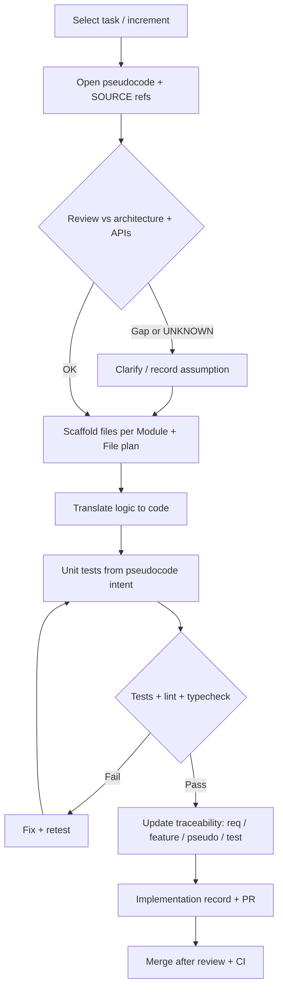

# Phase 9 — Implementation

## 1. Purpose

Build and integrate the solution per approved architecture, requirements, and development preparation: code, configuration, infrastructure hooks, and **UI that matches agreed visuals** without sacrificing accessibility, security, or traceability.

This phase applies the **Translate component image to code** workflow when implementation is driven from mocks or screenshots (see Phase 8 Section 14 and `Translate Component Image to Code — Template Prompt.md`). When work is driven from blueprint pseudocode, follow **`Pseudocode to Code Conversion Guidelines.md`** (translation procedure, error handling, testing).

**Construction discipline:** Phase 9 is where **construction quality** is exercised daily—readable modules, disciplined refactoring (**REF-001**), incremental delivery with tests, and loose coupling as agreed in Phase 8. Treat implementation as a **craft** (clarity over cleverness). Full principle set: Phase **8** — *Construction Quality Principles (Reference)*.

## 2. Pseudocode-to-code flow template

Use this pattern when work items reference **`docs/blueprint/`** pseudocode or project `.pseudo.md` bodies. Authoritative rules remain in **`Pseudocode to Code Conversion Guidelines.md`** (P2C-001); replace placeholders with your task IDs and file paths.

**Caption guidance:** Non-pseudocode work (greenfield without `.pseudo.md`, or image-only UI) may skip the left branch but should still hit **tests**, **traceability**, and **review**. Image-driven flows swap **`Translate Component Image to Code — Template Prompt.md`** for the pseudocode opening steps while keeping **TR** and **MR**.

---

## 3. Entry Criteria

- **G6 — Development Ready** is recorded, including Environment and Delivery Strategy (Template A-14), Module and File Planning Document (Template A-13), Development Plan (Template A-15), setup guidance, coding standards reference, and initial test setup.
- Requirements and architecture baselines under change control.
- Toolchain and branching strategy in use.
- When blueprint pseudocode or `.pseudo.md` bodies are in scope, the team agrees to use **Section 2** (and P2C-001) as the default translation loop unless an approved alternative is recorded.

## 4. Required Inputs

- Approved scope for the increment or release.
- Development Plan (Template A-15), or TD-001 / HG-001 execution plan when those artifacts provide the detailed work model.
- Module and File Planning Document (Template A-13), including directory structure, file catalog, ownership, interfaces/dependencies, and test placement.
- Environment and Delivery Strategy (Template A-14), including branch/release flow, config/secrets, CI/CD, deployment/rollback, and observability expectations.
- Naming/Identifier Conformance Notes from Phase 8, including lifecycle-local ID policy, Namespace M module/component/file rules, Namespace G mappings where applicable, and CC-PID/raw database ID rules where public identifiers are exposed.
- Architecture/design artifacts from Phase 7, including ARD-001 / DDS outputs, ADRs, Data Model / ERD, API and Integration Contract, and UI/UX Design Document where applicable.
- Requirements Specification Package (Template A-8), Feature Inventory Document (Template A-9), traceability rules, and initial test setup.
- Phase 7 naming and design-token rules (Section 12) and Phase 8 component inventory / codegen prompts as adopted by the team.

## 5. Activities

### Modular Decomposition (Reference)

Implementation follows **approved design** (DDS/SRS). Structure code by dividing the system into **manageable modules**; prefer **high cohesion** and **loose coupling**.

| Technique | Use |
| --- | --- |
| **Functional decomposition** | Split by core features (e.g. auth, catalog, cart, payments); one module per major function. |
| **Object-oriented decomposition** | Model domain objects and relationships; group classes into modules by domain area. |
| **Layered architecture** | Separate presentation, business logic, and data access; sub-modules per layer as needed. |
| **Modular programming** | Self-contained modules with explicit interfaces; encapsulation, inheritance, polymorphism where the stack supports it. |

**Practices:** Plan for scalability; **unit-test modules independently**; consider patterns such as MVC, MVVM, or service boundaries aligned to architecture.

Document **programming languages and tools** selected for the project with brief **rationale** (fit for problem domain, team, operations).

### Incremental Implementation and Cadence (Reference)

Prefer **one feature or coherent unit at a time**; run **unit tests immediately** after each unit when practical; **refactor** on a cadence to improve readability, reduce duplication, and simplify complex logic (**REF-001**). Keep quick trace hooks (which code ties to which feature) consistent with Phase 8 prep and Phase 10 test documentation.

- Implement features with reviews aligned to coding standards and secure coding policy; translate approved pseudocode per **`Pseudocode to Code Conversion Guidelines.md`** when BP-001 or project standards supply `.pseudo.md` bodies—use **Section 2** as the visual checklist for that loop.
- For **UI from images:** use `Translate Component Image to Code — Template Prompt.md`; attach project `@` context files (existing cards, charts, factories) before generating new code; reconcile output class names with Phase 8 Section 12 where applicable.
- Maintain traceability from requirements/features to code (and to blueprint pseudocode if BP-001 was used).
- Apply `STD-ENG-001` naming and identifier rules: keep lifecycle-local IDs stable, use registered Namespace G IDs only when assigned, follow Namespace M for modules/components/files, use CC-PID for public entity references where applicable, and do not expose raw database primary keys externally.
- Integrate, configure, and document environment-specific behavior.
- Apply **REF-001** (`Refactoring Evaluation Checklist.md`) when planning non-trivial refactors or reviewing change risk (complexity, readability, coupling, tests).

## 6. Required Outputs

- Working software in agreed environments.
- Implementation records for completed work items, including task/requirement links and relevant design/source references.
- Code review / merge evidence showing reviewers, checks, and disposition of requested changes.
- Unit/integration artifacts per test strategy.
- Build/configuration changes and deployment-impact notes aligned to the Environment and Delivery Strategy.
- Updated traceability links from requirements/features to code, pseudocode, tests, and known defects where applicable.
- Naming/identifier conformance evidence for material modules, public IDs, APIs/logs/URLs, and release artifacts where applicable.
- Updated task status in the Development Plan, TD-001 task list, HG-001 plan, or equivalent backlog.
- Known defects, limitations, technical debt, and follow-up work recorded for Phase 10 validation and downstream planning.
- Updated docs (API, config, operator notes) as defined by scope.

## 7. Implementation Checkpoints

- Increment / milestone review: meets acceptance criteria; defects triaged.
- Security or architecture escalation when deviations from baseline are required.
- **G7 routing note:** Phase 9 does not own a canonical Master Lifecycle gate. Phase 10 owns **G7 — Testing Passed**; failed G7 evidence routes remediation back to Phase 9 with bug reports, severity, and affected requirements identified.

## 8. Roles Responsible

- Developers: implementation quality and peer review.
- Tech lead: coherence with architecture and templates.
- QA: verification per test strategy.

## 9. Quality Checks

- Lint/type/test gates pass per CI policy.
- Implementation records link each material change to requirement, feature, task, or approved defect/remediation source.
- Naming/identifier usage follows the Phase 8 conformance notes; exceptions are documented and approved before release.
- Image-derived UI: external CSS, semantic HTML, assumptions documented; no unnecessary inline styles.
- Secrets and credentials not introduced in source control.
- Refactors scoped per **REF-001**: behavior preservation documented unless the increment is an explicit functional change; debt reduction does not drop agreed test or security bars.
- Deviations from the Module and File Planning Document, Development Plan, Environment and Delivery Strategy, or architecture/design artifacts are recorded and escalated before merge when material.
- Pseudocode-sourced work follows **Section 2** end-to-end (review → translate → test → trace → PR) or documents why a stage was skipped (e.g. time-boxed spike).

## 10. Exit Criteria

- Agreed backlog item(s) complete per Definition of Done.
- Known limitations and follow-ups recorded.
- Implementation evidence is ready for Phase 10 testing: code merged or otherwise available in the agreed environment, traceability links updated, unit/build checks run, and defects/debt visible.

## 11. Related Templates / Documents

- **Development Plan:** `28. Appendix A — Template Library.md` — **Template A-15 — Development Plan**.
- **Module and File Planning Document:** `28. Appendix A — Template Library.md` — **Template A-13 — Module and File Planning Document**.
- **Environment and Delivery Strategy:** `28. Appendix A — Template Library.md` — **Template A-14 — Environment and Delivery Strategy**.
- **`21. Decision Gates.md`** — G6 handoff into Phase 9 and G7 failure routing back to Phase 9.
- **`22. Required Documents.md`** — artifact register for development preparation and implementation evidence.
- **`24. Traceability Rules.md`** — requirement, design, task, implementation, and test traceability.
- **`04. Definitions.md`** — controlled lifecycle terms.
- Phase 8 — Construction quality principles and Development Guidelines Package (DGP-001); Section 12 (component library), Section 13 (pseudocode-to-code standard), Section 14 (image-to-code).
- **`Pseudocode to Code Conversion Guidelines.md`** — formatting and translation from pseudocode to implementation (pair with **Section 2** flow diagram in this phase).
- **`Unit Test and Pseudocode Writing Guidelines.md`** — unit tests aligned to pseudocode and Phase 10 / USSM Section 7.
- `Translate Component Image to Code — Template Prompt.md`.
- **Example sequencing:** `Example — Five-Iteration Website Task List.md` — non-normative milestone order for a marketing-site stack; convert through Template A-15 and TD-001/HG-001 before treating it as project scope.
- **REF-001:** `Refactoring Evaluation Checklist.md` — complexity, readability, maintainability, refactor scope.

