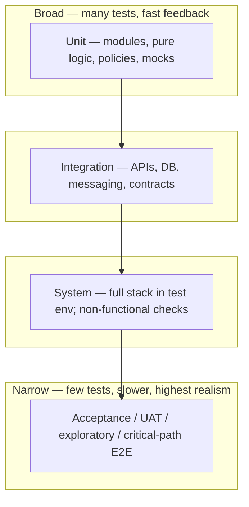

# Phase 10 — Testing and Validation

## 1. Purpose

Validate that the solution meets requirements and quality bars: **unit through acceptance** testing, traceability from tests back to specifications, and **CI/CD gates** consistent with organizational standards. Operational unit-test discipline (AAA, mocks, determinism, pseudocode-driven checks) is spelled out in **`Unit Test and Pseudocode Writing Guidelines.md`**, which supports but does not replace the normative strategy below.

### Classic SDLC Testing Focus (Reference)

Testing confirms the product **behaves correctly** and **meets requirements** from earlier lifecycle stages.

- **Levels:** unit, integration, and system testing as appropriate; some teams add heavy **manual** coverage, others emphasize **automation**—either way, each unit should behave as intended before release-level QA.
- **Guiding questions:** Does the software produce the intended outcomes? Does it satisfy specified functions and objectives?

Treat testing as the gate between implementation and release-quality validation; defects feed back to implementation or requirements per change control.

### Feature-Aligned Testing and Trace Hooks (Reference)

From efficient-development practice: implement **unit tests** that track **individual functions or units**; maintain **regression** coverage so new work does not break existing behavior; **automate** repetition where it pays off; **document** which functions or methods implement which features so traceability stays auditable. Full discipline is in **`Unit Test and Pseudocode Writing Guidelines.md`** and USSM §7.

### Verification Evidence vs Requirements and Tasks (Reference)

Where **Phase 6** maintains a **requirements catalog** and tasks with **`linked_requirement_ids`** on `tasks_board.json` (see **`24. Traceability Rules.md`**), Phase 10 results—test runs, defect closure, acceptance evidence—should remain linkable to the **same requirement IDs** for audits and release records. Optional **traceability report** steps may run in CI alongside test suites when the program gates on orphan/gap detection.

### UI/UX Validation Scorecard (Reference)

Supplement functional testing with **surface and journey** criteria from **`29. Appendix B — Checklists.md`**: WCAG-aligned contrast checks, consistency of patterns, interactive states, typography readability, heuristic violations, IA findability signals, and task-friction metrics where moderated sessions or telemetry are available. This does not replace USSM §7 or Annex E; it extends acceptance reviews for user-facing quality.

## 2. Test pyramid template (recommended balance)

Use this as a **volume and feedback-speed** guide when tailoring **Template A-16** (Test Strategy). Percent bands are illustrative—adjust per product risk, regulated criticality, and team automation maturity (see USSM Section **7.3**).

**Caption guidance:** Prefer **more investment at the base** (unit + narrow integration); reserve the tip for journeys that justify end-to-end cost. Record rationale when the shape is **top-heavy** (many E2E, sparse unit)—common debt drivers include unstable environments or missing seams for isolation.

---

## 3. Alignment with USSM

Testing practices and artifact expectations follow **USSM Section 7 — Development and Testing** in `USSM — Unified Software Standards Manual v1.0.md`.

Key USSM concepts to apply in this phase:

- **Test levels:** unit, integration, system, acceptance (USSM Section 7.3), aligned to ISO/IEC 12207 and IEEE 29119.
- **Test case structure and traceability:** USSM Section 7.4 — link each case to CRS / SRS identifiers.
- **CI/CD quality gates:** USSM Section 7.5 — automated build, static analysis, tests, gated promotion.
- **Reviews and metrics:** USSM Section 7.6 — code and test reviews; coverage, defects, build stability.

Use **USSM Annex E Section 10.5.3** (testing compliance checklist) during formal reviews.

## 4. Relationship to unit tests and pseudocode

| Document | Role |
| --- | --- |
| **`Unit Test and Pseudocode Writing Guidelines.md`** | Supporting UTP-001 guidance: AAA, independence, mocking, deterministic tests, edge cases, security-aware unit checks, test file placement, run-after-write workflow; pseudocode cross-reference without duplicating format rules. |
| **`Pseudocode to Code Conversion Guidelines.md`** | Pseudocode format and translation to code (Phase 8–9; BP-001). |

Phase 8 may require tests planned or stubbed against pseudocode; Phase 9 delivers implementation; **Phase 10** confirms the full strategy—including that unit tests honor **`Unit Test and Pseudocode Writing Guidelines.md`** where the program adopts it.

## 5. Entry criteria

- Phase 9 exit criteria met for the scope under test (or explicit waiver for standalone test campaigns).
- Phase 9 implementation evidence is available: working increment, implementation records, code review / merge evidence, unit/integration artifacts, traceability updates, and known defects/debt where applicable.
- Test Strategy (Template A-16) or USSM-aligned strategy identifies levels, environments, quality thresholds, and traceability expectations (pyramid balance may be summarized with **Section 2** when helpful).
- Where blueprint extraction applied: pseudocode and trace matrix available for behavioral regression design.

## 6. Activities

- Execute test levels per Test Strategy (Template A-16): unit → integration → system → acceptance as applicable—keep balance aligned with **Section 2** unless A-16 documents a deliberate deviation.
- Execute Acceptance Test Scenarios (Template A-17) for business-readable acceptance coverage.
- Map results to requirements / CRS identifiers (USSM §7.4).
- Run or verify CI pipelines per USSM §7.5; record defects and coverage against thresholds.
- Record QA Results (Template A-18), Bug Reports (Template A-19), and Validation Sign-Off (Template A-20).
- For unit scope: apply **`Unit Test and Pseudocode Writing Guidelines.md`** (Sections 2 and 4) in reviews and audits.
- Where scope includes significant UI: run or sample **UI/UX audit** dimensions from **`29. Appendix B — Checklists.md`** (design-system adherence, accessibility basics, heuristic severity, key friction metrics).

## 7. Required outputs

- Test Strategy execution results (Template A-16).
- Acceptance Test Scenario outcomes (Template A-17).
- QA Results (Template A-18), including test reports or dashboards, coverage, CI status, and readiness recommendation.
- Bug Reports (Template A-19) with severity, disposition, linkage to requirements, and verification record where defects are found.
- Validation Sign-Off (Template A-20) documenting the G7 decision, residual risk, exceptions, and approval.
- Evidence of CI passage for promoted builds.
- Updates to traceability when tests expose specification gaps.

## 8. Decision Gate — G7

- **G7 — Testing Passed:** Test Strategy execution results, Acceptance Test Scenario outcomes, QA Results, Bug Reports with severity/disposition, and Validation Sign-Off are reviewed for release or milestone readiness.
- Possible outcomes: Passed · Passed with known issues (logged) · Failed.
- On failure: route defects and remediation scope back to Phase 9, then re-test affected areas before re-review.
- Escalation when coverage or defect thresholds breach policy.

## 9. Roles responsible

- QA / test engineering: plan execution and reporting.
- Developers: unit test ownership per guidelines; fix defects.
- Tech lead: scope and environment alignment.

## 10. Exit criteria

- Acceptance criteria for the validation scope are met or formally waived with recorded risk.
- Critical/high defects resolved or deferred per change control.
- Validation Sign-Off (Template A-20) records the G7 decision, approver, date, residual risks, and follow-up actions.

## 11. Related documents

- Phase 9 — Implementation.
- Phase 11 — Release Preparation.
- **`21. Decision Gates.md`** — G7 — Testing Passed evidence and outcomes.
- **`22. Required Documents.md`** — artifact register for testing and validation evidence.
- **`24. Traceability Rules.md`** — requirement, design, implementation, test, and defect traceability.
- **`28. Appendix A — Template Library.md`** — Templates A-16 through A-20 (**Section 2** pyramid complements A-16 Test Strategy).
- **`Unit Test and Pseudocode Writing Guidelines.md`** — unit testing + pseudocode workflow (Phase 8–10).
- **`Pseudocode to Code Conversion Guidelines.md`** — pseudocode standard (Phase 7–9).
- USSM Section 7, Annex E.
- **`29. Appendix B — Checklists.md`** — UI/UX scoring and audit framework.
