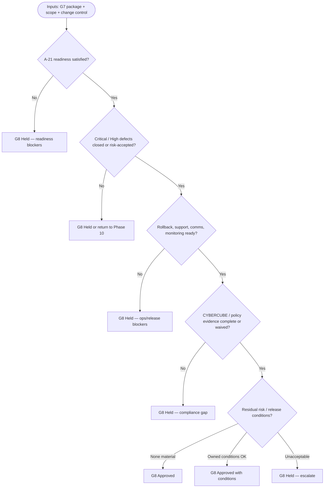

# Phase 11 — Release Preparation

## 1. Purpose

Prepare a tested increment for controlled deployment by confirming release scope, validation evidence, known issues, rollback readiness, security posture, release communications, and formal approval.

This phase converts **G7 — Testing Passed** evidence into a release decision. Its exit gate is **G8 — Release Approved**.

## 2. Go/no-go decision map (G8-oriented)

Use this pattern when framing **Template A-26** (Final Approval Record) and stakeholder reviews. Detailed evidence lives in **Template A-21** (Release Readiness Checklist), **A-22–A-25**, and Phase 10 outputs—not every box below maps one-to-one to a template row.

**Routing note:** Quality or test failures usually loop to **Phase 10**; incomplete documentation, security review, rollback clarity, or stakeholder approval gaps are typically resolved **within Phase 11** before re-review (**§7**).

---

## 3. Entry Criteria

- **G7 — Testing Passed** is recorded, including Test Strategy execution results, Acceptance Test Scenario outcomes, QA Results, Bug Reports where defects exist, and Validation Sign-Off.
- Release scope is identified for the target deployment or milestone.
- Change control, risk, and exception records are current for release-impacting decisions.
- Stakeholders understand how **§2** maps to **G8** outcomes (Approved · Approved with conditions · Held).

## 4. Required Inputs

- Validation Sign-Off (Template A-20) and QA Results (Template A-18).
- Known defects, deferred work, accepted limitations, and residual risks from Phase 10.
- Release scope, feature list, implementation records, and traceability updates from Phases 6–10.
- Environment and Delivery Strategy (Template A-14), including deployment/rollback expectations.
- Security, privacy, compliance, operational, and support requirements applicable to the release.
- CYBERCUBE standards applicability evidence from `25. Quality and Compliance Checks.md` §5, including non-applicability rationale where used.
- PRCS registration evidence for product releases: `PRD-XXX`, approved `PCL-L.D.E.C`, domain tags, product owner, and criticality-driven standards tiering.
- Naming/Identifier release evidence for `STD-ENG-001`: stable artifact IDs, Namespace G mappings where applicable, CC-PID use for public entity IDs, no raw database IDs exposed externally, and Namespace M conformance for modules/components/files.

## 5. Activities

- Confirm release scope and compare it against validated requirements, features, and approved exclusions.
- Walk stakeholders through **§2** as needed so **G8** outcomes (Approved · Approved with conditions · Held) match recorded evidence.
- Complete the Release Readiness Checklist using Template A-21.
- Prepare or refresh the Known Issues List using Template A-22.
- Draft Release Notes using Template A-23.
- Prepare the Rollback Plan using Template A-24.
- Complete the Security Review Checklist (Template A-25.1) and summarize Security Review Results using Template A-25 when required by criticality, data sensitivity, change risk, or release policy.
- Confirm required CYBERCUBE standards evidence is complete before release approval, or that non-applicability rationale is documented and accepted.
- Confirm the release is tied to an approved PRCS product record before production deployment when the release is product-bound. If no product record applies, document the approved non-applicability or Work Type Tag rationale.
- Confirm naming/identifier evidence is complete for release-impacting artifacts, public IDs, APIs/logs/URLs, modules/components/files, and governance records.
- Confirm support, operations, communications, monitoring, and deployment-window readiness.
- Prepare the Final Approval Record using Template A-26.

## 6. Required Outputs

- **Release Readiness Checklist** (Template A-21).
- **Known Issues List** (Template A-22) when issues, limitations, accepted risks, or deferred work remain.
- **Release Notes** (Template A-23).
- **Rollback Plan** (Template A-24).
- **Security Review Checklist** (Template A-25.1) and **Security Review Results** (Template A-25) when security review is required.
- **Final Approval Record** (Template A-26).
- PRCS production confirmation or non-applicability rationale for the release.
- Naming/Identifier release confirmation or non-applicability rationale.
- Updated change control, risk, support, and operational notes as applicable.

## 7. Decision Gate — G8

- **G8 — Release Approved:** Release Readiness Checklist, Known Issues List, Release Notes, Rollback Plan, Security Review Results, and Final Approval Record are reviewed for deployment readiness.
- Possible outcomes: Approved · Approved with conditions · Held.
- On failure: record blockers, owners, and re-review date; return to Phase 10 for quality blockers or remain in Phase 11 for release-readiness blockers.

## 8. Roles Responsible

- Release Manager: owns release readiness coordination and final release package.
- Product Owner / Sponsor: approves release scope, customer-facing notes, and known-issue risk.
- Engineering Lead / Tech Lead: confirms build, implementation, and rollback readiness.
- QA Lead: confirms validation evidence and unresolved defect posture.
- Security / Operations / Support: review release risks, deployment readiness, monitoring, and support preparation where applicable.

## 9. Quality Checks

- G7 evidence is present and the release scope matches validated functionality.
- Critical/high defects are resolved or have documented risk acceptance and approval.
- Rollback procedure is actionable, tested where feasible, and aligned with data/migration constraints.
- Release notes and known issues are clear enough for affected stakeholders.
- Security, privacy, compliance, and operational checks are complete or formally waived.
- Applicable CYBERCUBE standards evidence from `25. Quality and Compliance Checks.md` §5 is complete before **G8**, or non-applicability rationale is documented.
- Product-bound releases have an approved `PRD-XXX` and `PCL-L.D.E.C` before production deployment; pre-product or cross-cutting releases document why Work Type Tag(s) or non-applicability are sufficient.
- Public-facing entity IDs use CC-PID where applicable, raw database IDs are not exposed externally, and module/component/file naming follows the Phase 8 naming plan or approved exceptions.
- Conditions and residual risks are owned, dated, and visible in the Final Approval Record.
- **§2** decision path matches the recorded **G8** outcome (no outcome label that contradicts readiness answers).

## 10. Exit Criteria

- G8 decision is recorded in the Final Approval Record.
- Release package is ready for Phase 12 deployment or held with blockers documented.
- Deployment owner, release window, rollback path, communications, and monitoring expectations are confirmed.

## 11. Related Templates / Documents

- **`21. Decision Gates.md`** — G8 — Release Approved evidence and outcomes.
- **`22. Required Documents.md`** — artifact register for release preparation evidence.
- **`24. Traceability Rules.md`** — requirement, release scope, test, defect, and deployment traceability.
- **`25. Quality and Compliance Checks.md`** — CYBERCUBE Standards Applicability Matrix and G8 release evidence expectations.
- **`26. Change Control.md`** — handling release-impacting changes and approvals.
- **`28. Appendix A — Template Library.md`** — Templates A-21 through A-26 (**§2** complements A-21/A-26 for go/no-go framing).
- `16. Phase 10 — Testing and Validation.md` — G7 validation evidence.
- `18. Phase 12 — Deployment.md` — deployment execution after release approval.
