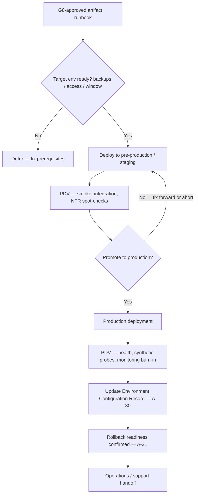

# Phase 12 — Deployment

## 1. Purpose

Deploy the approved release into the target environment, validate the deployment, record configuration and migration evidence, and confirm rollback status so the project can transition into maintenance and improvement.

This phase executes the release package approved at **G8 — Release Approved**. Its operational exit checkpoint is **G9 — Deployment Completed**.

## 2. Environment promotion flow template

Use this pattern when sequencing **Templates A-27–A-31** execution and USSM **§8.4–8.6**. Rename environments (`staging`, `pre-prod`, `canary`) to match **Template A-14** and your runbooks; some programs collapse stages when risk is low—document intentional skips.

**Rollback:** If PDV fails after production deploy, follow **Template A-24** / incident path—not this happy-path diagram. **§9** (**Decision Gate — G9**) captures **Completed with rollback**.

---

## 3. Alignment with USSM

Deployment behavior, packaging, validation, and governance align with **USSM Section 8 — Deployment** in `USSM — Unified Software Standards Manual v1.0.md`.

Use USSM §8 for:

- Deployment and rollback **planning** (§8.2), **release packaging** (§8.3), **environment readiness** (§8.4).
- **Installation and configuration** discipline (§8.5).
- **Post-deployment validation (PDV)** (§8.6), **transition to operations** (§8.7).
- **Rollback and contingency** (§8.8), **baseline and audit evidence** (§8.9–8.10).

## 4. Installation, Configuration, and Promotion

Classic deployment stage concerns:

| Concern | Intent |
| --- | --- |
| **Installation** | Deploy to target hardware/software environments (enterprise or end-user machines) per runbooks. |
| **Configuration** | Tune settings, parameters, and integrations for each organization or tenant. |
| **Deployment** | Promote tested artifacts to **production** (or customer-managed production) with PDV per USSM §8.6. |

These activities align with USSM §8.5–8.6; record evidence for audits and rollback readiness.

## 5. Entry Criteria

- **G8 — Release Approved** is recorded, including Release Readiness Checklist, Release Notes, Rollback Plan, Final Approval Record, and applicable known-issue/security evidence.
- Deployment window, deployment owner, operations/support contacts, escalation path, and target environment are confirmed.
- Release artifact, access, backup/restore point, monitoring, and rollback path are ready.
- Promotion path (including skipped stages) is agreed and consistent with **§2** and **Template A-14**.

## 6. Required Inputs

- Final Approval Record (Template A-26) and Release Readiness Checklist (Template A-21).
- Rollback Plan (Template A-24).
- Release Notes (Template A-23) and Known Issues List (Template A-22) where applicable.
- Environment and Delivery Strategy (Template A-14) and existing Environment Configuration baseline to be updated into the Environment Configuration Record (Template A-30).
- Migration plan or migration scripts where data, schema, infrastructure, or configuration changes are in scope.

## 7. Activities

- Complete the Deployment Checklist using Template A-27 before execution; align step order with **§2** unless the checklist documents a justified deviation.
- Deploy the approved artifact using the agreed automation, runbook, or deployment procedure.
- Record deployment execution in the Deployment Record using Template A-28.
- Execute and record migrations using Template A-29 when migrations are in scope.
- Update the Environment Configuration Record using Template A-30.
- Run post-deployment validation, smoke checks, health checks, monitoring checks, and support/operations handoff.
- Record Rollback Confirmation using Template A-31, whether rollback was invoked or not.
- Escalate customer-affecting failures through incident response and rollback paths.

## 8. Required Outputs

- **Deployment Checklist** (Template A-27), signed or approved for execution.
- **Deployment Record** (Template A-28).
- **Migration Record** (Template A-29) when migrations are in scope.
- **Environment Configuration Record** (Template A-30).
- **Rollback Confirmation or non-invocation note** (Template A-31).
- Post-deployment validation evidence, monitoring status, support/operations handoff notes, and incident/rollback records if applicable.

## 9. Decision Gate — G9

- **G9 — Deployment Completed:** Deployment Checklist, Deployment Record, Migration Record where applicable, Environment Configuration Record, and Rollback Confirmation are reviewed for deployment completion.
- Possible outcomes: Completed · Completed with rollback · Failed.
- On failure: invoke rollback per Rollback Plan; trigger incident response if customer-affecting; record remediation route before entering Phase 13.

## 10. Roles Responsible

- Release Manager / Deployment Lead: owns deployment execution and completion evidence.
- Operations / SRE: owns environment readiness, monitoring, incident escalation, and post-deployment health.
- Engineering Lead: supports deployment, migration, smoke checks, and remediation.
- QA / Product Owner: confirms post-deployment validation and customer-visible behavior where applicable.
- Security / Compliance: reviews deployment-impacting security conditions when required.

## 11. Quality Checks

- G8 approval evidence is present before deployment starts.
- Deployment steps match the approved release artifact, environment, and change window.
- Migration steps are validated and reconciled, with rollback/remediation notes where applicable.
- Environment configuration is recorded without plaintext secrets.
- Post-deployment validation and monitoring checks are completed.
- Rollback status is explicitly recorded, even when rollback was not invoked.
- Recorded deployment sequence matches **§2** for each environment touched, or exceptions are noted in the Deployment Record.

## 12. Exit Criteria

- G9 decision is recorded as Completed, Completed with rollback, or Failed.
- Deployment evidence is complete and stored with release records.
- Operations/support handoff is complete, including monitoring expectations and known issues.
- Phase 13 maintenance owners have the deployment, configuration, and rollback evidence needed for ongoing support.

## 13. Related Documents

- **`21. Decision Gates.md`** — G9 — Deployment Completed evidence and outcomes.
- **`22. Required Documents.md`** — artifact register for deployment evidence.
- **`24. Traceability Rules.md`** — release, deployment, environment, migration, and rollback traceability.
- **`28. Appendix A — Template Library.md`** — Templates A-27 through A-31 (**§2** gives a promotion / PDV spine for execution planning).
- **`17. Phase 11 — Release Preparation.md`** — release approval and G8 evidence.
- **`19. Phase 13 — Maintenance and Improvement.md`** — operational support and improvement handoff after deployment.
- **`USSM — Unified Software Standards Manual v1.0.md`** — §8 deployment guidance.

