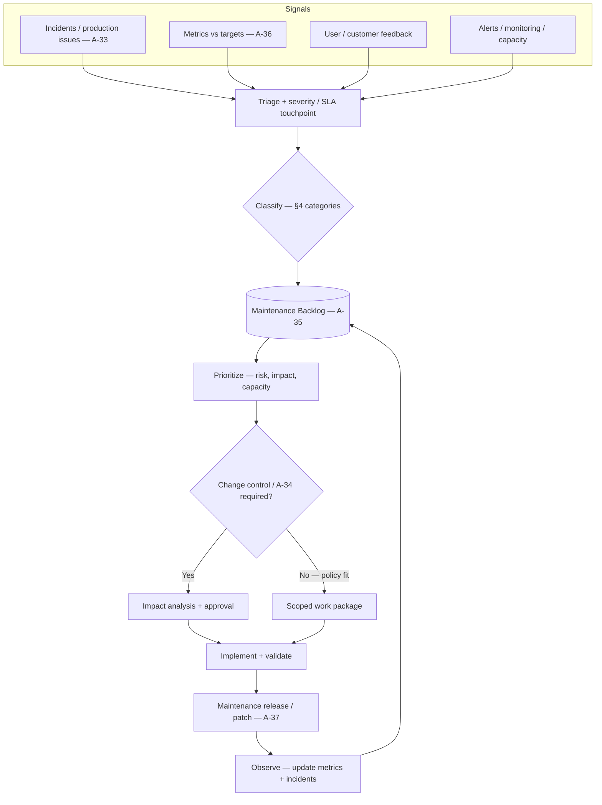

# Phase 13 — Maintenance and Improvement

## 1. Purpose

Operate, support, correct, adapt, improve, and monitor the released solution after deployment. Phase 13 turns deployment evidence and operational reality into maintenance decisions, backlog items, patches, metrics, and improvement inputs for Phase 14.

Phase 13 does not own a standalone Master Lifecycle gate. It produces operational evidence that informs **G10 — Maintenance Review Completed** during **Phase 14 — Post-Release Review**.

## 2. Maintenance backlog flow template

Use this pattern when wiring **Templates A-33–A-37** together: operational signals become **prioritized backlog items**, then approved changes and shipped patches. Categorize work using **§4** (corrective / adaptive / perfective / preventive). **`26. Change Control.md`** applies when **Template A-34** or policy requires formal approval.

**Loop:** **OBS** feeds the next review cycle and **Phase 14** / **G10** evidence; unresolved signals stay on **A-35** with explicit owners.

---

## 3. Alignment with USSM

Ongoing operation and change after release follow **USSM Section 9 — Maintenance** in `USSM — Unified Software Standards Manual v1.0.md`.

Apply USSM §9 for:

- **Maintenance categories:** corrective, adaptive, perfective, preventive (§9.3).
- **Change requests, impact analysis, testing, and release** of maintenance patches (§9.4).
- **Monitoring, documentation, configuration management** (§9.5–9.6).
- **End-of-life and disposal** (§9.7) and **continuous improvement** (§9.8).

Cross-reference **USSM Annex G** (continuous improvement log) for lessons learned.

## 4. Classic Maintenance Categories

| Type | Typical actions |
| --- | --- |
| **Corrective** | Fix defects and errors reported in production. |
| **Adaptive** | Adjust to environment or requirement changes; handle user questions and incidents; keep service running. |
| **Perfective** | Improve quality or limited rollout feedback before wider release; narrow blast radius when appropriate. |
| **Preventive** | Hardening, dependency updates, monitoring improvements to reduce future failures. |

Customer-specific issues are handled under adaptive/corrective flows with traceability to SLAs and change control.

## 5. Entry Criteria

- **G9 — Deployment Completed** is recorded, including Deployment Record, Environment Configuration Record, Rollback Confirmation or non-invocation note, and Migration Record where applicable.
- Operations/support handoff from Phase 12 is complete.
- Monitoring, alerting, known issues, support ownership, and escalation paths are active or explicitly waived.
- Team agrees how operational signals map into **§2** (backlog entries, owners, and cadence).

## 6. Required Inputs

- Deployment Record (Template A-28), Environment Configuration Record (Template A-30), and Rollback Confirmation (Template A-31).
- Migration Record (Template A-29) where migrations were in scope.
- Known Issues List (Template A-22), Release Notes (Template A-23), and support/operations handoff notes.
- Forecasts, targets, business assumptions, SLO/SLA targets, and maintenance ownership records.
- Change control, incident response, and process improvement procedures.

## 7. Activities

- Establish or update the Maintenance Plan using Template A-32.
- Track incidents and production issues using Template A-33.
- Route maintenance changes through Maintenance Change Requests using Template A-34 and change control where scope, risk, release, or customer impact requires it.
- Maintain the Maintenance Backlog using Template A-35; keep item lifecycle consistent with **§2** unless the Maintenance Plan documents another model.
- Review operational metrics and forecast/actual variance using Template A-36.
- Record maintenance releases or patches using Template A-37 when maintenance changes are deployed.
- Review refactoring and technical-debt opportunities using REF-001 where perfective or preventive maintenance changes are proposed.
- Feed lessons learned, recommendations, and unresolved issues into Phase 14.

## 8. Required Outputs

- **Maintenance Plan** (Template A-32).
- **Incident / Production Issue Records** (Template A-33) where incidents or production issues occur.
- **Maintenance Change Requests** (Template A-34) for approved or proposed maintenance changes.
- **Maintenance Backlog** (Template A-35).
- **Operational Metrics / Actuals Review** (Template A-36).
- **Maintenance Release / Patch Records** (Template A-37) when maintenance changes are deployed.
- Inputs for Phase 14 / G10: maintenance backlog, lessons learned, improvement recommendations, operational metrics, incident trends, and process improvement notes.

## 9. Forecast vs Actuals

Compare **operating actuals** (revenue, cost, adoption, SLA metrics) to **forecasts and targets** from the business case and Phase 6 planning. Material gaps should trigger backlog prioritization, capacity discussion, risk-register updates, or forecast/model revisions per **`28. Appendix A — Template Library.md`** (**Template A-5 — Entrepreneurial forecasting guide**).

## 10. Refactoring and Code Quality

Perfective and preventive maintenance often includes **refactoring** (structure and clarity without intended behavior change). Use **REF-001** (`Refactoring Evaluation Checklist.md`) to prioritize debt reduction, readability, and coupling improvements consistently across releases. Pair checklist findings with impact analysis and regression testing per USSM §9.4.

## 11. Operational Checkpoints

- Maintenance plan is current and ownership is clear.
- Production issues are triaged, prioritized, and linked to remediation or accepted risk.
- Maintenance changes have impact analysis, validation expectations, and approval where required.
- Operational metrics and forecast/actual variance are reviewed on the defined cadence.
- Phase 14 has enough evidence to complete G10.
- Backlog and patch cadence reflect **§2** (signals → backlog → approval → ship → observe).

## 12. Roles Responsible

- Product Owner: prioritizes maintenance backlog and customer-visible improvements.
- Engineering Lead: owns corrective, adaptive, perfective, and preventive technical changes.
- Operations / SRE: owns monitoring, incidents, reliability, service targets, and operational handoff.
- Customer Success / Support: captures customer issues, support impact, and communications.
- Security / Compliance: reviews security-sensitive incidents, maintenance changes, and risk acceptances.

## 13. Quality Checks

- Maintenance work is categorized as corrective, adaptive, perfective, or preventive.
- Incidents and production issues include impact, timeline, remediation, and follow-up.
- Maintenance changes have impact/risk assessment, validation plan, and change-control linkage when required.
- Metrics reviews connect actuals to targets, forecasts, SLOs, and backlog decisions.
- Deployed maintenance changes include release/patch evidence and rollback status.
- Major backlog paths (incident → backlog → change → release) are traceable without orphan tickets relative to **§2**.

## 14. Exit Criteria

- Maintenance evidence is ready for Phase 14 review.
- Open issues, accepted risks, backlog priorities, and improvement recommendations are visible.
- Operational metrics and actuals are available for post-release review.
- Maintenance owners agree on next-cycle recommendations or ongoing support actions.

## 15. Related Documents

- `05. Roles and Responsibilities.md` — Support, Engineering, SRE, Security, and Customer Success ownership for production issues and improvement loops.
- **`18. Phase 12 — Deployment.md`** — G9 deployment evidence and operations handoff.
- **`20. Phase 14 — Post-Release Review.md`** — G10 review using Phase 13 operational evidence.
- **`21. Decision Gates.md`** — G10 — Maintenance Review Completed evidence and outcomes.
- **`22. Required Documents.md`** — artifact register for maintenance and improvement evidence.
- **`24. Traceability Rules.md`** — incident/change/backlog/release traceability.
- **`26. Change Control.md`** — maintenance change approval and scope control.
- **`27. Process Improvement.md`** — routing improvement recommendations into the next cycle.
- **`28. Appendix A — Template Library.md`** — Templates A-32 through A-37 (**§2** ties A-33–A-37 into an end-to-end backlog narrative).
- **Appendix A — Template A-5** — Entrepreneurial forecasting guide (refresh assumptions when monitoring actuals vs plan).
- **REF-001:** `Refactoring Evaluation Checklist.md`
- **`USSM — Unified Software Standards Manual v1.0.md`** — §9 maintenance and §10 continuous improvement.
