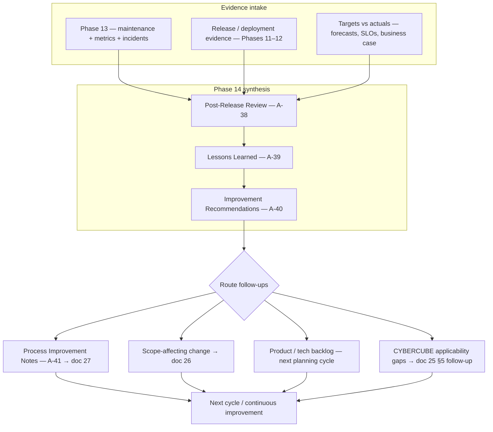

# Phase 14 — Post-Release Review

## 1. Purpose

Close the lifecycle loop by reviewing release outcomes, maintenance evidence, operational performance, lessons learned, improvement recommendations, and process changes. Phase 14 determines whether the release cycle is closed, closed with follow-up actions, or routed back for additional work.

This phase owns **G10 — Maintenance Review Completed**.

## 2. Lessons-learned loop template

Use this pattern when structuring **Templates A-38–A-41** and **G10** narrative: evidence consolidates into **review artifacts**, then **actionable outputs** route by impact. **`27. Process Improvement.md`**, **`26. Change Control.md`**, and the **Maintenance Backlog (A-35)** remain the authoritative routing guides—the diagram is a map, not a substitute for those procedures.

**G10:** Record outcomes as **Closed**, **Closed with follow-up actions**, or **Re-open prior phase** (**§7**) so routing matches commitments in **A-38**.

---

## 3. Entry Criteria

- Phase 13 maintenance evidence is available, including Maintenance Plan, Maintenance Backlog, Operational Metrics / Actuals Review, and incident/change/patch records where applicable.
- Operational owners have had enough time or review cadence to observe release outcomes.
- Known issues, accepted risks, support impact, and improvement candidates are current.
- Review sponsors agree **§2** fits how this program routes lessons learned (adjust labels if templates are merged).

## 4. Required Inputs

- Maintenance Plan (Template A-32).
- Incident / Production Issue Records (Template A-33) where issues occurred.
- Maintenance Change Requests (Template A-34) and Maintenance Release / Patch Records (Template A-37) where maintenance changes were made.
- Maintenance Backlog (Template A-35).
- Operational Metrics / Actuals Review (Template A-36).
- Deployment and release evidence from Phases 11–12 as needed.
- CYBERCUBE standards applicability evidence, release evidence, exceptions, and non-applicability rationale from `25. Quality and Compliance Checks.md` §5.
- Forecasts, business targets, SLO/SLA targets, customer/support feedback, and process improvement candidates.

## 5. Activities

- Prepare the Post-Release Review using Template A-38.
- Capture Lessons Learned using Template A-39.
- Convert findings into Improvement Recommendations using Template A-40.
- Keep artifact sequencing aligned with **§2** unless **A-38** documents a justified alternate order.
- Record Process Improvement Notes using Template A-41 where lifecycle, standard, tooling, or workflow changes are needed.
- Review the Maintenance Backlog (Template A-35) and decide what carries into the next planning cycle.
- Compare outcomes against business case, forecasts, SLO/SLA targets, and release objectives.
- Review CYBERCUBE standards applicability gaps, evidence gaps, exceptions, and improvement actions for the next cycle.
- Route product changes through backlog/planning, scope-affecting changes through change control, and process changes through `27. Process Improvement.md`.

## 6. Required Outputs

- **Post-Release Review** (Template A-38).
- **Lessons Learned Record** (Template A-39).
- **Improvement Recommendations** (Template A-40).
- **Maintenance Backlog** (Template A-35), reviewed and updated.
- **Process Improvement Notes** (Template A-41) where process improvements are identified.
- CYBERCUBE standards applicability gap and improvement notes where evidence, controls, exceptions, or non-applicability rationale require follow-up.
- G10 decision and next-cycle routing recorded in the Post-Release Review.

## 7. Decision Gate — G10

- **G10 — Maintenance Review Completed:** Post-Release Review, Lessons Learned Record, Improvement Recommendations, Maintenance Backlog, and Process Improvement Notes are reviewed.
- Possible outcomes: Closed · Closed with follow-up actions · Re-open prior phase.
- On failure or follow-up: route improvements through `27. Process Improvement.md`, `26. Change Control.md`, or the next planning cycle as appropriate.

## 8. Roles Responsible

- Product Owner: owns outcome review, backlog routing, and next-cycle product recommendations.
- Engineering Lead: owns technical lessons, defects, debt, and implementation follow-up.
- Operations / SRE: owns operational metrics, incident trends, reliability, and support handoff findings.
- Customer Success / Support: owns customer feedback, support impact, and communications lessons.
- Security / Compliance: reviews security, privacy, compliance, or risk findings where applicable.

## 9. Quality Checks

- Phase 13 evidence is reviewed rather than summarized from memory.
- Lessons learned include both positive and negative patterns with source evidence.
- Recommendations have owners, priorities, and routing paths.
- Process improvements identify affected phases, standards, templates, or tooling.
- CYBERCUBE standards applicability gaps and improvement actions are identified, owned, or explicitly marked as no action needed.
- Maintenance backlog is updated and ready for next-cycle planning.
- G10 decision, authority, date, and follow-up actions are recorded.
- Every improvement or follow-up from **§2** routing has an owner and destination (backlog, change control, process improvement, or explicit deferral).

## 10. Exit Criteria

- G10 decision is recorded.
- Follow-up actions have owners and routing.
- Maintenance backlog and improvement recommendations are ready for next planning cycle.
- Process improvement notes are routed to the appropriate owner or governance path.

## 11. Related Documents

- **`19. Phase 13 — Maintenance and Improvement.md`** — operational evidence feeding G10.
- **`21. Decision Gates.md`** — G10 — Maintenance Review Completed evidence and outcomes.
- **`22. Required Documents.md`** — artifact register for post-release review evidence.
- **`24. Traceability Rules.md`** — release, incident, backlog, recommendation, and process-improvement traceability.
- **`25. Quality and Compliance Checks.md`** — CYBERCUBE Standards Applicability Matrix and G10 post-release review expectations.
- **`26. Change Control.md`** — routing scope-affecting follow-up actions.
- **`27. Process Improvement.md`** — routing lifecycle/process improvements.
- **`28. Appendix A — Template Library.md`** — Templates A-35 and A-38 through A-41 (**§2** sequences A-38 → A-39 → A-40 and ties routing to A-41).
- **`USSM — Unified Software Standards Manual v1.0.md`** — §9 maintenance, §10 continuous improvement, and Annex G.
