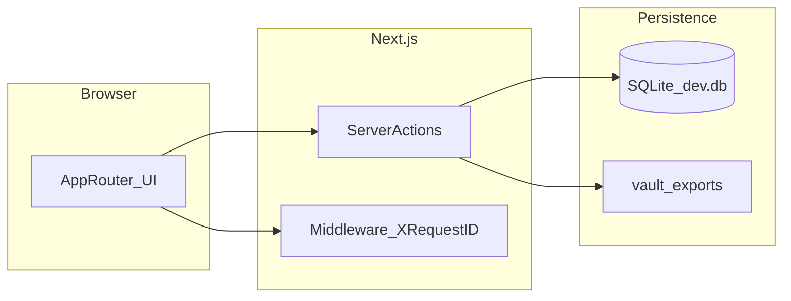

# Lifecycle Platform

Next.js + Prisma app for lifecycle templates, gate reviews, dashboards, and markdown export to `vault/`.

## Quick Start

```bash
cd lifecycle-platform
cp .env.example .env
npm install
npx prisma migrate deploy
npm run seed
npm run dev
```

Open [http://localhost:3001/dashboard](http://localhost:3001/dashboard) (`/` redirects here; `npm run dev` binds port **3001**).

## Seed Data

`npm run seed` ensures a solo user (`solo@local.test`), upserts the **`demo`** project (`slug=demo`, `vaultFolder=IDEA-0002`), then replaces **demo-only** relational rows (requirements, features, trace links, evidence, applicability). Platform-wide tables (`LifecyclePhaseConfig`, `TemplateRegistryEntry`, `GateRuleConfig`, `RoleConfig`, `AppSetting`, plus `Approval` / `ApprovalComment` / `AuditEntry` when doing a full reset) follow **`SEED_FULL_GLOBAL_RESET`**:

| Value | Behavior |
|-------|----------|
| unset or anything except `0` / `false` / `no` | **Full global reset** — delete those platform rows, then `createMany` fresh rows. |
| `0`, `false`, or `no` | **Safe re-seed** — skip the wipe; upsert keyed rows so local approvals and audit history stay intact. |

Copy `.env.example` to `.env` and set `SEED_FULL_GLOBAL_RESET=0` when you want repeatable seed runs without clearing approvals.

## Useful Scripts

- `npm run dev` — start app
- `npm run typecheck` — TypeScript checks
- `npm run lint` — ESLint
- `npm run build` — production build (via `scripts/next-build-reliable.ts`: runs `prisma generate && next build`, and on known transient Next chunk/page errors runs `npm run clean` **once** then rebuilds)
- `npm run build:direct` — single production build **without** retry (debugging or CI isolation)
- `npm run seed` — run seed script
- `npm run check-templates` — validate template registry structure (fields, schemas)
- `npm run phase-model-check` — regression assertions for 14-phase model and gates G1–G10
- `npm run db-phase-sanity` — raw-SQL check that every `Project.currentPhase` is in 1–14 (run after migrations)
- `npm run repair-workspace-phases` — UPDATE rows with out-of-range phases back into 1–14 (repair script)
- `npm run seed-smoke` — verify seeded `demo` project has requirements/features/trace links (run after `seed`)
- `npm run validate` — `lint` → `typecheck` → `build` (repeatable local/CI gate)
- `npm run test` / `npm run test:cov` — Vitest (coverage targets core modules; see `vitest.config.ts`)
- `npm run ci` — full pipeline: `validate` → `check-templates` → `phase-model-check` → **`test:cov`** → `prisma migrate deploy` → `db-phase-sanity` → `seed` → `seed-smoke` → `data-integrity-check`
- `npm run data-integrity-check` — verify `demo` trace links point at real requirement/feature rows
- `npm run route-smoke` — HTTP checks against a **running** server (`BASE_URL`, default `http://127.0.0.1:3001`)
- `npm run release-snapshot` — write `vault/releases/<timestamp>/release-report.json` (local only; folder is gitignored)
- `npm run pre-release` — **solo release gate**: validate → templates → **backup** → migrate → seed → seed-smoke → data integrity → ephemeral `next start` on port **3010** → route-smoke → release snapshot (`SKIP_BACKUP=1` or `PRE_RELEASE_FAST=1` skips backup)
- `npm run pre-release:fast` — same without migrate, HTTP smoke, or snapshot (quick sanity check)

## Release readiness (solo)

1. Ensure `.env` exists with `DATABASE_URL` (see `.env.example`).
2. Run **`npm run pre-release`** before you tag or hand off a build.
3. Inspect the latest report under `vault/releases/*/release-report.json` (optional — folder ignored by git).

**Environment overrides**

| Variable | Effect |
|----------|--------|
| `PRE_RELEASE_FAST=1` | Skips migrate, route smoke, release snapshot, **and backup** (via `npm run pre-release:fast`, **cross-platform** via `cross-env`) |
| `SKIP_ROUTE_SMOKE=1` | Full pre-release but no ephemeral server / HTTP checks |
| `SKIP_RELEASE_SNAPSHOT=1` | Full pre-release but no `vault/releases/` write |
| `SKIP_BACKUP=1` | Skips `vault/backups/` snapshot at start of pre-release |
| `SMOKE_PORT` | Port for temporary `next start` during route smoke (default **3010**) |
| `BASE_URL` | Used only by **`npm run route-smoke`** when testing an already-running server |
| `CI` / `PRE_CI_CLEAN` | When **`CI=true`** (many CI runners) or **`PRE_CI_CLEAN=1`**, `npm run ci` runs **`npm run clean` first** (`scripts/ci-prep.ts`) to reduce intermittent Next.js `.next` chunk drift. |
| `SEED_FULL_GLOBAL_RESET` | `0` / `false` / `no` = seed without wiping approvals, audit entries, or platform config tables (upsert by key). Omit or any other value = full platform wipe then recreate (CI default). |

**Troubleshooting**

| Symptom | What to check |
|---------|----------------|
| `route-smoke` / `pre-release` fails at HTTP step | Port **3010** in use — set `SMOKE_PORT=3020` or stop the conflicting process. |
| Child `next start` left running | Use Ctrl+C once — handlers send **SIGTERM** to the smoke server; **`SIGKILL`** (`kill -9`) on the parent cannot run cleanup (OS limitation). |
| Prisma / seed errors | Run `npx prisma migrate deploy` and `npm run seed` manually; confirm `file:./dev.db` path is writable. |
| Build failures | Run `npm run validate` alone (lint + types + build). `npm run build` retries once after `npm run clean` when logs match known transient Next signatures (missing `./NNNN.js` chunks, `PageNotFoundError` during page collection). If it still fails, run `npm run build:direct` for a single-shot log, or `npm run clean && npm run build:direct`. |
| Dev-only chunk/module-not-found errors (`./1331.js`, `vendor-chunks/*`) | Stop dev server and rerun `npm run dev` (or `npm run dev:clean`). |
| Empty / wrong demo data | Re-run `npm run seed` then `npm run seed-smoke`. |
| CI build flakes despite retry | Ensure the runner sets **`CI=true`** so `ci-prep` clears `.next`, or set **`PRE_CI_CLEAN=1`** once; confirm Node/npm versions match local. |

## Operations

- **Runbooks:** `docs/runbooks/` — release, restore, incident, data retention.
- **ADRs:** `docs/adr/` — solo identity, SQLite, server actions, 14-phase model.
- **Health / metrics:** `GET /api/healthz` · `GET /api/metrics` (Prometheus text; in-process counters from middleware).
- **Structured logs:** JSON via `pino` (`lib/server/logger.ts`); set `LOG_LEVEL` in `.env`.

## Architecture (solo data plane)



## Notes

- **Phase model:** `Project.currentPhase` is workspace milestones **1–14** with gates **G1–G10**. Application code clamps invalid stored values for safety; `npm run db-phase-sanity` fails CI if the database still contains out-of-range phases after `migrate deploy` (fix with `repair-workspace-phases` or migration).
- **Late gates (G8–G10):** milestone-specific workspace templates may still be scaffold or minimal compared to earlier milestones; gate logic and transitions remain authoritative for advancement.

- SQLite connection is configured via `DATABASE_URL` in `.env` (loaded for Prisma CLI via `import "dotenv/config"` in `prisma.config.ts`).
- Prisma CLI reads **`prisma.config.ts`** (schema path, migrations folder, seed command); avoid duplicating seed config under `package.json`.
- Artifacts export to `./vault/{PRD-XXX or IDEA-NNNN}/` using Appendix A metadata convention.
- **`/projects/[id]/requirements`** and **`/projects/[id]/features`** support URL filters and inline status edits (scope on features); **`/projects/[id]/trace`** lists links and orphan hints.
