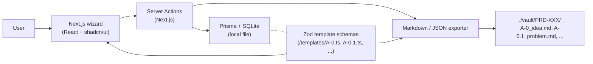
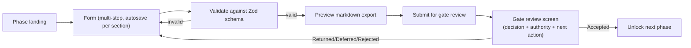

## Goal

A solo, local Next.js app that drives a project through Phases 1–4, enforces gates G1/G2/G3, and outputs evidence files (markdown + JSON) that match the Master Lifecycle template format already in [Master Lifecycle/28. Appendix A — Template Library.md](Master%20Lifecycle/28.%20Appendix%20A%20—%20Template%20Library.md).

## Why this slice

- 4 phases, 3 gates, **6 templates** = small enough to ship in days, large enough to validate the model.
- Discovery is also where most ideas die — biggest leverage for the user.
- Same engine (form schema → wizard → gate → evidence export → traceability) extends to all 14 phases without rework.

## Core architecture

**One source of truth per template:** a Zod schema (e.g. `templates/A-0-idea.ts`) defines the fields, validation, _and_ markdown rendering. The same schema drives form rendering, DB persistence, and file export.

## Tech stack

- **Next.js 15** (App Router) + **TypeScript** + **React 19** — fast scaffolding, server actions, no separate API.
- **Prisma + SQLite** — single local DB file (the user already uses Prisma per MCP plugins). Good fit for solo/local.
- **Tailwind + shadcn/ui** — clean, modern UI without much CSS work.
- **Zod** + **React Hook Form** — schema-driven forms with one source of truth.
- **react-markdown** + **Mermaid** for previews; **gray-matter** for markdown front-matter on export.

## Data model (Prisma sketch)

Core tables, roughly mirroring the lifecycle vocabulary in [Master Lifecycle/24. Traceability Rules.md](Master%20Lifecycle/24.%20Traceability%20Rules.md):

- `Project` — `prdId` (PRD-XXX, optional), `pclCode`, `title`, `complexityLevel`, `currentPhase` (1–14), `status` (Active/Deferred/Rejected/Archived).
- `Artifact` — `projectId`, `templateId` (A-0, A-0.1, …), `localId` (e.g. `IDEA-0001`), `version`, `status` (Draft/Submitted/Approved), `dataJson` (validated by the template's Zod schema), `markdownPath`.
- `GateDecision` — `projectId`, `gateId` (G1/G2/G3), `decision` (Accepted/Conditional/Returned/Deferred/Rejected), `authorityName`, `authorityRole`, `decidedAt`, `evidenceArtifactIds[]`, `nextAction`.
- `TraceLink` — `fromArtifactId`, `toArtifactId`, `relation` (informs/derives/validates).
- `ApprovalRecord` — `artifactId`, `reviewerName`, `reviewerRole`, `status`, `notes`, `reviewedAt`.

(Single-user, no auth, no `tenant_id` since deployment is solo-local — the multi-tenancy standard 3.4 is intentionally out of scope per the chosen MVP.)

## Templates included in MVP (exact 6)

Per [Master Lifecycle/22. Required Documents.md](Master%20Lifecycle/22.%20Required%20Documents.md) §"Discovery and problem framing" + §"Evaluation and feasibility":

- **A-0 Idea Capture Form** (16 sections, defined in [Master Lifecycle/07. Phase 1 — Idea Capture.md](Master%20Lifecycle/07.%20Phase%201%20—%20Idea%20Capture.md) §12).
- **A-0.1 Problem Definition Document** — Phase 2, evidence for G2.
- **A-3.1 Project Selection Scorecard** — Phase 3, evidence for G3 selection signal.
- **A-3.2 Feasibility Assessment** — Phase 4, G3 feasibility evidence.
- **A-3.3 Business Case** — Phase 4, G3 funding evidence.
- **A-4 Business Field Report** — Phase 3 market evidence.

(A-5 forecasting workbook and the PRCS Standards Applicability Matrix are deferred — captured as lightweight free-text fields on the project for now.)

## Wizard flow per phase

Same pattern for every phase. Rejected/Deferred/Research-More projects stay in the dashboard with rationale (per Phase 1 §7 and §10).

## Project layout

Put it at `/Users/victor/Documents/lifecycle-platform/`:

- `app/` — routes: `/`, `/projects/[id]`, `/projects/[id]/phase/[n]`, `/projects/[id]/gate/[g]`
- `lib/` — `prisma.ts`, `markdownExporter.ts`, `gateRules.ts`, `traceability.ts`
- `templates/` — `A-0-idea.ts`, `A-0.1-problem.ts`, `A-3.1-selection.ts`, `A-3.2-feasibility.ts`, `A-3.3-business-case.ts`, `A-4-business-field.ts` (each exports `{ schema, sections, toMarkdown }`)
- `prisma/schema.prisma`, `prisma/dev.db`
- `vault/` — generated evidence files (organized by `PRD-XXX/` or local `IDEA-NNNN/`)
- `package.json`, `README.md`

## What gets enforced (gate rules)

A small `lib/gateRules.ts` evaluates whether a gate can be passed, drawing directly from [Master Lifecycle/21. Decision Gates.md](Master%20Lifecycle/21.%20Decision%20Gates.md) §5:

- **G1**: requires Approved A-0 with all 16 sections complete (per Phase 1 §9 quality checks).
- **G2**: requires Approved A-0.1 with at least one independent validation source recorded.
- **G3**: requires Approved A-3.1, A-3.2, A-3.3, and either A-4 or a recorded waiver, plus a confirmed complexity level and PRCS candidate metadata.

Failing a gate routes the user back to the artifact with the missing items listed (matching the "On failure" rules in §5).

## Out of scope for MVP (explicit deferrals)

- Phases 5–14, gates G4–G10 (later milestones; same architecture).
- Multi-user, auth, multi-tenancy (3.4 STD-DAT-004) — solo-local only.
- Full CYBERCUBE Standards Applicability Matrix (Appendix D) — captured as free-text now, structured later.
- AI-assisted drafting of forms — extension point, not MVP.
- Cloud sync, mobile.

## Risks / decisions to revisit

- **Schema drift:** if the markdown templates in `28. Appendix A` change, the Zod schemas must be updated. Mitigation: a `npm run check-templates` script can grep section headers in the markdown and warn on mismatches (small follow-up task).
- **Vault location:** writing to `./vault/` keeps everything in the platform repo. Alternative is writing into the existing `Master Lifecycle/` folder. **Recommend:** start in `./vault/` to avoid polluting the canonical docs vault; add an "export to vault path" config later.

templates/
  types.ts
  markdown.ts
  registry.ts
  A-0-idea.ts
  A-0.1-problem.ts
  A-3.1-selection.ts
  A-3.2-feasibility.ts
  A-3.3-business-case.ts
  A-4-business-field.ts

components/
  DynamicForm.tsx